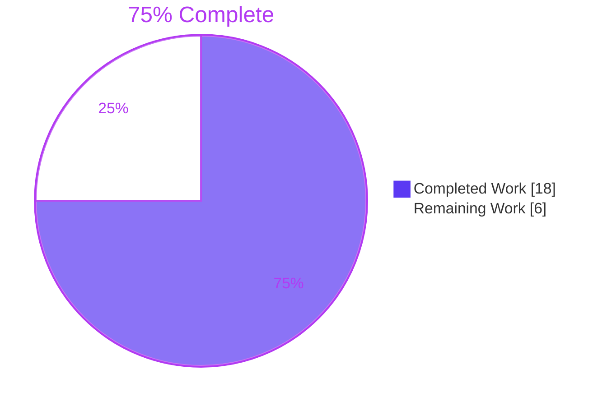
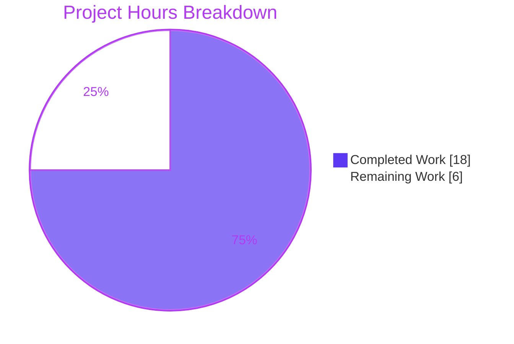
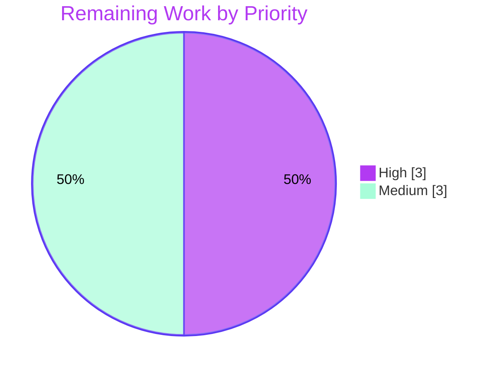

# 1. Executive Summary

## 1.1 Project Overview

This project adds `hello-world-node/`, a dependency-free Node.js HTTP server for a tutorial. It serves `GET /hello` (`200`, `text/plain; charset=utf-8`, `Hello world`) and answers everything else with `404 Not found`. Malformed HTTP is left to Node's built-in parser. The project is exactly three files: a 10-line CommonJS `index.js` on `node:http`, the user's `package.json` reproduced verbatim, and a Run/Try it `README.md`. Every route lives in one `routes` table, so each future endpoint is a one-line addition.

## 1.2 Completion Status



| Metric | Value |
|---|---|
| Total Hours | 24 |
| Completed Hours (AI + Manual) | 18 (18 AI + 0 manual) |
| Remaining Hours | 6 |
| Percent Complete | **75%** |

18 completed hours ÷ 24 total hours = **75% complete**. Every AAP-specified deliverable is done. The 6 remaining hours are path-to-production work.

## 1.3 Key Accomplishments

- ✅ `GET /hello` returns `200`, `text/plain; charset=utf-8` and `Hello world` (11 bytes). Query strings are ignored
- ✅ All other methods and paths return `404 Not found`, matched exactly against the raw path
- ✅ Malformed, oversized, `CONNECT` and unsupported-`Expect` requests get Node's defaults, and the server keeps serving
- ✅ `PORT` defaults to `3000` and can be overridden (`8080`). The exact startup log line follows npm's banner
- ✅ `package.json` is byte-identical to the user's JSON, and nothing is installed
- ✅ Every README command produces exactly its stated output
- ✅ All nine Definition of Done checks and all nine supplementary checks pass on Node v20.20.2 (36 of 36 assertions, in two runs)
- ✅ `index.js` is 10 lines, lines 4/7/10 are verbatim, and it has no forbidden constructs

## 1.4 Critical Unresolved Issues

**0 of 12** AAP requirements (R1–R12) are open. Three items remain: two are accepted with a caveat, and one is a pending merge. None of them blocks local tutorial use. Item 1 blocks wider exposure (Section 5.2, D1).

| Issue | Impact | Owner | ETA |
|---|---|---|---|
| The verified runtime, Node v20.20.2, has been end-of-life since 2026-04-30. It carries 23 post-EOL CVEs with no 20.x fix, and its bundled llhttp 9.3.1 lacks the 9.4.2/9.4.3 parser fixes (accepted under the AAP 0.3.1 pin) | Security exposure if the server is reachable beyond a local tutorial | Platform / DevOps | 2 h |
| Node-default parser behaviours: pipelined or mis-framed requests can lose later responses, or get a `404` before Node's `400` (accepted, since the AAP keeps Node defaults) | Possible desync behind a non-validating proxy. The server never crashes | DevOps | 2 h (deployment controls) |
| The project is on branch `blitzy-12aed985-76eb-4264-9349-84a90c6db706`, and `main` is still at `0e301a6` | The deliverable is absent from `main` until merged | Repository owner | 1 h |

## 1.5 Access Issues

No access issues identified. The branch is pushed to `origin`, Node v20.20.2 is installed, and the project needs no credentials or external services.

## 1.6 Recommended Next Steps

1. [High] Review and merge this branch into `main`.
2. [High] Re-run the Definition of Done on a maintained Node LTS (22.x/24.x), and adopt it for anything beyond the tutorial.
3. [Medium] If the server is exposed off-host, put it behind a TLS-terminating, request-validating reverse proxy that adds security headers, or restrict it to loopback.
4. [Medium] Write a supervision runbook: start from `hello-world-node/`, stop the whole process group, and pin Node on `PATH`.

# 2. Project Hours Breakdown

## 2.1 Completed Work Detail

| Component | Hours | Description |
|---|---|---|
| HTTP server (`hello-world-node/index.js`) | 3 | `routes` table (lines 3–5), exact-key lookup on `` `${req.method} ${req.url.split('?')[0]}` `` (line 7), plain-`if` dispatch (line 8), `404` fallback (line 9), and a direct `listen()` with the startup log (line 10). R2–R7, R10, R13 |
| Manifest (`hello-world-node/package.json`) | 0.5 | The user's 11-line JSON, byte for byte: `engines.node` `>=20`, `scripts.start` `node index.js`, no added fields. R8 |
| Documentation (`hello-world-node/README.md`) | 1 | The `## Run` and `## Try it` sections, with the exact element text, order and `sh`/`text` fencing from AAP 0.2.3. R9 |
| Pinned runtime provisioning | 1 | Node v20.20.2 / npm 10.8.2 from the official tarball (sha256 verified), isolated through `PATH` order with no global packages. AAP 0.3.1 |
| Definition of Done acceptance | 2.5 | Checks 1–9 run in the user's order with the S1/S2/S3 server lifecycle, plus the nine supplementary contract checks. R11 |
| Behaviour-contract and Node-default validation | 3 | Malformed requests, missing `Host`, `Expect`, `HEAD`, `CONNECT`, the 16 KiB header limit, keep-alive with unread bodies, pipelining, `PORT` variants, startup-log ordering, and process-group stop. R6, R7 |
| Security and performance validation | 3.5 | Path/query injection, prototype-key lookups, smuggling and header attacks, DoS probes, information disclosure, browser rendering, and latency/concurrency under load. R7, AAP 0.6 |
| Runtime support and API-currency research | 2 | Node 20 support status, releases, CVE and llhttp applicability. Also confirmed that `createServer`/`writeHead().end()`/`listen` is current and not deprecated (AAP 0.2.2, 0.3.1) |
| Static compliance review | 1.5 | Manifest bytes, verbatim lines 4/7/10, forbidden-construct scan, three-file composition, root `README.md` and branch `One` untouched, and the user-rule count. R1, R8, R10, R13, R14 |
| **Total** | **18** | |

## 2.2 Remaining Work Detail

| Category | Hours | Priority |
|---|---|---|
| Code review and merge of the branch into `main` (closes the AAP 0.2.1 branch placement) | 1 | High |
| Runtime currency: run the full gate on a maintained Node LTS (22.x/24.x) and adopt it for use beyond the tutorial. No file change is needed | 2 | High |
| Deployment isolation and edge hardening: TLS-terminating, request-validating reverse proxy with security headers, or loopback/firewall restriction | 2 | Medium |
| Process-supervision runbook: whole-group stop, runtime on `PATH`, `PORT`, restart policy | 1 | Medium |
| **Total** | **6** | |

## 2.3 Hours Reconciliation

| Item | Hours |
|---|---|
| Completed (Section 2.1) | 18 |
| Remaining (Section 2.2) | 6 |
| **Total project hours** | **24** |
| Completion | 18 ÷ 24 = **75%** |

Confidence is high for the completed items, which are fully specified by the AAP and verified at runtime. It is medium for the remaining deployment items, because the target hosting environment is not defined.

# 3. Test Results

The AAP excludes automated test files, so this project has no unit-test framework and no code-coverage tooling. The checks below are scripted acceptance runs against the live server on Node v20.20.2 / npm 10.8.2. Each server ran in a private network namespace, so the literal ports `3000` and `8080` were used. The acceptance gate ran twice, and both runs gave identical results.

| Area / Category | Framework | Tests | Passed | Failed | Coverage | What This Proves |
|---|---|---|---|---|---|---|
| Definition of Done checks 1–9 (AAP 0.5.2) | bash + `curl` + `nc`, `setsid` lifecycle | 24 assertions | 24 | 0 | 9 of 9 checks | The server starts with the exact log line, serves `/hello`, honours `PORT`, matches its README, rejects bad input and stays up, and is 10 lines long |
| Supplementary contract checks (AAP 0.5.2 table) | bash + `curl` + `nc` | 12 assertions | 12 | 0 | 9 of 9 rows | Query strings, trailing slash, `HEAD`, ignored bodies, encoded paths, minimal headers, missing `Host`, invalid headers and unsupported `Expect` all behave as contracted |
| Edge and hygiene probes | bash + `curl` + `nc` | 10 assertions | 10 | 0 | — | 16 KiB limit (`404` at 15,000 characters, `431` at 17,000), prototype keys `404`, `CONNECT` closed, one startup line, clean group stop, no lockfile or `node_modules`, exactly 3 files |
| Concurrency | `xargs -P 50` + `curl` | 1 run (2,000 requests) | 2,000 | 0 | 50 concurrent | Mixed hits and misses under concurrency all return the correct status, with no errors or resets |
| Hostile raw payloads | `printf` + `nc` | 8 payloads | 8 | 0 | — | Garbage, bad versions, lowercase methods, `constructor`, bad `Content-Length`, bad chunking, NUL and truncated requests never crash the process. The same PID serves `/hello` after each one |
| Static validation | `node --check`, `JSON.parse`, `cmp`, `grep`, `wc` | 13 checks | 13 | 0 | 3 of 3 files | Syntax is valid, the manifest is byte-identical to the user's JSON, lines 4/7/10 are verbatim, there are no forbidden constructs, blank lines or CRs, and the README has exactly two headings |

**Totals observed:** 67 assertions and checks, plus 2,000 load requests. 0 failures. The condensed Definition of Done script in Section 9.4 (15 assertions) was also run, and it printed `PASS=15 FAIL=0`.

**Not Covered**

- **No repeatable automated suite.** Verification is the scripted Definition of Done in Section 9.4 and the manual checks in Section 9.5. Nothing runs in CI, because the AAP excludes tests and CI workflows.
- **Extension contract (R12).** No second route is committed, because "Feature Requests" reads "None yet". The one-line-addition shape has been shown only on a throwaway copy. Re-run the Definition of Done when the first feature route lands.
- **Other runtimes in the `engines` range.** Parser details such as the `431` limit, `417` and `CONNECT` closure were verified on v20.20.2 only. Re-run the checks on the production Node LTS before release.
- **Shutdown under load.** No request was in flight when the server was stopped. Graceful shutdown is excluded by the AAP.
- **Long-duration soak.** Hours-long memory and file-descriptor stability was not measured.

# 4. Runtime Validation & UI Verification

Every flow below was driven against the running server, started with `npm start` from `hello-world-node/` on Node v20.20.2. The project has no external integrations and no authentication, so none were exercised.

- ✅ **Startup and configuration.** Unset or empty `PORT` binds `3000`, and `PORT=8080` binds `8080`. The last line of output is exactly `Server listening on http://localhost:<port>`, after npm's `> hello-world-node@1.0.0 start` / `> node index.js` banner. It goes to stdout and is printed once, after the bind succeeds.
- ✅ **Primary journey: `GET /hello`.** Returns `HTTP/1.1 200 OK`, `Content-Type: text/plain; charset=utf-8` and `Hello world` (11 bytes, no newline). Query strings give the same response.
- ✅ **404 fallback.** `/unknown`, `POST /hello`, `//`, `//hello`, `/Hello`, `/hello/`, `/%68ello` and `/__proto__` all return `404` with `Not found` (9 bytes) and the same content type. `HEAD` returns `404` with headers and no body.
- ✅ **Node-default rejection.** `GARBAGE`, `HTTP/1.1` without `Host`, and invalid headers get `400 Bad Request` with `Connection: close`. A 17,000-character path gets `431`, `Expect: unsupported` gets `417` with an empty body, and `CONNECT` is closed with no reply. `/hello` keeps answering after every one of these.
- ✅ **README accuracy.** All three README commands, run exactly as written, produce the output the README states. `npm start` run from the repository root fails with npm `ENOENT`, which confirms that the README's directory line is required.
- ✅ **Concurrency and performance.** 2,000 mixed requests at 50-way concurrency all returned the correct status. A single process scales to roughly 28k requests/s on one core, with sub-millisecond sequential latency.
- ✅ **Security posture.** SQL, XSS, template and command-injection payloads in the path or query are never reflected. Prototype-member keys never dispatch. In a browser, `/hello` and `/unknown` render plain text only, and no script runs.
- ⚠ **Process lifecycle.** Stopping the whole process group (`kill -- -<pid>`) frees the port. Signalling only npm's PID leaves `node index.js` holding the port, and the next start then exits with `EADDRINUSE`. There is no graceful shutdown, as the AAP excludes it.
- ⚠ **Pipelined and mis-framed requests.** If one write carries two or more valid requests followed by a malformed one, only the first response is delivered, with no `400`. Some invalid `Transfer-Encoding` framings receive the app's `404` before Node closes the connection. Both are Node defaults, and the process never fails.
- **Never exercised at runtime:** Node 22.x/24.x, HTTPS or TLS termination, a committed second route, shutdown with a request in flight, and npm's update notifier on a networked host.

# 5. Compliance & Quality Review

## 5.1 Compliance Matrix

| # | Deliverable | Benchmark | Status | Progress | Evidence |
|---|---|---|---|---|---|
| 1 | Three-file project (R1) | Exactly `index.js`, `package.json`, `README.md`, and none of the excluded artifacts | ✅ PASS | ██████████ 100% | `git diff --name-status origin/main...HEAD` shows 3 × `A`. No lockfile, `node_modules`, tests, CI, `.env` or Docker files |
| 2 | Runtime and modules (R2) | Node ≥20, CommonJS, `node:http` only, no `npm install` | ✅ PASS | ██████████ 100% | `index.js:1` is the only `require`. `package.json` has no `type` and no dependencies |
| 3 | Routing and dispatch (R3, R4) | One-line `"METHOD /path"` handlers, exact-key lookup, plain `if`, `404` fallback, no `try/catch` | ✅ PASS | ██████████ 100% | `index.js:3–9`. Line 7 matches the plan verbatim |
| 4 | Listener (R5) | Direct `listen()`, nothing exported | ✅ PASS | ██████████ 100% | `index.js:10` matches the plan verbatim. No `module.exports` |
| 5 | Port and startup log (R6) | `PORT` with default `3000`, exact log line as the last line | ✅ PASS | ██████████ 100% | `index.js:2`, `index.js:10`. Definition of Done checks 1, 3 and 4 |
| 6 | Behaviour contract (R7, implicit content type and bodies) | User Behavior and "Bad and malformed requests" tables; server never stops responding | ✅ PASS | ██████████ 100% | Checks 5–8, 12 supplementary assertions, 8 hostile payloads with liveness 8/8 |
| 7 | Manifest (R8) | Byte-for-byte the user's JSON | ✅ PASS | ██████████ 100% | `cmp` is identical (11 lines, 251 bytes, LF) |
| 8 | README (R9) | Only the Run and Try it sections, exact text and fencing | ✅ PASS | ██████████ 100% | `hello-world-node/README.md`, 2 headings. Check 4 output matches |
| 9 | Line budget and style (R10) | ≤10 lines; no blank lines, comments or `'use strict'`; LF | ✅ PASS | ██████████ 100% | `wc -l index.js` gives `10 index.js`. CR count 0 |
| 10 | Definition of Done (R11) | All nine checks pass in the user's order | ✅ PASS | ██████████ 100% | 24/24 assertions in two identical runs |
| 11 | Extension contract (R12) | A new route is one `routes` line, and the listener is unchanged | ✅ PASS | ██████████ 100% | Single dispatch table with a trailing comma (`index.js:4`). No committed second route yet |
| 12 | Scope boundaries (0.2.1, 0.8) | Only `GET /hello`. Root `README.md` and branch `One` untouched. Project on `main` | ⚠ PARTIAL | █████████░ 90% | Root `README.md` unchanged (17 bytes). `origin/One` = `0e301a6`. `/health` returns `404`. Merge into `main` pending |

## 5.2 AAP & Rule Divergences and Gaps

AAP 0.9 records no user-specified rules, so enterprise-standard best practice is the governing rule set. The AAP outranks it.

| # | What the AAP/Rule Required | What Was Delivered Instead | Why It Diverged | Impact | Remediation |
|---|---|---|---|---|---|
| D1 | Best practice: run on a supported, patched runtime | Verified on Node v20.20.2, which has been EOL since 2026-04-30 and bundles llhttp 9.3.1 | **Sanctioned.** The AAP 0.3.1 pin outranks the Rules | Security exposure beyond local use | Re-run the Definition of Done on Node 22.x/24.x and adopt it (2 h) |
| D2 | Best practice: document decisions in code | `index.js` has no comments | **Sanctioned.** AAP 0.7.2 forbids comments, and 0.2.3 spends all 10 lines on code | Minor maintainability cost | None; comments would fail check 9 |
| D3 | Best practice: security headers, TLS, restricted bind, input validation, error handling, graceful shutdown, tests | Only `Content-Type` is sent; `listen(port)` binds all interfaces; `PORT` is not validated; no tests | **Sanctioned.** AAP 0.8.2 exclusions and the exact lines in 0.7.2 | Nil locally; material if exposed | Controls at the deployment layer (2 h) |
| D4 | AAP 0.2.1: project "is created on `main`" | Commits are on branch `blitzy-12aed985-…`. `origin/main` is still at `0e301a6` | Delivered as a review branch for pull-request merge | `main` lacks the project until merge | Review and merge (1 h) |
| D5 | AAP 0.5.1: malformed requests get `400` and the server keeps serving | Accepted Node defaults beyond the documented resolution: lost pipelined responses, `404` before `400` on mis-framed bodies | AAP 0.1.2/0.8.2 forbid `clientError` listeners and `createServer` options | Possible desync behind a non-validating proxy; never a crash | Validating reverse proxy if fronted (in the 2 h deployment item) |

**D1: Runtime currency.** Best practice calls for a supported runtime, but AAP 0.3.1 pins v20.20.2 and the AAP outranks the Rules. Node 20 reached end-of-life on 2026-04-30, and v20.20.2 (2026-03-24) is the last 20.x release. The Node.js project treats the 23 CVEs fixed in its June and July 2026 security releases as applying to end-of-life lines. They include CVE-2026-58044, a parser header-truncation desync that affects HTTP clients and forwarding proxies, roles this server does not play. On v20.20.2, llhttp 9.3.1 still accepts an empty `Transfer-Encoding` alongside `Content-Length`. The repository itself declares only `>=20` (`package.json:7`), so the fix needs no file change: choose a maintained LTS and re-run the Definition of Done.

**D2: No inline comments.** Enterprise practice expects non-obvious decisions to be documented in the source. `hello-world-node/index.js` has none, because AAP 0.7.2 forbids comments and blank lines and AAP 0.2.3 spends the 10-line budget entirely on code. The decisions a maintainer would look for are recorded in the plan (AAP 0.5.1 and 0.7.2) rather than in the file: why the query split is inlined, why there is no `try/catch`, and why Node's parser defaults are kept. The cost is small for a 10-line file that its README explains. No action is needed. Adding comments would break Definition of Done check 9 (`wc -l index.js` must print `10 index.js`).

**D3: Production hardening excluded.** Best practice would add security headers, TLS, a loopback bind, `PORT` validation, startup-error handling, graceful shutdown and automated tests. AAP 0.8.2 excludes HTTPS, authentication, graceful shutdown, tests, `PORT` validation and `EADDRINUSE` handling, and AAP 0.7.2 fixes the exact handler and `listen()` lines. As a result, `index.js:4` and `index.js:9` send only `Content-Type`, `index.js:10` listens on all interfaces, and `index.js:2` forwards `PORT` unchanged (`PORT=0` logs `:0`). The impact is nil for a local tutorial and material for any public exposure. These controls belong at the deployment layer, such as a reverse proxy or firewall. The 10-line source contract should stay unchanged.

**D4: Branch placement.** AAP 0.2.1 says `hello-world-node/` is created on `main`. The three commits (`5d8cac2` manifest, `260fd1a` server, `081eb9c` README) are on branch `blitzy-12aed985-76eb-4264-9349-84a90c6db706`, which is pushed to `origin`. `origin/main` still points at the initial commit `0e301a6`. The work is delivered as a review branch so that it reaches `main` through this pull request, and no file depends on the branch it lives on. Until the merge, anyone cloning `main` sees only the root `README.md`. Branch `One` is untouched, as the AAP requires. The fix is to review and merge (1 hour).

**D5: Node-default edge behaviours.** AAP 0.5.1 resolves the case of one valid request pipelined with a malformed one. Runtime probing found two further Node 20 defaults, and both were accepted. First, when two or more valid requests and a malformed one arrive in a single write, only the first response is delivered, with no `400`, and the connection closes. Second, some invalid `Transfer-Encoding` or chunk framings reach the listener and receive `404` (sometimes followed by `400`) before Node closes the connection. Changing either would need a `clientError` listener or `createServer` options, which AAP 0.1.2 and 0.8.2 forbid. Nothing is smuggled, and the process never fails. If the server is fronted, use a request-validating proxy.

# 6. Risk Assessment

| Risk | Category | Severity | Probability | Mitigation | Status |
|---|---|---|---|---|---|
| End-of-life Node 20 runtime: 23 post-EOL CVEs with no 20.x fix, and llhttp 9.3.1 lacks its 9.4.2/9.4.3 parser fixes | Security | High | Medium | Run on a maintained LTS (22.x/24.x satisfy `engines` `>=20`) and re-run the Definition of Done. No source change needed | Open (accepted under AAP 0.3.1) |
| Parser leniency and mis-framed bodies (`404` before `400`, empty `Transfer-Encoding` accepted) behind a non-validating intermediary could desynchronise request streams | Security | Medium | Low | Front with a request-validating reverse proxy. Do not chain through lenient proxies | Open (accepted Node default) |
| Plaintext HTTP, all-interface bind (`index.js:10`), and no `nosniff`/CSP/`Cache-Control`/HSTS headers | Security | Medium | Medium (if exposed) | TLS termination and headers at a reverse proxy, or a loopback/firewall restriction | Open (by AAP design) |
| Stopping only npm's PID orphans `node index.js` on the port, and the next start crashes with `EADDRINUSE` and a stack trace | Operational | Medium | Medium | Supervisors must signal the whole process group (`kill -- -<pgid>`). Document it in the runbook | Open (documented in AAP 0.5.2) |
| No graceful shutdown, health endpoint or monitoring hooks; in-flight requests are dropped on stop | Operational | Low | Medium | External liveness probe on `GET /hello`. Accept for tutorial scope | Accepted (AAP 0.8.2) |
| Wrong runtime: a system-wide Node (for example v22) runs if the intended Node is not first on `PATH`, because `engines` is not enforced. Parser details were verified on v20.20.2 only | Technical | Low | Medium | Pin the runtime in the deployment image or supervisor. Re-run the Definition of Done on the chosen version | Open |
| A single process saturates one core (~28k req/s), and burst p95 rises. Slow or half-open clients are held until Node's default timeouts (`headersTimeout` 60 s, `requestTimeout` 300 s) | Technical | Low | Low | Rate limiting and connection caps at the edge. Scale horizontally if load ever matters | Accepted (AAP 0.8.2 excludes tuning) |
| `PORT` is passed unvalidated (`PORT=0` logs `:0` while binding an ephemeral port; `PORT=08080` logs `:08080`) | Integration | Low | Low | Supply a numeric, free port operationally | Accepted (AAP 0.4.2) |

# 7. Visual Project Status



**Remaining hours by priority (6 h total)**



| Remaining category (Section 2.2) | Hours | Priority |
|---|---|---|
| Review and merge into `main` | 1 | High |
| Runtime currency on a maintained Node LTS | 2 | High |
| Deployment isolation and edge hardening | 2 | Medium |
| Process-supervision runbook | 1 | Medium |
| **Total** | **6** | |

# 8. Summary & Recommendations

The project is **75% complete**: 18 of 24 hours. Every AAP-specified deliverable is in place and verified. `hello-world-node/` holds exactly the three planned files. `index.js` is 10 lines and matches the plan's lines 4, 7 and 10 verbatim. `package.json` is byte-identical to the user's JSON, and `README.md` carries only the Run and Try it sections. All twelve stated requirements (R1–R12) are met, and none is open.

Verification was run against the live server on the pinned Node v20.20.2. All nine Definition of Done checks and all nine supplementary contract checks pass: 36 assertions, plus 10 edge and hygiene probes, in two identical runs. Static checks pass 13 of 13. A 2,000-request concurrent load returned the correct status every time, and eight hostile raw payloads left the same process serving `GET /hello`. Wider probing found no reflection or dispatch outside the `routes` table, and plain-text-only rendering in a browser. That probing covered injection, prototype keys, smuggling attempts, header attacks and DoS.

The remaining 6 hours are path-to-production work. The critical path has two steps: merge the branch into `main` (1 h), then re-run the Definition of Done on a maintained Node LTS and adopt it (2 h). Node 20 is end-of-life, and post-EOL CVEs plus llhttp parser fixes are absent from v20.20.2. The AAP pins that version, and that acceptance is the most material open caveat. After those steps come deployment controls the AAP deliberately keeps out of the source (2 h): TLS, security headers and request validation at a reverse proxy, or a loopback/firewall restriction. The last item is a short supervision runbook (1 h), so the process group is always stopped as a unit.

Success metrics for release: on the production runtime, the Section 9.4 script prints `PASS=15 FAIL=0`, the Section 9.5 commands give their annotated outputs, and `wc -l index.js` prints `10 index.js`. `git status` must show no lockfile or `node_modules`.

**Production readiness:** ready as a local tutorial today. It is not ready for internet exposure until the runtime is moved to a maintained LTS and the deployment-layer controls in Section 2.2 are in place. Neither step requires changing any of the three project files.

# 9. Development Guide

## 9.1 System Prerequisites

- Linux, macOS or Windows (WSL) with a POSIX shell. There are no hardware requirements beyond ~45 MB of RAM per server.
- **Node.js ≥20**. The project was verified on **v20.20.2 with npm 10.8.2**. For anything beyond the tutorial, use a maintained LTS (22.x or 24.x). See Section 5.2, D1.
- `curl`, plus `nc` (OpenBSD netcat) and `setsid` (util-linux) for the malformed-request check and background starts.
- Ports `3000` and `8080` must be free.
- No database, cache, queue, credentials or `npm install`. The project has zero dependencies.

## 9.2 Environment Setup

Put the intended Node first on `PATH`. If a different `node` is found first, such as a system-wide v22, `npm start` uses it, because `engines` is not enforced at run time.

```bash
# NODE_HOME = the directory you extracted the official Node.js tarball into
export NODE_HOME="<your Node.js install directory>"   # e.g. the extracted node-v20.20.2-linux-x64 folder
export PATH="$NODE_HOME/bin:$PATH"
node --version   # v20.20.2
npm --version    # 10.8.2
```

Optional environment variable: `PORT` (default `3000`). No `.env` file is used.

## 9.3 Build and Static Validation

There is no build step. "Compile" means a syntax check. Run this from the repository root:

```bash
cd hello-world-node && node --check index.js && wc -l index.js \
  && node -e "JSON.parse(require('fs').readFileSync('package.json','utf8'))" \
  && grep -c $'\r' index.js package.json README.md; \
  test ! -e package-lock.json -a ! -e node_modules && echo clean
```

Expected output: `10 index.js`, then `index.js:0`, `package.json:0`, `README.md:0`, then `clean`.

## 9.4 Application Startup and Definition of Done

Start the server in the foreground and stop it with Ctrl+C:

```bash
cd hello-world-node
npm start
# > hello-world-node@1.0.0 start
# > node index.js
#
# Server listening on http://localhost:3000
```

Custom port: `PORT=8080 npm start` logs `Server listening on http://localhost:8080`.

Background start and stop. Always signal the **whole process group**:

```bash
cd hello-world-node
LOG=$(mktemp); setsid npm start > "$LOG" 2>&1 & S=$!
sleep 1; tail -n 1 "$LOG"      # Server listening on http://localhost:3000
kill -- -"$S"                  # stops npm, sh and node together
```

Definition of Done, checks 1–9 in the user's order. The script is written to a temporary file **outside** `hello-world-node/` and run from the repository root. It needs ports 3000 and 8080 free and prints `PASS=15 FAIL=0`.

```bash
DOD=$(mktemp); cat > "$DOD" <<'EOF'
#!/usr/bin/env bash
set -u
cd hello-world-node || exit 2
LOG=$(mktemp -d); P=0; F=0
t()  { if [ "$2" = "$3" ]; then P=$((P+1)); echo "PASS $1"; else F=$((F+1)); echo "FAIL $1: got [$2]"; fi; }
up() { for i in $(seq 1 100); do [ "$(tail -n 1 "$1" 2>/dev/null)" = "$2" ] && return 0; sleep 0.05; done; return 1; }
sl() { curl -s -i "$@" | tr -d '\r' | sed -n '1p;$p' | paste -sd'|'; }
setsid npm start > "$LOG/s1" 2>&1 & S1=$!
up "$LOG/s1" 'Server listening on http://localhost:3000'; t "1 npm start" "$?" 0
t "2 GET /hello" "$(curl -s -i http://localhost:3000/hello | tr -d '\r' | sed -n '1p;/^Content-Type/p;$p' | paste -sd'|')" 'HTTP/1.1 200 OK|Content-Type: text/plain; charset=utf-8|Hello world'
PORT=8080 setsid npm start > "$LOG/s2" 2>&1 & S2=$!
up "$LOG/s2" 'Server listening on http://localhost:8080'; t "3 PORT=8080 npm start" "$?" 0
t "3 curl :8080/hello" "$(curl -s http://localhost:8080/hello)" 'Hello world'
kill -- -"$S2"; kill -- -"$S1"; sleep 0.5
setsid npm start > "$LOG/s3" 2>&1 & S3=$!
up "$LOG/s3" 'Server listening on http://localhost:3000'; t "4 README: npm start" "$?" 0
PORT=8080 setsid npm start > "$LOG/s4" 2>&1 & S4=$!
up "$LOG/s4" 'Server listening on http://localhost:8080'; t "4 README: PORT=8080 npm start" "$?" 0
kill -- -"$S4"
t "4 README: curl" "$(curl -s http://localhost:3000/hello)" 'Hello world'
t "5 /unknown" "$(sl http://localhost:3000/unknown)" 'HTTP/1.1 404 Not Found|Not found'
t "5 POST /hello" "$(sl -X POST http://localhost:3000/hello)" 'HTTP/1.1 404 Not Found|Not found'
t "6 //" "$(sl --path-as-is http://localhost:3000//)" 'HTTP/1.1 404 Not Found|Not found'
t "6 still serving" "$(curl -s http://localhost:3000/hello)" 'Hello world'
t "7 /Hello" "$(curl -s -i http://localhost:3000/Hello | head -1 | tr -d '\r')" 'HTTP/1.1 404 Not Found'
t "8 GARBAGE" "$(printf 'GARBAGE\r\n\r\n' | timeout 10 nc localhost 3000 | head -1 | tr -d '\r')" 'HTTP/1.1 400 Bad Request'
t "8 still serving" "$(curl -s http://localhost:3000/hello)" 'Hello world'
t "9 wc -l index.js" "$(wc -l index.js)" '10 index.js'
kill -- -"$S3"
echo "PASS=$P FAIL=$F"
EOF
bash "$DOD"
```

On a shared Linux host where ports 3000/8080 may be taken, run it in a private network namespace (as root): `timeout 300 unshare --net bash -c 'ip link set lo up && bash "$0"' "$DOD"`.

## 9.5 Example Usage and Verification

With the default-port server running:

```bash
curl http://localhost:3000/hello                       # Hello world
curl -i http://localhost:3000/hello                    # HTTP/1.1 200 OK, Content-Type: text/plain; charset=utf-8
curl -i http://localhost:3000/unknown                  # HTTP/1.1 404 Not Found ... Not found
curl -i 'http://localhost:3000/hello?any=query'        # 200, Hello world (query ignored)
curl -I http://localhost:3000/hello                    # 404 with Content-Type, no body (HEAD)
printf 'GARBAGE\r\n\r\n' | nc localhost 3000           # HTTP/1.1 400 Bad Request, Connection: close
printf 'GET /hello HTTP/1.1\r\n\r\n' | nc localhost 3000   # 400 (HTTP/1.1 without Host)
curl -i -H 'Expect: unsupported' http://localhost:3000/hello  # 417 Expectation Failed, empty body
```

Responses also carry Node's framing headers (`Date`, `Connection: keep-alive`, `Keep-Alive: timeout=5`, `Transfer-Encoding: chunked`). These are runtime defaults, not part of the contract.

**Adding a route** (AAP 0.4.3): insert one line before `};` in `index.js`, in the same shape as line 4, for example `'GET /health': (req, res) => res.writeHead(200, { 'Content-Type': 'application/json' }).end('{"status":"ok"}'),`. Then add one `curl` check under `## Try it` and raise the `wc -l` limit by one. Only routes listed under "Feature Requests" may be added.

## 9.6 Troubleshooting

| Symptom | Cause | Resolution |
|---|---|---|
| `npm error enoent ... package.json` (exit 254) | `npm start` was run from the repository root | `cd hello-world-node` first |
| `Error: listen EADDRINUSE: address already in use :::3000` (exit 1) | The port is held, often by an orphaned `node index.js` after only npm's PID was killed | Find the owner with `lsof -ti :3000` and stop it. In future, stop with `kill -- -<pgid>` |
| `node --version` prints v22 or another version | Another Node is earlier on `PATH` | Re-export `PATH` as in Section 9.2 |
| `curl: (7) Failed to connect` | The server is not running, or it is on another `PORT` | Check `tail -n 1` of the log for the listening URL |
| A `package-lock.json` or `node_modules/` appeared | `npm install` was run | Delete both. The project must contain only its three files |
| `nc` hangs after a response | Keep-alive holds the connection for ~5 s | Add `Connection: close` to the raw request, or wrap with `timeout 10` |

# 10. Appendices

## A. Command Reference

| Purpose | Command (run from) |
|---|---|
| Syntax check | `node --check index.js` (`hello-world-node/`) |
| Line budget | `wc -l index.js` → `10 index.js` (`hello-world-node/`) |
| Manifest parses | `node -e "JSON.parse(require('fs').readFileSync('package.json','utf8'))"` (`hello-world-node/`) |
| Start (default port) | `npm start` (`hello-world-node/`) |
| Start (custom port) | `PORT=8080 npm start` (`hello-world-node/`) |
| Background start | `LOG=$(mktemp); setsid npm start > "$LOG" 2>&1 & S=$!` (`hello-world-node/`) |
| Stop background server | `kill -- -"$S"` |
| Definition of Done | `bash "$DOD"` (repository root; script in Section 9.4) |
| Isolated run on a shared host | `timeout 300 unshare --net bash -c 'ip link set lo up && bash "$0"' "$DOD"` |
| Changes on this branch | `git diff --stat origin/main...blitzy-12aed985-76eb-4264-9349-84a90c6db706` |

## B. Port Reference

| Port | Use | Source |
|---|---|---|
| 3000 | Default listening port when `PORT` is unset or empty | `index.js:2` |
| 8080 | Custom-port example in the README and Definition of Done check 3 | `hello-world-node/README.md` |
| Any `PORT` value | Passed to `listen()` and printed unchanged, without validation | AAP 0.4.2 |

## C. Key File Locations

| Path | Purpose |
|---|---|
| `hello-world-node/index.js` | Server: preamble (lines 1–2), `routes` table (3–5), request listener (6–9), `listen()` and startup log (10) |
| `hello-world-node/package.json` | Manifest: name, version, `private`, `engines.node >=20`, `scripts.start` |
| `hello-world-node/README.md` | Run and Try it instructions |
| `README.md` (root) | Repository title, `# OnetwoforOct526`. Unchanged |

## D. Technology Versions

| Technology | Version | Notes |
|---|---|---|
| Node.js | v20.20.2 (verified) | `engines` `>=20`. End-of-life since 2026-04-30, so prefer 22.x/24.x LTS in production |
| npm | 10.8.2 | Ships with Node v20.20.2. Used only for `npm start` |
| llhttp (bundled) | 9.3.1 | Node's HTTP parser in v20.20.2 |
| Module system | CommonJS | `require('node:http')`. No `"type"` field |
| Dependencies | none | No lockfile, no `node_modules` |

## E. Environment Variable Reference

| Variable | Required | Default | Effect |
|---|---|---|---|
| `PORT` | No | `3000` | Listening port, also echoed in the startup log line |
| `PATH` | Yes | — | Must resolve `node`/`npm` to the intended release |

## F. Developer Tools Guide

- **curl:** `-i` shows the status and headers, `-I` sends `HEAD`, and `--path-as-is` keeps `//` or `%68ello` unnormalised. curl strips a bare trailing `?`, so use `nc` to test `/hello?`.
- **nc (OpenBSD):** sends raw or malformed HTTP. Wrap it in `timeout 10`, because keep-alive holds connections for about 5 s.
- **setsid + `kill -- -<pgid>`:** starts and stops `npm`, `sh -c` and `node` as one group. Killing npm's PID alone orphans `node`.
- **`ss -ltnp` / `lsof -ti :<port>`:** identify the `node` process holding a port.
- **`unshare --net`:** a private loopback for parallel or CI runs on a shared Linux host.

## G. Glossary

| Term | Meaning |
|---|---|
| `routes` table | The single object in `index.js` that maps `"METHOD /path"` keys to one-line handlers |
| 404 fallback | `index.js:9`, the response for any key that is not in `routes` |
| Definition of Done (DoD) | The user's nine acceptance checks (AAP 0.5.2) |
| Supplementary checks | Nine further contract checks from AAP 0.5.2 for the behaviour-table rows the DoD does not cover |
| Node defaults | Built-in `node:http` behaviour that is kept unchanged: `400`, `431`, `417`, `CONNECT` closure, and bodiless `HEAD` |
| EOL | End-of-life: the Node.js project no longer ships fixes for that release line |
