# Technical Specification

# 1. Introduction

## 1.1 Executive Summary

**OnetwoforOct526** is a newly initialized repository that contains no implementation. Its only tracked file is `README.md`, and that file holds one line, the heading `# OnetwoforOct526`, which gives the project its name. There is no source code, dependency manifest, configuration, test suite, or descriptive documentation. The repository says nothing about the system's purpose, its domain, or the people it is meant for.

#### Repository Identity

| Attribute | Value | Source |
|---|---|---|
| Project name | OnetwoforOct526 | `README.md` |
| Hosting remote | `https://github.com/blitzytest02/OnetwoforOct526.git` | Git remote `origin` |
| Branches | `main` (default), `One` | Git refs |
| Commit history | One commit, `0e301a6` ("Initial commit"), 2026-10-05, by `blitzytest02` | Git log |
| Tracked files | `README.md` only | Git index |

The `main` and `One` branches point to the same commit, so neither holds work the other lacks.

#### Executive Summary Topics

The repository holds no evidence for the standard executive-summary topics. They are recorded below as undetermined rather than guessed.

| Topic | Repository Evidence | Status |
|---|---|---|
| Brief project overview | Project name in `README.md` | Name only; no description |
| Core business problem | None | Undetermined |
| Key stakeholders and users | None. The commit author account `blitzytest02` is the only party the repository identifies. | Undetermined |
| Expected business impact and value proposition | None | Undetermined |

The purpose, problem statement, stakeholders, and value proposition have to come from sources outside the repository before this summary can describe the system.

## 1.2 System Overview

The repository has no system to describe yet. The sub-sections below report what it actually contains for each overview topic.

### 1.2.1 Project Context

| Aspect | Repository Evidence | Status |
|---|---|---|
| Business context and market positioning | No product description, domain terms, or market references | Undetermined |
| Current system limitations | No legacy code, migration notes, or references to a predecessor system | No evidence that the project replaces or upgrades an existing system |
| Integration with the existing enterprise landscape | The only external relationship is the GitHub remote `https://github.com/blitzytest02/OnetwoforOct526.git` | No API clients, service endpoints, infrastructure definitions, or environment configuration |

The only links between the repository and anything outside it are source hosting and version control.

### 1.2.2 High-Level Description

**Primary system capabilities:** None. The repository has no executable code, scripts, or service definitions.

**Major system components:**

| Component | Path | Role |
|---|---|---|
| Project README | `README.md` | Names the project (`# OnetwoforOct526`). Contains no other content. |

No other files or folders are tracked, on either the `main` branch or the `One` branch.

**Core technical approach:** Undetermined. No language, framework, runtime, build tool, package manager, or architectural pattern can be identified, because there are no source files, manifests (such as package, module, or build descriptors), or configuration files.

The diagram below shows the complete current repository structure.

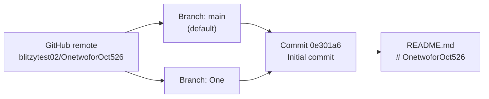

### 1.2.3 Success Criteria

The repository defines no success criteria. It has no requirements documents, acceptance tests, CI pipelines, benchmarks, monitoring configuration, or service-level definitions that could supply measurable targets.

| Criterion Type | Repository Evidence | Status |
|---|---|---|
| Measurable objectives | None | Undetermined |
| Critical success factors | None | Undetermined |
| Key performance indicators (KPIs) | None | Undetermined |

Objectives, success factors, and KPIs have to be set by project stakeholders outside the repository before success can be measured.

## 1.3 Scope

The repository holds no requirements, roadmap, or scope statement. The scope below is therefore limited to what is actually present.

### 1.3.1 In-Scope

**Core Features and Functionalities**

| Category | Repository Evidence | Status |
|---|---|---|
| Must-have capabilities | No feature code or requirements list | None implemented or specified |
| Primary user workflows | No user interface, CLI, API routes, or workflow definitions | None implemented or specified |
| Essential integrations | No client libraries, connectors, or endpoint configuration | None implemented or specified |
| Key technical requirements | No language, runtime, platform, or performance constraints declared | None specified |

**Implementation Boundaries**

| Boundary | Repository Evidence | Status |
|---|---|---|
| System boundaries | The repository consists of one tracked file, `README.md`, on branches `main` and `One` | The boundary is the repository itself; no deployable system exists |
| User groups covered | No roles, personas, or access-control definitions | Undetermined |
| Geographic/market coverage | No localization files, regional configuration, or market references | Undetermined |
| Data domains included | No schemas, models, migrations, or data files | None |

### 1.3.2 Out-of-Scope

The repository documents no explicit exclusions. Because nothing is implemented, every capability is currently outside the delivered scope. The table records what the repository shows for each out-of-scope topic.

| Topic | Repository Evidence | Status |
|---|---|---|
| Explicitly excluded features/capabilities | No exclusion list or non-goals statement | None documented |
| Future phase considerations | No roadmap, issue references, or TODO markers. Branch `One` points to the same commit as `main`, so it holds no work for a separate phase. | None documented |
| Integration points not covered | The repository has no integrations at all | All external integrations are uncovered |
| Unsupported use cases | No executable artifact exists | Every runtime use case is currently unsupported |

Scope, in both directions, has to be defined from sources outside the repository before implementation starts.

## 1.4 References

- `README.md`: the only tracked file. Its single line, `# OnetwoforOct526`, gives the project name and contains no other documentation.
- `/` (repository root): contains only `README.md`. There are no source folders, manifests, configuration, tests, or other documentation.
- Git metadata (`origin` remote, branch refs, commit log): established the remote `https://github.com/blitzytest02/OnetwoforOct526.git`, the branches `main` and `One` (both at commit `0e301a6`), and the single "Initial commit" dated 2026-10-05 by `blitzytest02`.

# 2. Product Requirements

## 2.1 Feature Catalog

The repository implements and specifies **no product features**. On both branches (`main` and `One`, each at commit `0e301a6`), the only tracked file is `README.md`, and its single line, `# OnetwoforOct526`, gives the project name. No feature IDs are assigned, because assigning one would mean inventing a capability the repository does not contain.

#### Feature Evidence Assessment

| Feature Source | Repository Evidence | Catalog Result |
|---|---|---|
| Executable code (services, CLIs, UIs, libraries) | None | No functional features |
| Requirements, roadmap, or issue documents | None | No specified features |
| Dependency manifests or configuration | None | No implied features (integrations, storage, runtimes) |
| Tests or acceptance specifications | None | No verifiable behaviour |
| `README.md` | Project name only | Documentation artifact; not a feature |

#### Feature Metadata, Description, and Dependencies

| Catalog Attribute | Value |
|---|---|
| Feature IDs assigned | None. `F-001` is the first ID available once a feature is defined. |
| Categories, priorities, statuses | Not applicable |
| Overview, business value, user benefits, technical context | Undetermined. The repository states no purpose, users, or domain (see 1.1 Executive Summary). |
| Prerequisite, system, and external dependencies | None. There are no packages, services, or runtimes to depend on. |
| Integration requirements | None. The only external relationship is source hosting at `https://github.com/blitzytest02/OnetwoforOct526.git` (see 1.2.1 Project Context). |

Features have to come from stakeholder input outside the repository before this catalog can be filled in.

## 2.2 Functional Requirements

No functional requirements exist, and no `F-XXX-RQ-YYY` identifiers are issued. A requirement needs a parent feature, and section 2.1 catalogues none. The repository has no code whose behaviour could be restated as a requirement, and no tests or specifications that could supply acceptance criteria.

#### Requirement Details and Technical Specifications

| Attribute | Repository Evidence | Status |
|---|---|---|
| Description, acceptance criteria, priority, complexity | No requirement statements or tests | None defined |
| Input parameters and output/response | No API routes, CLI arguments, function signatures, or UI forms | None defined |
| Performance criteria | No benchmarks, SLAs, timeouts, or resource limits | None defined |
| Data requirements | No schemas, models, migrations, or data files | None defined |

#### Validation Rules

| Rule Type | Repository Evidence | Status |
|---|---|---|
| Business rules | No domain logic | None defined |
| Data validation | No input handling or validation schemas | None defined |
| Security requirements | No authentication, authorization, secrets handling, or security policy files | None defined |
| Compliance requirements | No licence file, regulatory references, or audit configuration | None defined |

Because no requirement exists, there is nothing to test. Requirements added later should use the format in section 2.6 and include measurable acceptance criteria.

## 2.3 Feature Relationships

No feature relationships exist, because the repository has no features. So no dependency map is drawn here. The only structural relationships in the repository (remote → branches `main`/`One` → commit `0e301a6` → `README.md`) are version-control relationships. Section 1.2.2 High-Level Description diagrams them.

| Relationship Type | Repository Evidence | Status |
|---|---|---|
| Feature dependencies map | No features | None |
| Integration points | No API clients, endpoints, queues, or connectors | None |
| Shared components | No modules, libraries, or reusable code | None |
| Common services | No logging, configuration, authentication, or persistence services | None |

## 2.4 Implementation Considerations

No per-feature implementation considerations apply, because no features exist. The table records what the repository shows for each consideration at repository level.

| Consideration | Repository Evidence | Status |
|---|---|---|
| Technical constraints | No language, framework, runtime, platform, or build tooling declared | None declared |
| Performance requirements | No performance targets or benchmarks | None declared |
| Scalability considerations | No deployment, infrastructure, or container definitions | None declared |
| Security implications | No code, dependencies, or configuration that could create an attack surface | None identified |
| Maintenance requirements | No CI pipelines, linters, dependency-update tooling, or contribution guidelines | None declared |

The only artifact to maintain is `README.md`, which currently holds the project name and nothing else.

## 2.5 Traceability Matrix

The matrix below links features to requirements, evidence, and specification sections. It has no feature rows yet. The only row records the current baseline so that later entries trace back to it.

| Feature ID | Requirement IDs | Source Evidence | Related Specification Sections |
|---|---|---|---|
| None assigned | None issued | `README.md` (project name only), commit `0e301a6` | 1.1 Executive Summary, 1.2 System Overview, 1.3 Scope |

#### Related Process Flowcharts

The repository defines no business processes or workflows, so no process flowcharts exist. The only diagram in this specification is the repository-structure diagram in 1.2.2 High-Level Description.

#### Related Technical Specification Sections

| Section | Relevance to Product Requirements |
|---|---|
| 1.1 Executive Summary | Records that purpose, stakeholders, and value proposition are undetermined |
| 1.2 System Overview | Records that there are no capabilities, components, or success criteria |
| 1.3 Scope | Records that no must-have features, workflows, or integrations exist, and that every capability is outside the delivered scope |
| 1.4 References | Lists the repository evidence behind sections 1.1–1.3 |

## 2.6 Assumptions, Constraints, and Requirement Versioning

#### Requirements Baseline

| Baseline Attribute | Value |
|---|---|
| Source revision | Commit `0e301a6` ("Initial commit"), 2026-10-05, author `blitzytest02` |
| Branches covered | `main` (default) and `One`, which point to the same commit |
| Features catalogued | 0 |
| Requirements issued | 0 |

Each later revision of this section should record the commit it was derived from, along with the features and requirements it adds, changes, or retires.

#### Identifier and Classification Conventions

These conventions come from this specification, not from the repository. They apply once features are defined.

| Element | Format | Allowed Values |
|---|---|---|
| Feature ID | `F-XXX`, three digits, sequential | Starts at `F-001` |
| Requirement ID | `F-XXX-RQ-YYY`, three digits, sequential per feature | Starts at `RQ-001` under each feature |
| Feature priority / status | Single value per feature | Critical, High, Medium, Low / Proposed, Approved, In Development, Completed |
| Requirement priority / complexity | Single value per requirement | Must-Have, Should-Have, Could-Have / High, Medium, Low |

#### Assumptions

- This section describes the repository as of commit `0e301a6`. Requirements held outside the repository, such as issue trackers or stakeholder documents, are not reflected here.
- Branch `One` is treated as having no separate requirements, because its tree is identical to `main`.

#### Constraints

- The repository declares no technical, regulatory, budgetary, or schedule constraints.
- Until purpose and stakeholders are defined (see 1.1 Executive Summary), no feature can be given a priority, business value, or acceptance criteria based on evidence.

## 2.7 References

- `README.md` - The only tracked file. Its single line, `# OnetwoforOct526`, names the project and defines no features or requirements.
- `/` (repository root) - Contains only `README.md`. There is no source code, manifest, configuration, test, or requirements document.
- Git metadata (remote `origin`, branch refs `main` and `One`, commit log) - Established the remote `https://github.com/blitzytest02/OnetwoforOct526.git`, that both branches point to commit `0e301a6` with identical trees, and the single "Initial commit" by `blitzytest02` on 2026-10-05.
- 1.1 Executive Summary - Confirmed that purpose, stakeholders, and value proposition are undetermined.
- 1.2 System Overview - Confirmed there are no capabilities or success criteria; source of the repository-structure diagram (1.2.2).
- 1.3 Scope - Confirmed there are no in-scope features, workflows, or integrations.
- 1.4 References - Evidence base shared with this section.

# 3. Technology Stack

## 3.1 Programming Languages

The repository has no technology stack yet. At commit `0e301a6`, the only commit on branches `main` and `One`, it tracks a single file, `README.md`, whose entire content is `# OnetwoforOct526`. No programming language has been chosen. This matches 1.2.2 High-Level Description, which records the core technical approach as undetermined.

| Component | Language / Format | Repository Evidence | Status |
|---|---|---|---|
| Project documentation | Markdown | `README.md`: a single H1 heading, 17 characters | Present |
| Backend, frontend, mobile, desktop | None | No source files on any branch | Not present |
| Scripts and automation | None | No shell, build, or task-runner scripts | Not present |

**Languages in the default technology stack**

| Platform | Default Language | Repository Evidence | Status |
|---|---|---|---|
| Backend | Python | No `.py` files or Python project descriptors | Not present |
| Web and cross-platform mobile | TypeScript | No `.ts`/`.tsx` files, `package.json`, or `tsconfig.json` | Not present |
| iOS | Swift | No Swift sources or Xcode project | Not present |
| Android | Kotlin | No Kotlin sources or Gradle build | Not present |
| macOS | Objective-C | No Objective-C sources | Not present |
| Desktop (ElectronJS) | JavaScript/TypeScript | No Electron project | Not present |

**Selection criteria and constraints**

- Markdown is used only for the README, which carries no runtime, compiler, or interpreter dependency.
- The repository declares no language, runtime, or platform constraints (2.4 Implementation Considerations, 2.6 Assumptions, Constraints, and Requirement Versioning). No language can be justified until the project's purpose and features are defined (1.1 Executive Summary, 2.1 Feature Catalog).
- This section describes commit `0e301a6`. Revise it when the first source file, manifest, or pipeline definition is committed.

## 3.2 Frameworks & Libraries

The repository uses no frameworks or libraries. It has no source files that could import them and no manifests or configuration files that could declare them, so there are no versions to report.

**Frameworks in the default technology stack**

| Layer | Default Framework | Repository Evidence | Status |
|---|---|---|---|
| Backend web framework | Flask | No Python application, routes, or dependency declarations | Not present |
| AI framework | LangChain | No AI or LLM integration code or configuration | Not present |
| Web frontend | React with TypeScript | No components, `package.json`, or bundler configuration | Not present |
| CSS framework | TailwindCSS | No Tailwind or PostCSS configuration and no stylesheets | Not present |
| Mobile / cross-platform | React Native with TypeScript | No React Native project | Not present |
| Desktop | ElectronJS | No Electron main-process code or app manifest | Not present |

**Compatibility and integration requirements**

- With no frameworks there are no version-compatibility constraints, peer-dependency rules, or runtime pairings to maintain.
- There are no integration requirements between components. The repository holds one documentation file and no runtime components.

**Justification:** No framework choice is recorded in the repository, and no requirement exists that would justify one (2.2 Functional Requirements lists none).

## 3.3 Open Source Dependencies

The repository has no third-party or open-source dependencies. The working tree and every branch (`main`, `One`) contain only `README.md`.

| Dependency Mechanism | Repository Evidence | Status |
|---|---|---|
| Package manifests (npm, PyPI, Maven, Go, and others) | No package, module, or build descriptors | None |
| Lockfiles | None committed | None |
| Package registries | No registry configuration (for example `.npmrc` or `pip.conf`) | None referenced |
| Vendored or bundled third-party code | No vendor or third-party folders | None |
| Git submodules | No `.gitmodules` file | None |
| Dependency-update and scanning tooling | No `.github/` folder, so no Dependabot or equivalent configuration | None |

**Security implications**

- With no dependencies, the repository has no software supply-chain exposure and no known-vulnerability inventory to track. This agrees with 2.4 Implementation Considerations, which identifies no attack surface.
- No version-pinning policy exists yet, because nothing is installed.

## 3.4 Third-Party Services

GitHub is the only external service the repository depends on, and only for source hosting. No runtime service integrations exist, consistent with 1.2.1 Project Context.

| Service Category | Repository Evidence | Status |
|---|---|---|
| Source hosting | GitHub remote `https://github.com/blitzytest02/OnetwoforOct526.git`, with remote branches `origin/main` (default) and `origin/One` | In use, version control only |
| External APIs and integrations | No API clients, SDKs, endpoint URLs, or webhook definitions | None |
| Authentication (default stack: Auth0) | No identity-provider configuration, client identifiers, or auth middleware | Not present |
| Monitoring and observability | No logging, metrics, tracing, or error-reporting configuration | None |
| Cloud services (default stack: AWS) | No cloud SDK usage, account configuration, or resource definitions | Not present |

**GitHub feature usage:** The repository has no `.github/` folder, so it configures no GitHub Actions workflows, issue or pull-request templates, CODEOWNERS rules, or Dependabot settings. GitHub serves only as the remote Git host.

**Security implications:** The repository contains no secrets, API keys, credentials, or environment files (such as `.env`). With no service integrations, there are no credentials to manage.

## 3.5 Databases & Storage

The repository defines no databases, caches, or storage services. As 1.3.1 In-Scope records, it includes no data domains.

| Category | Default Stack Proposal | Repository Evidence | Status |
|---|---|---|---|
| Primary database | MongoDB | No connection strings, drivers, schemas, models, or migrations | Not present |
| Secondary databases | None proposed | None | None |
| Caching | None proposed | No cache client or configuration | None |
| File / object storage | None proposed | No storage buckets, upload handling, or data files | None |

**Data persistence strategy:** The Git repository is the only persisted data. It holds one commit (`0e301a6`) containing one blob (`README.md`). The local clone uses Git repository format version 0 with the SHA-1 object format, and the GitHub remote holds a copy. No application data exists to persist, back up, or migrate.

## 3.6 Development & Deployment

Git and GitHub are the only development tools in use. The repository defines no build, test, packaging, or deployment stage.

| Area | Default Stack Proposal | Repository Evidence | Status |
|---|---|---|---|
| Version control | None proposed | Git; default branch `main`, branch `One`, both at commit `0e301a6` ("Initial commit", 2026-10-05, author `blitzytest02`) | In use |
| Development tools | None proposed | No `.editorconfig`, linter, formatter, pre-commit hook, or `.gitignore` | None |
| Build system | None proposed | No build scripts, Makefiles, or package-manager scripts | None |
| Testing | None proposed | No test files or test framework | None |
| Containerization | Docker | No `Dockerfile`, Compose file, or `.dockerignore` | Not present |
| Infrastructure as Code | Terraform | No `.tf` files or state backend configuration | Not present |
| CI/CD | GitHub Actions | No `.github/workflows/` folder | Not present |
| Deployment target | AWS | No environment, region, or resource definitions | Not present |

The diagram shows the current toolchain (solid edges) and the stages that do not exist (dotted edges).

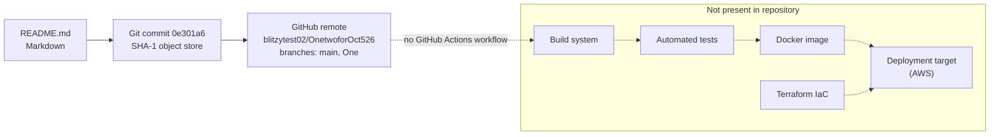

**CI/CD requirements:** None. No pipeline runs on push or pull request, and there is nothing to build, verify, or release.

**Security implications:** No pipeline secrets, deployment credentials, or container images exist. Changes to the repository have no automated quality or security gates, which matches the absence of maintenance tooling recorded in 2.4 Implementation Considerations.

## 3.7 References

**Repository files and folders**

- `README.md` - The only tracked file. It contains `# OnetwoforOct526` and declares no languages, frameworks, dependencies, services, or tooling.
- `` (repository root) - Holds only `README.md` and Git metadata. It has no source folders, manifests, lockfiles, Dockerfiles, IaC, `.github/` folder, or hidden configuration files.
- Git metadata (`.git/`) - Single commit `0e301a6` ("Initial commit", 2026-10-05, `blitzytest02`). Branches `main`, `origin/main` and `origin/One` all resolve to that commit, each with a tree containing only `README.md`. The GitHub remote is `blitzytest02/OnetwoforOct526`. The clone uses repository format version 0 with the SHA-1 object format.

**Technical Specification cross-references**

- 1.2 System Overview - Records the core technical approach as undetermined and GitHub as the only external relationship.
- 1.3 Scope - States that no key technical requirements are specified and no data domains are included.
- 2.4 Implementation Considerations - States that no technical constraints, infrastructure, attack surface, or maintenance tooling exist.
- 2.6 Assumptions, Constraints, and Requirement Versioning - Sets commit `0e301a6` as the baseline and states that no technical constraints are declared.

**Web sources**

- None. The repository has no dependencies whose versions would need external confirmation.

# 4. Process Flowchart

## 4.1 System Workflows

The repository defines no business processes or application workflows. On both branches, `main` and `One` (each at commit `0e301a6`), the only tracked file is `README.md`, which contains one line, `# OnetwoforOct526`. There are no services, user interfaces, CLIs, API routes, jobs, or workflow definitions, so there is nothing to execute. This matches 1.3.1 In-Scope ("Primary user workflows: None implemented or specified") and 2.5 Traceability Matrix, which records that no process flowcharts exist.

The only process the repository supports is the Git version-control lifecycle: a contributor changes files, commits them, and pushes to the GitHub remote. This section documents that lifecycle as the sole workflow. Its behaviour comes from standard Git and GitHub, not from anything the repository configures. The repository has no active hooks (`.git/hooks` holds only `.sample` files) and no `.github/` folder.

### 4.1.1 Core Business Processes

| Process Element | Repository Evidence | Status |
|---|---|---|
| End-to-end user journeys | No UI, CLI, API routes, or user roles (see 1.3.1 In-Scope) | None |
| System interactions | No components that could interact; `README.md` is the only artifact (see 1.2.2 High-Level Description) | None |
| Decision points | No conditional logic, rules engines, or routing code | None in repository code |
| Error handling paths | No exception handling, validation, or error responses | None in repository code |

**Version-control contribution process (only observable process)**

| Step | Actor / System | Action | Decision Point |
|---|---|---|---|
| 1 | Contributor | Selects a target branch | `main` (default, tracks `origin/main`) or `One` (exists only as `origin/One` until checked out locally) |
| 2 | Contributor, working tree | Edits files | None |
| 3 | Local clone | `git add` stages the change; `git commit` records it | Pre-commit hook present? No: none is active |
| 4 | Local clone → GitHub remote | `git push` sends the commit | Push accepted? If not, follow the recovery path in 4.4.3 |
| 5 | GitHub remote | Updates the branch ref | CI workflow triggered? No: no `.github/workflows/` exists |

The process ends with the commit stored on the remote. No build, test, release, or deployment follows (see 3.6 Development & Deployment).

### 4.1.2 Integration Workflows

| Integration Type | Repository Evidence | Status |
|---|---|---|
| Data flow between systems | Git object transfer between the local clone and the GitHub remote `https://github.com/blitzytest02/OnetwoforOct526.git` | Version control only |
| API interactions | No API clients, SDKs, endpoint URLs, or service contracts (see 3.4 Third-Party Services) | None |
| Event processing flows | No queues, topics, event handlers, webhook handlers, or GitHub Actions event triggers | None |
| Batch processing sequences | No scheduled jobs, cron definitions, ETL scripts, or scheduled workflows | None |

Only one kind of data crosses the system boundary: Git objects, meaning the commit `0e301a6`, its tree, and the `README.md` blob `a41f3cb`. They move by `clone`/`fetch` (remote to local) and `push` (local to remote). 4.4.4 shows this exchange as a sequence diagram.

## 4.2 Flowchart Requirements

Every required flowchart element is mapped below for the one workflow that exists, the version-control contribution process. Application workflows have none of these elements because none exist (see 2.1 Feature Catalog: no features, no feature IDs assigned).

### 4.2.1 Workflow Element Coverage

| Flowchart Element | Version-Control Contribution Process | Diagram |
|---|---|---|
| Start and end points | Starts when a contributor has a change to make. Ends when the commit is stored on the GitHub remote. | 4.4.1, 4.4.2 |
| Process steps | Select branch → edit → `git add` → `git commit` → `git push` → remote ref update | 4.4.2 |
| Decision diamonds | Target branch (`main` or `One`); active hook (none); push accepted; CI workflow defined (none) | 4.4.2, 4.4.3 |
| System boundaries | Contributor's working tree; local `.git` object store; GitHub remote. No application runtime boundary exists. | 4.4.1, 4.4.4 |
| User touchpoints | The contributor runs Git commands. There are no end-user touchpoints. | 4.4.1, 4.4.4 |
| Error states and recovery | Push rejected for credentials or non-fast-forward; recovered by fixing access or by fetch + rebase/merge | 4.4.3 |
| Timing and SLA | None defined (see 4.2.2) | n/a |

### 4.2.2 Timing and SLA Considerations

The repository defines no timing constraints. It has no service-level definitions, timeouts, rate limits, schedules, or performance targets, which matches 1.2.3 Success Criteria (measurable objectives and KPIs undetermined). Every Git operation is started by hand and runs synchronously. Nothing runs on a schedule, and no time-bounded processing is triggered after a push.

| Timing Aspect | Repository Evidence | Status |
|---|---|---|
| Response-time or throughput SLAs | No SLA or benchmark definitions | None |
| Timeouts and rate limits | No configuration files | None |
| Scheduled execution windows | No cron or scheduled workflow definitions | None |
| Processing latency after push | No CI/CD pipeline (see 3.6 Development & Deployment) | Not applicable |

### 4.2.3 Validation Rules

| Rule Category | Repository Evidence | Status |
|---|---|---|
| Business rules at each step | No domain logic or rule definitions | None |
| Data validation requirements | No schemas, models, or input validators (see 1.3.1 In-Scope: data domains none). The only integrity check is Git's built-in content addressing: objects are identified by SHA-1 hash, repository format version 0. | Git built-in only |
| Authorization checkpoints | No authentication or access-control code; no identity provider (see 3.4 Third-Party Services). No `CODEOWNERS` file. Push access is controlled by GitHub account permissions held outside the repository; any branch-protection settings on GitHub cannot be seen from the repository. | External to repository |
| Regulatory compliance checks | No compliance policies, data-classification rules, audit configuration, or license file | None |
| Pre-commit / pre-push quality gates | No active hooks in `.git/hooks`; no linters or formatters (see 3.6 Development & Deployment) | None |

## 4.3 Technical Implementation

No application state or error-handling logic is implemented. The repository's only stateful mechanism is Git, so this section covers the state that Git keeps for the repository and the recovery options it provides.

### 4.3.1 State Management

| Concern | Repository Evidence | Implementation |
|---|---|---|
| State transitions | No state machines, status fields, or lifecycle code | Only Git's file and branch states: synced, modified, staged, ahead, diverged (see 4.4.5) |
| Data persistence points | No database, cache, or storage service (see 3.5 Databases & Storage) | 1. Local `.git` object store (format version 0, SHA-1). 2. GitHub remote copy. |
| Caching requirements | No cache clients or configuration | None. Remote-tracking refs (`origin/main`, `origin/One`) are local snapshots of remote state that change only on `git fetch`. |
| Transaction boundaries | No database transactions or unit-of-work code | A Git commit is the only atomic unit. The repository has exactly one: `0e301a6`. |

**Current persisted state**

| Ref | Commit | Tracked Content |
|---|---|---|
| `main` (local, tracks `origin/main`) | `0e301a63ba2224519532822a315ee6e29b809511` | `README.md` (blob `a41f3cb`) |
| `origin/main` (remote default, `origin/HEAD`) | `0e301a63ba2224519532822a315ee6e29b809511` | `README.md` (blob `a41f3cb`) |
| `origin/One` | `0e301a63ba2224519532822a315ee6e29b809511` | `README.md` (blob `a41f3cb`) |

The working tree is clean, with no uncommitted or untracked changes. The commit was authored by `blitzytest02` on 2026-10-05 12:57:49 +0530 with the message "Initial commit". All three refs point to the same commit, so `main` and `One` do not differ in state.

### 4.3.2 Error Handling

| Mechanism | Repository Evidence | Status |
|---|---|---|
| Retry mechanisms | No retry, backoff, or circuit-breaker code | None. A rejected push is retried by hand (see 4.4.3). |
| Fallback processes | No alternate paths, defaults, or degraded modes | None |
| Error notification flows | No logging, metrics, alerting, or error-reporting configuration (see 3.4 Third-Party Services); no CI to send failure notifications | None. Git reports errors only to the terminal of the contributor who ran the command. |
| Recovery procedures | No backup scripts or runbooks | Git history and the remote copy are the only recovery sources (see table below) |

**Recovery procedures available through Git**

| Failure | Recovery Source | Procedure |
|---|---|---|
| Local file damaged or deleted | Commit `0e301a6` | Restore the file from `HEAD` (`git restore README.md`) |
| Local clone lost | GitHub remote | Clone again from `https://github.com/blitzytest02/OnetwoforOct526.git` |
| Push rejected, non-fast-forward | Remote branch history | `git fetch`, then rebase or merge, resolve any conflicts, push again |
| Push rejected, authentication or permission | GitHub account settings (outside the repository) | Correct credentials or obtain access, push again |

## 4.4 Required Diagrams

The diagrams below model the version-control lifecycle, the only process the repository supports. Dotted edges and "Not present" groupings mark stages a typical system would have but this repository does not define. Every diagram was validated as renderable Mermaid.

### 4.4.1 High-Level System Workflow

Swim lanes separate the contributor, the local clone, and the GitHub remote. The CI and application-runtime lane is empty in the repository: it has no `.github/workflows/` and no executable code.

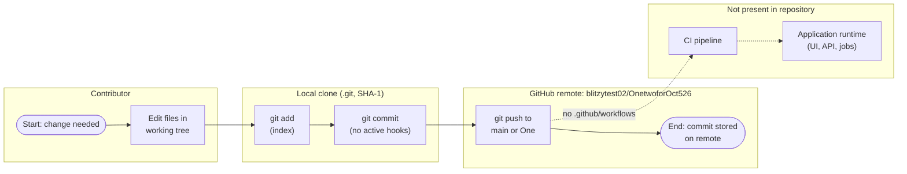

### 4.4.2 Detailed Process Flows

Per-feature process flows cannot be drawn because the repository has no core features (see 2.1 Feature Catalog). The contribution process is shown in detail instead, with every decision point. Each "No" branch at the hook and CI decisions reflects the absence of configuration, not a configured rule.

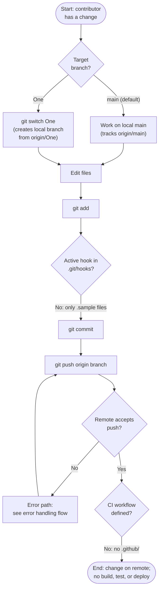

### 4.4.3 Error Handling Flowchart

Errors can occur only in Git and GitHub operations, and their handling is Git and GitHub default behaviour. The repository contains no application error handling (see 4.3.2).

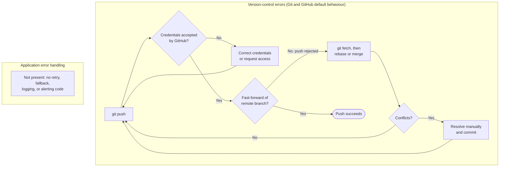

### 4.4.4 Integration Sequence Diagram

GitHub source hosting is the only integration (see 3.4 Third-Party Services). Pushing triggers no workflow defined in the repository.

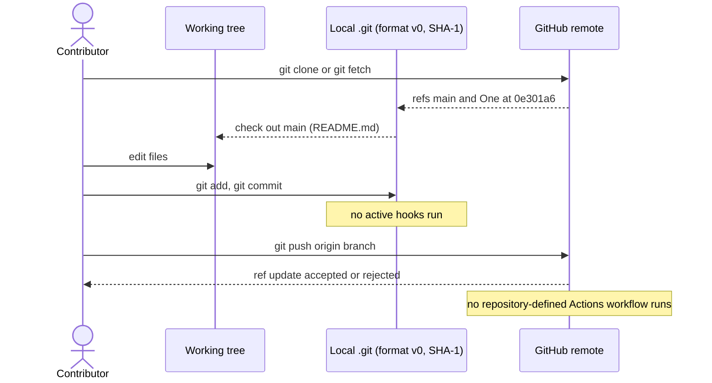

### 4.4.5 State Transition Diagram

The repository has no application state machine. The diagram shows the Git states a change moves through. The repository is currently in `Synced`: the working tree is clean, and `main`, `origin/main`, and `origin/One` all point to `0e301a6` (see 4.3.1).

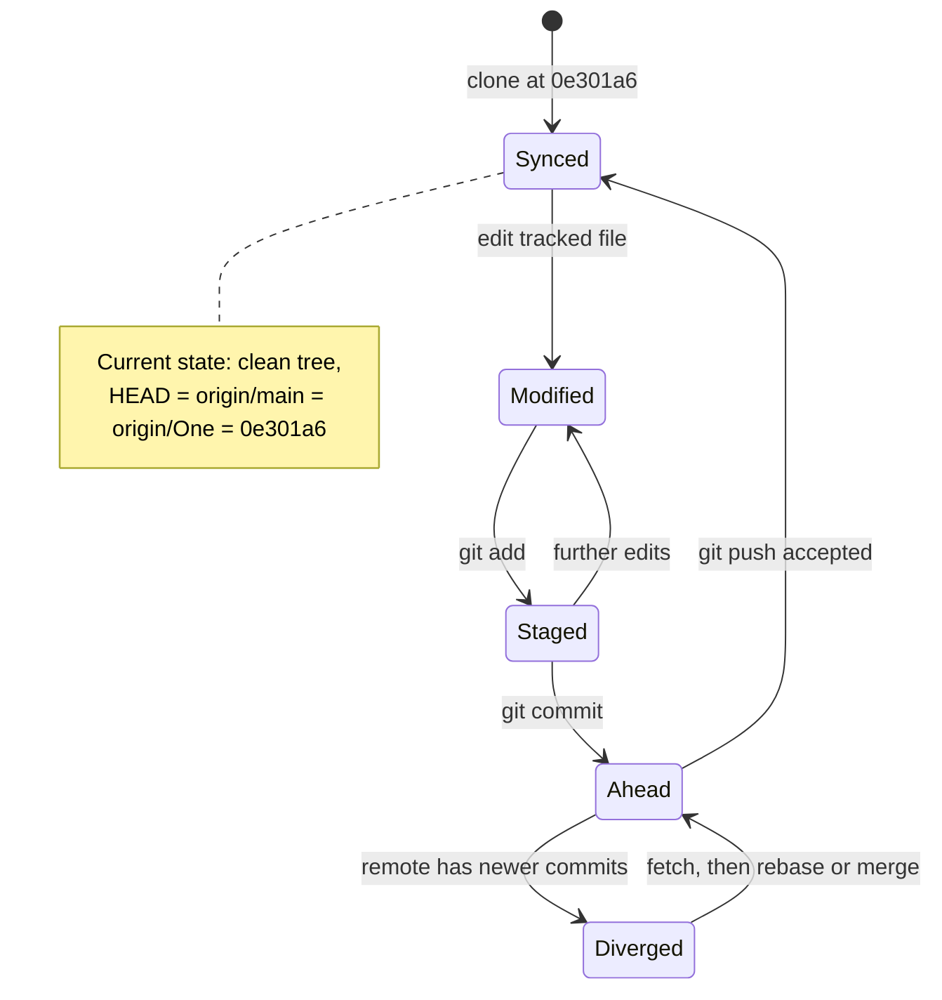

| State | Meaning | Persistence Point |
|---|---|---|
| Synced | Local branch matches its remote-tracking ref; working tree clean | Local `.git` and GitHub remote |
| Modified | Tracked file changed in the working tree, not staged | Working tree only (not yet persisted) |
| Staged | Change recorded in the index | Local `.git` index |
| Ahead | Local commit not yet pushed | Local `.git` object store |
| Diverged | Local and remote branches each hold commits the other lacks | Both, until reconciled |

## 4.5 References

**Repository files and folders**

- `README.md` - The only tracked file (blob `a41f3cb`). Its single line, `# OnetwoforOct526`, names the project and describes no process, interface, or workflow.
- `/` (repository root, `""`) - Contains only `README.md` and `.git/`. There are no source, configuration, test, `.github/`, or `.blitzyignore` files, and no subfolders.
- `.git/` (Git metadata) - Holds commit `0e301a63ba2224519532822a315ee6e29b809511` ("Initial commit", `blitzytest02`, 2026-10-05 12:57:49 +0530), shared by `main`, `origin/main`, and `origin/One`. Local `main` tracks `origin/main`. Repository format version 0, SHA-1. The working tree is clean.
- `.git/hooks/` - Contains only `.sample` files, so no active commit or push hooks.

**Technical Specification cross-references**

- 1.2 System Overview - No system capabilities; repository-structure diagram; no success criteria, KPIs, or SLAs.
- 1.3 Scope - No primary user workflows, integrations, user groups, or data domains.
- 2.1 Feature Catalog - No features or feature IDs, so no per-feature process flows.
- 2.3 Feature Relationships - No integration points, shared components, or common services.
- 2.5 Traceability Matrix - Records that no business-process flowcharts exist.
- 3.4 Third-Party Services - GitHub is the only external service (source hosting); no authentication, monitoring, or `.github/` configuration.
- 3.5 Databases & Storage - No databases, caches, or storage; Git is the only persisted data.
- 3.6 Development & Deployment - No build, test, CI/CD, containerization, or deployment stages.

# 5. System Architecture

## 5.1 HIGH-LEVEL ARCHITECTURE

The repository contains no software system. Its tracked tree holds one file, `README.md`, whose entire content is the heading `# OnetwoforOct526`. The architecture that exists is the version-control arrangement around that file: a Git repository with a local clone and a GitHub-hosted remote. This section describes that arrangement and states plainly which application-level elements are absent.

### 5.1.1 System Overview

#### Architecture Style and Rationale

No application architecture style (monolithic, layered, microservices, serverless, or event-driven) can be identified. There are no source files, dependency manifests, service definitions, or deployment descriptors (see 1.2.2 High-Level Description and 3.6 Development & Deployment).

The only style in effect is **Git's distributed version-control model**: every clone and the GitHub remote each hold a complete copy of the history. The rationale for the project's eventual architecture is not recorded. The repository has no architecture decision records, design documents, or README prose.

#### Key Architectural Principles and Patterns

These are the principles the repository state actually exhibits:

- **Content-addressed, immutable storage.** Git stores every object under its SHA-1 hash (repository format version 0). The history is three objects: commit `0e301a6`, tree `bf77f53`, and blob `a41f3cb` (`README.md`), all held in a single packfile.
- **Full-copy replication.** The local clone and the GitHub remote `blitzytest02/OnetwoforOct526` each hold the complete history.
- **Branch-based isolation.** Two branches exist, `main` (the default, `origin/HEAD`) and `One`. Both point to `0e301a6`, so the isolation has never been used.
- **Client-initiated synchronization.** The local clone pulls remote state through the fetch refspec `+refs/heads/*:refs/remotes/origin/*` and publishes with `git push`. Nothing on the remote initiates contact with the clone.
- **No automation layer.** There are no active hooks in `.git/hooks` (only `.sample` files) and no `.github/` folder, so commits and pushes trigger nothing.

#### System Boundaries and Major Interfaces

| Boundary | Inside | Interface Across the Boundary |
|---|---|---|
| Tracked content | `README.md` only | File system (working tree) |
| Local clone | Working tree, index, object store, refs, config, reflog | Git command-line operations by a contributor |
| Local clone to GitHub | Remote repository `blitzytest02/OnetwoforOct526` with branches `main` and `One` | Git over HTTPS (`git clone`, `git fetch`, `git push`) |
| Application runtime | Nothing | None (no UI, API, CLI, jobs, or data tier) |

#### Architectural Assumptions

- **A1:** The repository is an initial scaffold. Everything in this section describes current state, not an intended design, because no intent is recorded.
- **A2:** Branch `One` holds no separate work. Its tree is identical to `main` (blob `a41f3cb`).
- **A3:** The local clone's `.git/config` settings (remote URL credential, credential and askpass settings) belong to this environment, not to the project. Git never tracks or shares them, so they describe how this clone authenticates and do not define a project security mechanism.

### 5.1.2 Core Components Table

The five requested attributes are split across two tables to keep each table at four columns or fewer.

**Responsibilities and dependencies**

| Component Name | Primary Responsibility | Key Dependencies |
|---|---|---|
| Project README (`README.md`) | Names the project (`# OnetwoforOct526`); the only tracked content | None; plain Markdown, 17 bytes |
| Working tree | Editable checkout of `main` | Index and object store of the local clone |
| Local Git repository (`.git`) | Stores history (object store), staging (index), branch pointers (refs), remote settings (config), and the local ref log | Git client; SHA-1 object format; repository format version 0 |
| Branch model (`main`, `One`) | Separates lines of work; `main` is the default | Refs in the local clone and on GitHub |
| GitHub remote repository | Off-site copy of the history; hosts branches `main` and `One` | GitHub service and account access, both outside the repository |

**Integration points and critical considerations**

| Component Name | Integration Points | Critical Considerations |
|---|---|---|
| Project README (`README.md`) | Blob `a41f3cb` in tree `bf77f53` of commit `0e301a6` | States no purpose, users, or technology (see 1.1 Executive Summary) |
| Working tree | Contributor edits; `git add` and checkout | Clean, with no untracked files; no `.gitignore` or `.gitattributes`, so no ignore rules or content filters apply |
| Local Git repository (`.git`) | GitHub over HTTPS through `remote.origin.url` | One pack of three objects; hooks are samples only; the remote URL embeds a credential in plain text (see 5.3.5) |
| Branch model (`main`, `One`) | `branch.main` tracks `origin/main`; `origin/One` has no local branch | Both branches point to `0e301a6`; no protection rules are defined in the repository |
| GitHub remote repository | `git fetch` and `git push` from clones | The only copy outside the local clone; no `.github/` configuration (see 3.4 Third-Party Services) |

**Components not present:** application runtime (UI, API, CLI, background jobs), database, cache, file storage, identity provider, CI/CD pipeline, container images, and infrastructure-as-code. Sections 3.4–3.6 record their absence.

### 5.1.3 Data Flow Description

#### Primary Data Flows

The only data that moves is repository content, and every flow starts with a contributor running a Git command.

1. **Authoring.** A contributor edits a file in the working tree. `git add` writes the content as a blob into the object store and records it in the index. `git commit` writes a tree and a commit object and advances the current branch ref.
2. **Publishing.** `git push` sends the objects the remote lacks to GitHub over HTTPS, and GitHub updates the target branch (`main` or `One`).
3. **Synchronization.** `git fetch` reads GitHub's ref advertisement, downloads any missing objects, and updates `origin/main` and `origin/One` according to the fetch refspec.
4. **Checkout.** Git writes the selected commit's tree from the object store into the working tree.

The current history has one more fact of note: commit `0e301a6` lists `blitzytest02` as author and `GitHub` as committer, and carries a PGP signature. The commit was therefore created on GitHub and first reached the local clone through the synchronization flow (`git clone`).

#### Integration Patterns and Protocols

- **Protocol:** Git over HTTPS to `github.com`. This is the only network protocol in use.
- **Pattern:** synchronous, client-initiated request and response. The remote never notifies a clone of changes, and the repository defines no webhooks, message queues, event streams, or APIs.

#### Data Transformation Points

| Transformation | Input | Output |
|---|---|---|
| Staging (`git add`) | File content (`README.md`) | Compressed blob addressed by SHA-1 (`a41f3cb`) |
| Committing (`git commit`) | Index snapshot plus metadata | Tree object (`bf77f53`) and commit object (`0e301a6`) |
| Packing (fetch, push, clone) | Loose or missing objects | Delta-compressed packfile (currently one pack of three objects) |
| Checkout | Tree and blob objects | Plain files in the working tree |

No attribute-driven transformations, such as line-ending normalization, clean/smudge filters, or Git LFS pointers, are configured, because there is no `.gitattributes` or `.lfsconfig` file.

#### Key Data Stores and Caches

| Store | Location | Contents | Role |
|---|---|---|---|
| Working tree | Repository root | `README.md` | Editable copy |
| Index | `.git/index` | Staged snapshot of `README.md` | Staging area |
| Object store | `.git/objects` (one pack) | Commit `0e301a6`, tree `bf77f53`, blob `a41f3cb` | Authoritative local history |
| Remote-tracking refs | `.git/packed-refs` | `origin/main` and `origin/One` at `0e301a6` | Local snapshot of remote state, refreshed only by `git fetch` |
| GitHub remote | `github.com/blitzytest02/OnetwoforOct526` | The same commit on `main` and `One` | Off-site replica |

There is no application database, cache, or object storage (see 3.5 Databases & Storage). The remote-tracking refs are the only cache-like structure. They can go stale between fetches.

### 5.1.4 External Integration Points

GitHub is the only external system. The five requested attributes are split across two tables to keep each table at four columns or fewer.

**Integration type and exchange pattern**

| System Name | Integration Type | Data Exchange Pattern |
|---|---|---|
| GitHub (`blitzytest02/OnetwoforOct526`) | Source hosting; Git remote `origin` | On demand and client-initiated: clone and fetch pull refs and objects; push sends objects and ref updates |

**Protocol and service levels**

| System Name | Protocol/Format | SLA Requirements |
|---|---|---|
| GitHub (`blitzytest02/OnetwoforOct526`) | Git over HTTPS; ref advertisements and packfiles | None defined in the repository. Availability depends on GitHub's own service terms, which are outside the repository. |

No identity provider, cloud platform, monitoring service, third-party API, or webhook integration exists (see 3.4 Third-Party Services).

## 5.2 COMPONENT DETAILS

The components below are the ones listed in 5.1.2. Each is described by purpose, technology, interfaces, persistence, and scaling. Components that do not exist are covered once, in 5.2.5.

### 5.2.1 Project README (`README.md`)

| Aspect | Detail |
|---|---|
| Purpose and responsibilities | Names the project. The file's whole content is `# OnetwoforOct526` (17 bytes). It states no purpose, usage, or setup. |
| Technologies and frameworks | Markdown. No front matter, links, badges, or embedded code. |
| Key interfaces and APIs | None. It is read as a plain file. |
| Data persistence | Stored as blob `a41f3cb` (mode `100644`) in tree `bf77f53` of commit `0e301a6`, identically on `main` and `One`. |
| Scaling considerations | Not applicable. |

### 5.2.2 Local Git Repository (`.git`)

| Aspect | Detail |
|---|---|
| Purpose and responsibilities | Holds history, the staging area, branch pointers, remote settings, and a local ref log for the working tree. |
| Technologies and frameworks | Git; repository format version 0; SHA-1 object format; non-bare repository (`core.bare=false`); file-mode tracking on (`core.filemode=true`). |
| Key interfaces and APIs | Git command line: `add`, `commit`, `checkout`/`switch`, `fetch`, `push`. No hooks run: `.git/hooks` holds only `.sample` files. |
| Data persistence | `.git/objects`: one pack of three objects, no loose objects. `.git/index`: staging. `.git/packed-refs`: `origin/main` and `origin/One` at `0e301a6`. `.git/logs`: reflog, enabled by `core.logallrefupdates=true`. |
| Scaling considerations | The repository is minimal (one pack of three objects). No Git LFS, sparse-checkout, or partial-clone configuration exists, and none is needed at this size. |

**Configuration in effect (`.git/config`)**

| Key | Value | Architectural Effect |
|---|---|---|
| `remote.origin.fetch` | `+refs/heads/*:refs/remotes/origin/*` | Every remote branch is mirrored as a remote-tracking ref |
| `branch.main.remote` / `branch.main.merge` | `origin` / `refs/heads/main` | Local `main` tracks `origin/main` |
| `credential.helper` | Empty | No credential store or cache is used |
| `credential.interactive` / `core.askpass` | `false` / `echo` | Git never prompts. Authentication relies on the credential embedded in `remote.origin.url` (see 5.3.5). |

### 5.2.3 Branch Model (`main`, `One`)

| Aspect | Detail |
|---|---|
| Purpose and responsibilities | `main` is the default branch (`origin/HEAD -> origin/main`). `One` is a second branch whose purpose is not documented. |
| Technologies and frameworks | Git refs. |
| Key interfaces and APIs | `git switch One` creates a local branch from `origin/One`. Pushes update the branch on GitHub. |
| Data persistence | Refs in the local clone (`refs/heads/main`, `.git/packed-refs`) and on GitHub. All three refs resolve to `0e301a63ba2224519532822a315ee6e29b809511`. |
| Scaling considerations | No branch-naming convention, protection rules, or merge policy is defined in the repository. |

### 5.2.4 GitHub Remote Repository

| Aspect | Detail |
|---|---|
| Purpose and responsibilities | Off-site host for the history and the only copy outside the local clone. It also created the initial commit: the committer is `GitHub`, and the commit carries a PGP signature. |
| Technologies and frameworks | GitHub Git hosting. No `.github/` folder, so no Actions, templates, CODEOWNERS, or Dependabot (see 3.4 Third-Party Services). |
| Key interfaces and APIs | Git over HTTPS at `https://github.com/blitzytest02/OnetwoforOct526.git`. |
| Data persistence | Branches `main` and `One`, both at `0e301a6`. |
| Scaling considerations | Set by GitHub. The repository defines nothing here. |

### 5.2.5 Application Components Not Present

| Expected Component | Repository Evidence | Status |
|---|---|---|
| User interface, API, CLI, background jobs | No source files or entry points | Not present |
| Database, cache, file storage | No drivers, schemas, or configuration (see 3.5) | Not present |
| Identity and access management | No auth configuration or middleware (see 3.4) | Not present |
| Build, CI/CD, containers, infrastructure | No build scripts, `.github/workflows/`, `Dockerfile`, or `.tf` files (see 3.6) | Not present |

### 5.2.6 Component Interaction Diagram

Solid edges show interactions that exist. Dotted edges lead to layers the repository does not define.

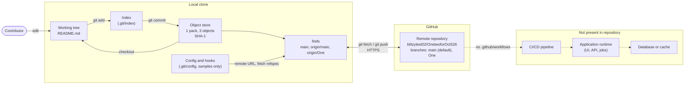

### 5.2.7 State Transition Diagram

The repository has no application state machine. At the architecture level, the state that matters is how the two branches relate to each other. 4.4.5 covers the per-change states (Synced, Modified, Staged, Ahead, Diverged).

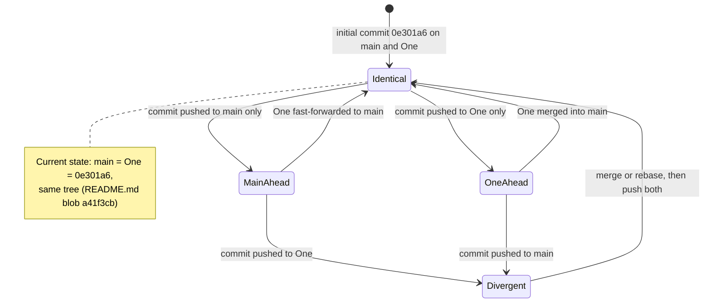

| State | Condition | Current |
|---|---|---|
| Identical | `main` and `One` point to the same commit | Yes, both at `0e301a6` |
| MainAhead | `main` has commits that `One` lacks | No |
| OneAhead | `One` has commits that `main` lacks | No |
| Divergent | Each branch has commits the other lacks | No |

### 5.2.8 Sequence Diagram: Remote Synchronization

This sequence shows how the local clone reaches GitHub, including where its configuration supplies authentication. 4.4.4 covers the full edit-commit-push sequence.

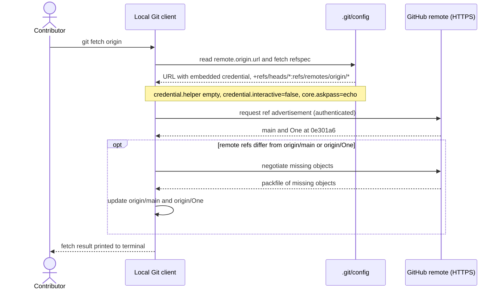

## 5.3 TECHNICAL DECISIONS

The repository records no technical decisions: it has no ADR files, design documents, or README prose. The decisions below are **inferred from observed repository state**. Wherever the reasoning behind a decision is not in the repository, it is marked "Not recorded". Tradeoffs describe the consequences of the current state.

### 5.3.1 Architecture Style Decisions and Tradeoffs

| Decision Area | Observed State | Tradeoff |
|---|---|---|
| Application architecture style | None: no code, manifests, or service definitions | No constraints have been imposed yet, but there is also no structure, module boundary, or runtime to build on |
| System of record | Git with a GitHub remote | Full history and replication come at no cost; GitHub is the only off-site copy |
| Branching | Two long-lived branches, `main` (default) and `One`, at the same commit | Allows parallel lines of work; the purpose of `One` is not recorded and its content duplicates `main` |
| Automation | No hooks, CI, or `.github/` | No setup or maintenance cost; no automated quality, security, or build gates (see 3.6) |

Rationale for every row: Not recorded.

### 5.3.2 Communication Pattern Choices

| Pattern | Used | Evidence |
|---|---|---|
| Synchronous request and response (Git over HTTPS) | Yes | `remote.origin.url` uses HTTPS to `github.com` |
| Pull-based synchronization | Yes | Fetch refspec `+refs/heads/*:refs/remotes/origin/*`; remote state reaches the clone only on `git fetch` |
| REST, GraphQL, or RPC APIs | No | No route, schema, or client definitions |
| Asynchronous messaging, events, or webhooks | No | No queue, broker, or webhook configuration |

Tradeoff: client-initiated pull keeps the setup trivial, but a clone does not learn of remote changes until someone fetches. 5.3.4 discusses the resulting staleness.

### 5.3.3 Data Storage Solution Rationale

| Store | Role | Rationale |
|---|---|---|
| Git object store (SHA-1, format v0) | The only persistent store; holds three objects | Implicit: the only store a source repository needs. Content addressing gives integrity checks and deduplication. |
| GitHub remote | Off-site replica | Implicit: the configured `origin` |
| Application database (MongoDB in the default stack) | Not present | No data domains exist (see 3.5 Databases & Storage) |

Repository format version 0 means Git's default SHA-1 object format; the SHA-256 object format is not in use. Rationale: Not recorded.

### 5.3.4 Caching Strategy Justification

The repository defines no application cache. Two Git structures behave like caches:

| Structure | Cached Data | Refresh / Invalidation |
|---|---|---|
| Remote-tracking refs (`origin/main`, `origin/One` in `.git/packed-refs`) | Last known position of each remote branch | Refreshed only by `git fetch`; stale in between |
| Index (`.git/index`) | File metadata used to detect working-tree changes quickly | Updated by `git add`, commit, and checkout |

Neither is a configured caching strategy. Both are built into Git. With one commit and identical branches, staleness has no effect today.

### 5.3.5 Security Mechanism Selection

| Concern | Mechanism in Effect | Assessment |
|---|---|---|
| Transport security | HTTPS to `github.com` | Encrypted in transit |
| Clone authentication | Credential embedded in `remote.origin.url` in the local `.git/config`; `credential.helper` empty; prompts disabled (`credential.interactive=false`, `core.askpass=echo`) | Environment-specific (assumption A3). The credential is stored in plain text, so anyone who can read or copy `.git/config` obtains it. The credential is never tracked, and this document deliberately does not reproduce it. |
| Repository authorization | GitHub account and repository permissions | Managed outside the repository; no CODEOWNERS or branch protection is defined in it |
| Content integrity | SHA-1 content addressing; commit `0e301a6` carries GitHub's PGP signature | The local clone cannot verify the signature (signature status `E`: the signing key is not in the local keyring) |
| Secrets in tracked content | None: no `.env`, keys, or credentials in tracked files (see 3.4) | No secret-management requirement |
| Application security (default stack: Auth0) | Not present | No application exists to secure |

### 5.3.6 Decision Tree Diagram

This tree shows how the evidence leads to the architecture classification used throughout this section.

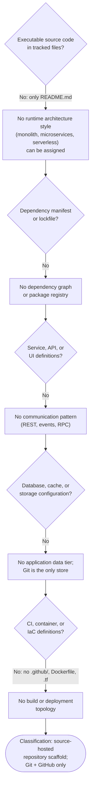

### 5.3.7 Architecture Decision Records

The repository contains no ADRs. The records below are reconstructed so the architecture's current position is explicit. ADR-001 to ADR-003 describe decisions in effect, observed in repository state. ADR-004 to ADR-007 are open, with no evidence either way.

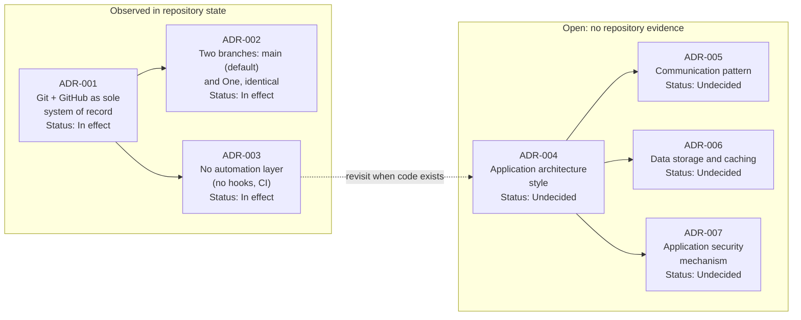

| ADR | Context | Decision | Consequences |
|---|---|---|---|
| ADR-001 | The project needs a home for its content | Git repository hosted on GitHub as `blitzytest02/OnetwoforOct526`; initial commit created on GitHub | Full history in every clone; GitHub is the only off-site copy |
| ADR-002 | Lines of work may need separating | Branches `main` (default) and `One`, both at `0e301a6` | Branch `One` has no distinct content or documented purpose |
| ADR-003 | No code exists to build or verify | No hooks, CI, or `.github/` configuration | No automated gates; to be revisited once code is added |
| ADR-004 to ADR-007 | No source code, manifests, or configuration | Undecided: architecture style, communication, storage and caching, application security | Every application-level architectural choice remains open |

## 5.4 CROSS-CUTTING CONCERNS

No application exists, so no application-level cross-cutting mechanisms are implemented. For each concern, this section states what is absent and which Git or GitHub mechanism, if any, covers it today.

### 5.4.1 Monitoring and Observability Approach

| Capability | Repository Evidence | Status |
|---|---|---|
| Metrics and dashboards | No metrics libraries, exporters, or dashboard definitions | Not present |
| Health checks | No services to check | Not applicable |
| Alerting | No alert rules or notification channels; no CI to report failures | Not present |
| Repository-state visibility | `git status`, `git log`, and ref inspection; working tree clean; `main`, `origin/main`, and `origin/One` at `0e301a6` | Available through Git commands only |

### 5.4.2 Logging and Tracing Strategy

The repository configures no application logging, log aggregation, distributed tracing, or correlation identifiers. Two Git records serve as audit trails:

| Record | Contents | Scope |
|---|---|---|
| Commit history | Commit `0e301a6`: author `blitzytest02`, committer `GitHub`, 2026-10-05 12:57:49 +0530, message "Initial commit", PGP signature | Shared by every clone and the GitHub remote |
| Reflog (`.git/logs/`, enabled by `core.logallrefupdates=true`) | Local ref movements: the clone of `origin` and later checkouts of `main` | Local clone only; never pushed or shared |

### 5.4.3 Error Handling Patterns

Errors can occur only in Git operations, and Git handles them with its default behaviour. The repository contains no retry, backoff, circuit-breaker, fallback, or dead-letter logic (see 4.3.2 Error Handling).

| Failure Class | Example | Pattern |
|---|---|---|
| Transport | HTTPS connection to `github.com` fails | Command fails and prints an error; the contributor reruns it |
| Authentication | Embedded URL credential rejected; prompts disabled, so Git cannot ask for a new one | Fail fast; correct `remote.origin.url` or GitHub access |
| Ref update | Non-fast-forward push rejected | Fetch, rebase or merge, then push again |
| Local repository damage | File deleted or clone lost | `git restore` from `HEAD`, or clone again from GitHub |

Error messages appear only on the terminal of the contributor who ran the command. Nothing is logged centrally or sent as a notification.

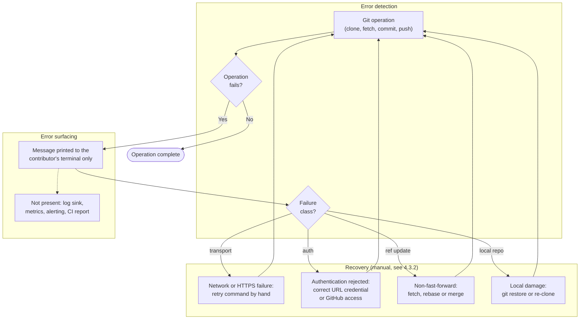

4.4.3 Error Handling Flowchart gives the detailed push-rejection path.

### 5.4.4 Authentication and Authorization Framework

The repository has no application authentication or authorization: no identity provider, sessions, tokens, roles, or permission checks (Auth0, from the default stack, is not present; see 3.4). Access control exists only at the repository level:

| Layer | Mechanism | Defined In |
|---|---|---|
| Authentication to GitHub | Credential embedded in the local `remote.origin.url` over HTTPS; no credential helper; prompts disabled | Local `.git/config` (untracked, environment-specific) |
| Authorization on the repository | GitHub repository permissions for `blitzytest02/OnetwoforOct526` | GitHub settings, outside the repository |
| Change ownership and review | No CODEOWNERS file, pull-request templates, or branch-protection definitions | Not defined |

The security assessment of this setup is in 5.3.5.

### 5.4.5 Performance Requirements and SLAs

The repository defines no performance requirements, SLAs, SLOs, or KPIs (see 1.2.3 Success Criteria). The measurable characteristics are:

| Characteristic | Observed Value |
|---|---|
| Tracked content size | One file, 17 bytes |
| Repository objects | Three (one commit, one tree, one blob) in one pack; no loose objects |
| Branches | Two (`main`, `One`) at the same commit |
| External service level | GitHub's own terms; the repository sets no target |

At this size, Git operations face no meaningful performance constraint, and no scalability measures (Git LFS, shallow or partial clones, sparse checkout) are configured.

### 5.4.6 Disaster Recovery Procedures

No backup scripts, runbooks, or recovery objectives (RPO, RTO) are defined. Recovery relies on Git's replication between the local clone and GitHub.

| Scenario | Recovery Source | Procedure | Data at Risk |
|---|---|---|---|
| Tracked file deleted or corrupted locally | Commit `0e301a6` | `git restore README.md` | Uncommitted edits |
| Branch pointer moved by mistake | Local reflog (`.git/logs/`) | Reset the branch to the commit shown in the reflog | None, if the reflog entry still exists |
| Local clone lost | GitHub remote | Clone again from `https://github.com/blitzytest02/OnetwoforOct526.git` | Unpushed commits |
| GitHub remote unavailable or lost | Local clone (full history) | Push the clone to a replacement remote | Commits that exist only on GitHub |
| Remote credential leaked | GitHub account settings | Revoke the credential, issue a new one, update `remote.origin.url` | None to content; possible unauthorized access until revoked |

Today the local clone and GitHub hold identical history: `main`, `origin/main`, and `origin/One` all point to `0e301a6`. Either copy can fully restore the other.

## 5.5 References

**Repository files and folders**

- `README.md` - The only tracked file. Its content is `# OnetwoforOct526` (17 bytes), stored as blob `a41f3cb` on both `main` and `One`.
- `` (repository root) - Contains only `README.md` and `.git/`. No source, manifest, configuration, CI, container, or infrastructure files, and no subfolders.

**Git metadata (local clone)**

- `.git/config` - Repository format version 0, non-bare, `core.filemode=true`, `core.logallrefupdates=true`, the HTTPS remote `origin` with an embedded credential (not reproduced), fetch refspec `+refs/heads/*:refs/remotes/origin/*`, `main` tracking `origin/main`, empty `credential.helper`, `credential.interactive=false`, `core.askpass=echo`.
- `.git/hooks/` - Only `.sample` files; no active hooks.
- `.git/objects/` - One pack holding three objects (commit `0e301a6`, tree `bf77f53`, blob `a41f3cb`); no loose objects; SHA-1 object format.
- `.git/packed-refs` - `origin/main` and `origin/One` at `0e301a63ba2224519532822a315ee6e29b809511`.
- `.git/logs/` - Reflog of local clone and checkout events.
- Commit `0e301a6` - Author `blitzytest02`, committer `GitHub`, 2026-10-05 12:57:49 +0530, "Initial commit", PGP signature that cannot be verified locally (status `E`).

**Technical Specification cross-references**

- 1.2 System Overview - No capabilities; core technical approach undetermined; repository structure diagram; no success criteria.
- 3.4 Third-Party Services - GitHub is the only external service; no `.github/`, authentication, monitoring, or cloud services; no secrets.
- 3.5 Databases & Storage - No database, cache, or storage; the Git repository is the only persisted data.
- 3.6 Development & Deployment - No build, test, container, IaC, CI/CD, or deployment target.
- 4.3 Technical Implementation - Git state, persistence points, and the recovery procedure table.
- 4.4 Required Diagrams - Contribution workflow, push error flow, integration sequence, and per-change state diagrams.

# 6. SYSTEM COMPONENTS DESIGN

## 6.1 Core Services Architecture

### 6.1.1 Applicability Assessment

**Core Services Architecture is not applicable for this system.**

The repository contains no software system, so it has no services to describe. Every branch (`main`, `origin/main`, `origin/One`) points to the single commit `0e301a6` ("Initial commit"), and that commit's tree holds one file: `README.md`, whose entire content is `# OnetwoforOct526` (17 bytes). Section 5.3.6 classifies the repository as a **source-hosted repository scaffold (Git + GitHub only)**.

#### Evidence Supporting the Verdict

| Criterion for a Services Architecture | Repository Evidence | Result |
|---|---|---|
| Executable service code (servers, workers, functions) | No source files; `README.md` is the only tracked file | Absent |
| Service or deployment descriptors (Dockerfile, Compose, Kubernetes manifests, serverless config, IaC) | None in the working tree or any branch; no `.github/` folder | Absent |
| Network interfaces between components (REST, gRPC, GraphQL, queues, events, webhooks) | None defined (see 5.3.2 Communication Pattern Choices) | Absent |
| Runtime infrastructure (load balancers, registries, gateways, orchestrators) | No configuration of any kind | Absent |
| Multiple independently deployable units | The repository holds 3 Git objects in total: commit `0e301a6`, tree `bf77f53`, blob `a41f3cb` | Absent |

#### What Exists Instead

The only distributed structure is Git's version-control model, described in 5.1 HIGH-LEVEL ARCHITECTURE:

- **Local clone.** A working tree plus a `.git` store that contains the full history.
- **GitHub remote.** The repository `blitzytest02/OnetwoforOct526`, which holds the same history on branches `main` and `One`.
- **Link.** Git over HTTPS. The contributor's Git client opens every connection, and each operation is a synchronous request and response.

None of these is an application service, and the repository contains no definition of any of them. Git and GitHub supply all of their behaviour. Sub-sections 6.1.2–6.1.4 go through each requested area, state that it is absent, and name the Git or GitHub mechanism that covers the concern today, if there is one.

#### Reassessment Trigger

The application architecture style is still an open decision (ADR-004 in 5.3.7 Architecture Decision Records), and so are communication (ADR-005) and storage (ADR-006). This section should be rewritten when the repository gains executable code together with service or deployment descriptors.

### 6.1.2 Service Components

The repository defines no service components. The tables below cover each requested area and record the closest equivalent that exists today.

#### Service Boundaries and Responsibilities

| Boundary | Responsibility | Defined By |
|---|---|---|
| Local clone (working tree + `.git`) | Holds the editable copy and the full history (3 objects, one pack) | Git defaults plus the local `.git/config` |
| GitHub remote `blitzytest02/OnetwoforOct526` | Off-site replica that hosts branches `main` and `One` | GitHub, outside the repository |
| Application services | None | Not present |

Neither boundary is a service that the repository implements or deploys. 5.1.2 Core Components Table gives the full component inventory.

#### Inter-Service Communication, Discovery, and Traffic Management

| Area | Status | Equivalent Today |
|---|---|---|
| Inter-service communication | Not applicable: there are no services | Git over HTTPS, synchronous and client-initiated. Changes reach the clone only on `git fetch` (refspec `+refs/heads/*:refs/remotes/origin/*`) and leave it only on `git push`. |
| Service discovery | Not present: no registry, DNS-based discovery, or service mesh | One static endpoint, `remote.origin.url`, set in the local `.git/config` |
| Load balancing | Not present: no load balancer, ingress, or proxy configuration | Whatever GitHub runs behind `github.com`, which is outside the repository |
| Circuit breaker | Not present | None. A failed Git command stops and prints an error. |
| Retry and fallback | Not present: no retry, backoff, or fallback logic (see 5.4.3 Error Handling Patterns) | A contributor reruns the command by hand. There is no secondary remote to fall back to. |

Prompts are disabled in the local configuration (`credential.interactive=false`, `core.askpass=echo`, empty `credential.helper`). An authentication failure therefore ends the operation at once instead of waiting for input.

#### Service Interaction Diagram

The diagram shows the only interaction path that exists. Dotted elements are typical service-tier components that the repository does not define.

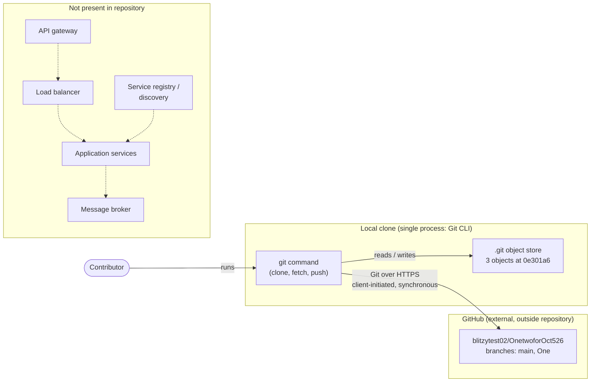

4.4.4 shows the step-by-step message sequence between contributor, working tree, local `.git`, and GitHub.

### 6.1.3 Scalability Design

The repository has no runtime workload and defines no scaling mechanism. The only thing that grows is the repository, and Git scales that by making full-copy clones.

#### Scaling Approach

| Area | Status | Evidence / Equivalent Today |
|---|---|---|
| Horizontal scaling | Not present for any runtime | Any number of clones can be made; each holds the complete history and works independently of the others |
| Vertical scaling | Not present | No instance sizes, resource requests, or limits are declared |
| Auto-scaling triggers and rules | Not present | No metrics source, scaling policy, orchestrator, or instance group is defined |
| Resource allocation | Not present | No container, VM, or function definitions; GitHub allocates the remote's capacity, which is outside the repository |
| Performance optimization | Not configured | No Git LFS (`.lfsconfig` absent), shallow or partial clone settings, or sparse checkout; Git's own packfile delta compression is the only optimization in effect |

#### Capacity Profile and Planning Guidelines

The repository sets no capacity targets, SLAs, or KPIs (see 5.4.5 Performance Requirements and SLAs). Current measured load:

| Dimension | Observed Value |
|---|---|
| Tracked content | 1 file (`README.md`), 17 bytes |
| Git objects | 3 (commit, tree, blob) in 1 pack, 0 loose |
| Branches | 2 (`main`, `One`), both at `0e301a6` |
| Remotes | 1 (`origin`, GitHub) |

At this size, Git operations face no capacity constraint. When the repository grows, these are the levers available, all standard Git or GitHub features and none of them configured yet:

- **Git LFS** to keep large binary assets out of the history.
- **Shallow or partial clones** (`--depth`, `--filter`) for clones that do not need the full history.
- **Sparse checkout** if the working tree becomes large.
- **Runtime capacity planning.** This starts only once services exist. ADR-004 in 5.3.7 remains undecided.

#### Scalability Architecture Diagram

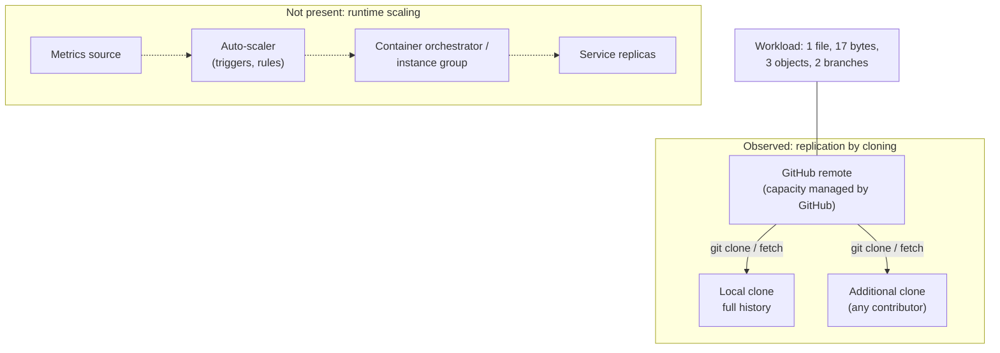

### 6.1.4 Resilience Patterns

The repository implements no application resilience patterns. Its resilience comes entirely from Git replicating the full history between the local clone and the GitHub remote, plus manual recovery steps.

#### Pattern Coverage

| Pattern Area | Status | Evidence / Equivalent Today |
|---|---|---|
| Fault tolerance | No automated mechanism | Git verifies object integrity through SHA-1 content addressing (repository format version 0). Failed operations stop and are rerun by hand (5.4.3). |
| Disaster recovery | No runbooks, backup scripts, RPO, or RTO | Restore from the surviving copy; 5.4.6 Disaster Recovery Procedures lists the procedures |
| Data redundancy | Two full copies | The local `.git` and the GitHub remote both hold commit `0e301a6`; no third copy or mirror is configured |
| Failover | Not present | One remote (`origin`) only; no secondary remote, mirror, or DNS failover |
| Service degradation | Not applicable | There are no features to degrade. Git keeps working offline (commit, log, checkout), and only fetch and push need GitHub. |

#### Failure Scenarios and Recovery

This is a summary; 5.4.6 has the full procedures.

| Failure | Impact | Recovery Path |
|---|---|---|
| GitHub unreachable (network or HTTPS failure) | Fetch and push fail; local work continues | Rerun when connectivity returns |
| Authentication rejected | Fetch and push fail at once (prompts disabled) | Correct `remote.origin.url` or GitHub access |
| Local clone lost or damaged | Uncommitted and unpushed work is lost | `git restore` from `HEAD`, or re-clone from GitHub |
| GitHub remote lost | Off-site copy gone | Push the local clone, which has the full history, to a replacement remote |
| Branch pointer moved by mistake | Branch shows the wrong commit | Reset using the local reflog (`core.logallrefupdates=true`) |

Today the two copies are identical (`main`, `origin/main`, and `origin/One` all at `0e301a6`), so either one can fully restore the other.

#### Resilience Pattern Diagram

Dotted elements are patterns that the repository does not implement.

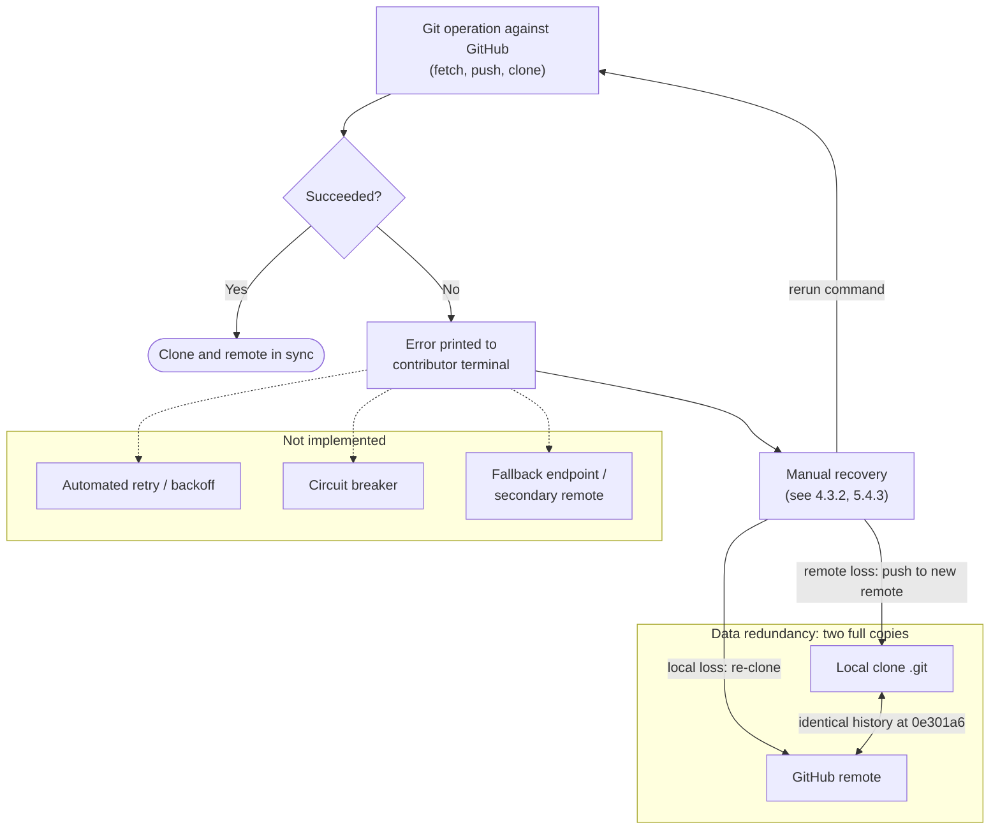

4.4.3 Error Handling Flowchart gives the detailed path for a rejected push.

### 6.1.5 References

#### Repository Files and Folders

- `README.md` - The only tracked file (17 bytes, content `# OnetwoforOct526`); declares no services, dependencies, or deployment.
- `` (repository root) - Contains only `README.md` and `.git/`; no source, manifests, Dockerfiles, Compose/Kubernetes manifests, IaC, or `.github/` folder.
- `.git/config` (local, untracked) - Single remote `origin` over HTTPS, fetch refspec, `branch.main` tracking, and disabled credential prompts; the only endpoint configuration that exists.
- `.git/packed-refs` (local) - `origin/main` and `origin/One` both at `0e301a6`.
- `.git/hooks/` (local) - Sample hooks only; no automation.
- `.git/objects/` (local) - One pack holding 3 objects (commit `0e301a6`, tree `bf77f53`, blob `a41f3cb`).

#### Technical Specification Cross-References

- 4.3.2 Error Handling - Manual recovery procedures for Git failures.
- 4.4.3 Error Handling Flowchart - Push-rejection recovery path.
- 4.4.4 - Sequence diagram of the contributor, working tree, local `.git`, and GitHub interactions.
- 5.1 HIGH-LEVEL ARCHITECTURE - System boundaries, component inventory, and GitHub as the only external integration.
- 5.3 TECHNICAL DECISIONS - Communication patterns (5.3.2), decision-tree classification (5.3.6), and open ADR-004 to ADR-007 (5.3.7).
- 5.4 CROSS-CUTTING CONCERNS - Absence of retry and circuit-breaker logic (5.4.3), no SLAs (5.4.5), and disaster recovery procedures (5.4.6).

## 6.2 Database Design

### 6.2.1 Applicability Assessment

**Database Design is not applicable to this system.**

The repository contains no application, so it has no database to design. Every reference (`main`, `origin/main`, `origin/One`) points to the single commit `0e301a6` ("Initial commit"). That commit's tree holds one file, `README.md`, whose entire content is `# OnetwoforOct526` (17 bytes). 3.5 Databases & Storage records that no databases, caches, or storage services exist, and 1.3.1 In-Scope records that the repository includes no data domains. ADR-006 (Data storage and caching) in 5.3.7 Architecture Decision Records is still **Undecided**.

#### Evidence Supporting the Verdict

| Criterion for a Database Design | Repository Evidence | Result |
|---|---|---|
| Database engine or service (relational, document, key-value) | No connection strings, drivers, or service definitions; the MongoDB of the default stack is not present (3.5) | Absent |
| Schema, models, or entity definitions | No `.sql` files, ORM models, or schema documents; `README.md` is the only tracked file | Absent |
| Migration tooling or scripts | No `migrations/` folder or migration framework configuration | Absent |
| Cache or session store | No cache client or configuration | Absent |
| Database provisioning (Compose, Kubernetes, IaC, `.env`) | None in the working tree or on any branch | Absent |
| Application code that reads or writes data | No source files of any kind | Absent |

#### What Is Persisted Instead

The Git repository is the only persisted data (3.5, 5.3.3 Data Storage Solution Rationale):

- **Local Git object store** (`.git/objects`): one pack file with 3 objects (commit `0e301a6`, tree `bf77f53`, blob `a41f3cb`), repository format version 0, SHA-1 object format.
- **References** (`.git/refs`, `.git/packed-refs`): the branch `main` and the remote-tracking refs `origin/main` and `origin/One`, all at `0e301a6`. No tags exist.
- **GitHub remote** `blitzytest02/OnetwoforOct526`: a full off-site copy of the same history.

Git defines these structures, and the repository does not configure them. Sub-sections 6.2.2–6.2.5 go through every requested area. Each one states that the database feature is absent and, where one exists, names the Git mechanism that does the same job today. The three requested diagrams are drawn on that Git data model, because it is the only data model present.

#### Reassessment Trigger

This section should be rewritten once the repository gains application code that persists data, or once ADR-006 is decided.

### 6.2.2 Schema Design

No application schema exists. The repository declares no entity, table, collection, or document type. The only structured data is Git's built-in object and reference model, which is documented below as the de facto data model.

#### Entity Relationships

There are no application entities and so no application relationships. The diagram shows Git's object model, filled in with the instances actually stored in this repository.

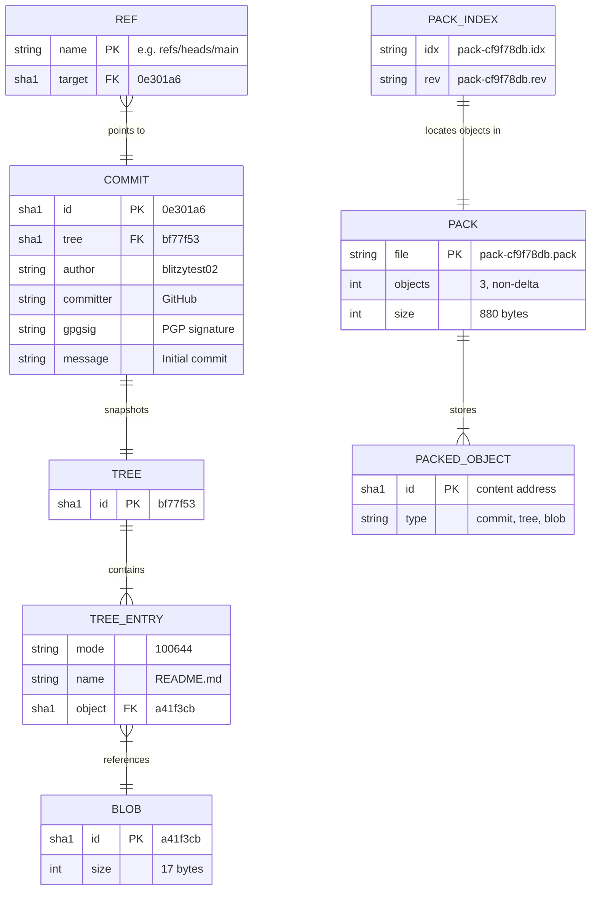

#### Data Models and Structures

| Entity (Git) | Observed Instances | Key | Content |
|---|---|---|---|
| Commit | 1: `0e301a6` (1,003 bytes) | SHA-1 of content | Tree `bf77f53`; author `blitzytest02`; committer GitHub; PGP signature; message "Initial commit"; no parent |
| Tree | 1: `bf77f53` (37 bytes) | SHA-1 of content | One entry: `100644 blob a41f3cb README.md` |
| Blob | 1: `a41f3cb` (17 bytes) | SHA-1 of content | `# OnetwoforOct526` |
| Reference | `refs/heads/main`, `refs/remotes/origin/main`, `refs/remotes/origin/One`; symbolic `HEAD` and `refs/remotes/origin/HEAD` | Ref name | Each resolves to `0e301a6`; `refs/tags/` is empty |

`git rev-list --all --count` returns 1, so the whole dataset is one commit, one tree, and one blob.

#### Indexing Strategy

No database index is defined. All of the index structures below are created and maintained by Git itself.

| Structure | Kind | Purpose | Observed |
|---|---|---|---|
| `.git/objects/pack/pack-cf9f78db….idx` | Pack index (object ID → offset) | Looks up any object by its SHA-1 without scanning the pack | 1,156 bytes; read-only (`r--r--r--`) |
| `.git/objects/pack/pack-cf9f78db….rev` | Reverse index (offset → object) | Maps pack positions back to object IDs | 64 bytes; read-only |
| `.git/index` | Staging index | Caches path, mode, blob ID, and file stat data so changes can be detected quickly | 137 bytes; one entry `README.md` (stage 0, size 17) |
| `.git/packed-refs` | Sorted reference file | Resolves remote-tracking refs from a single file | Header `peeled fully-peeled sorted`; 2 entries |

#### Constraints

There are no database constraints (primary keys, foreign keys, unique, check, or not-null). Git enforces the following integrity rules on the stored data:

| Constraint | Type | Enforcement | Status |
|---|---|---|---|
| Object ID = SHA-1 of the object's content | Primary key / uniqueness | Content addressing: an identical object cannot be stored twice, and changing content produces a new ID | Holds; `git fsck --full` reports no errors |
| Commit → tree, tree entry → blob | Referential integrity | Every referenced object must exist in the store | Holds; `git verify-pack` reports the pack `ok` |
| Ref → commit | Referential integrity | Each ref must resolve to an existing commit | All refs resolve to `0e301a6` |
| Objects are immutable once written | Immutability | Pack files are written read-only | `.pack`, `.idx`, `.rev` are `r--r--r--` |

#### Partitioning Approach

No partitioning is defined: there is no partition key, shard, or table split. All objects sit in a single pack file. The only way the data is divided is by branch namespace (`main`, `One`), and both branches currently point to the same commit, so even that division separates nothing.

#### Replication Configuration

No database replication exists. Git's clone model is the only replication in place. The GitHub remote and the local clone each hold the full history, and they are synchronized only when a contributor runs `git fetch` or `git push` by hand.

| Setting | Value | Effect |
|---|---|---|
| Remote | `origin` over HTTPS to `github.com` | Single upstream; no mirror or secondary remote |
| Fetch refspec | `+refs/heads/*:refs/remotes/origin/*` | Every remote branch is copied to a remote-tracking ref; the leading `+` permits forced updates |
| Push endpoint | Same as `remote.origin.url` (no `pushurl`) | Reads and writes use one endpoint |
| Upstream tracking | `branch.main.remote=origin`, `branch.main.merge=refs/heads/main` | `main` tracks `origin/main` |

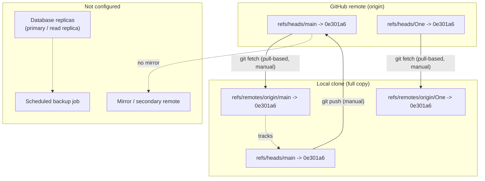

Replication is asynchronous and happens only when a contributor runs a command. No replication lag is measured, and nothing fails over automatically (see 6.1.4 Resilience Patterns).

#### Backup Architecture

No backup architecture is defined: there are no dump scripts, snapshots, scheduled jobs, retention schedules, RPO, or RTO. The data is protected only by redundancy:

| Copy | Location | Completeness |
|---|---|---|
| Local clone | `.git/` in the working directory | Full history (3 objects) plus the local-only reflog |
| GitHub remote | `blitzytest02/OnetwoforOct526` | Full history on branches `main` and `One` |

Because both copies are identical at `0e301a6`, either one can rebuild the other. 5.4.6 Disaster Recovery Procedures describes the recovery steps.

### 6.2.3 Data Management

No application data management exists. The tables below cover each requested area and record how Git handles the repository's own content today.

#### Migration Procedures

| Area | Status | Equivalent Today |
|---|---|---|
| Schema migrations | Not present: no migration framework, scripts, or `migrations/` folder | None |
| Data migrations or seed data | Not present: no fixtures, seed files, or import scripts | None |
| Storage-format migration | Not performed | Repository format version 0 with the default SHA-1 object format; `extensions.objectformat` is not set, so the SHA-256 format is not in use |

#### Versioning Strategy

There is no schema version and no migration ledger. Content is versioned only through Git:

| Mechanism | Observed State |
|---|---|
| Commits | 1 commit (`0e301a6`), the root of the history |
| Branches | `main` (default, tracks `origin/main`) and `One`, both at `0e301a6` |
| Tags / release versions | None (`refs/tags/` is empty) |
| Version metadata files (`VERSION`, `CHANGELOG`, manifest versions) | None |

#### Archival Policies

No archival policy is defined. Nothing is tiered, exported, or moved to cold storage. Every clone keeps the full history: the repository uses no Git LFS (`.lfsconfig` absent), and no shallow or partial clone settings are configured.

#### Data Storage and Retrieval Mechanisms

All reads and writes go through the Git command line. The repository adds no data-access layer, repository pattern, or API of its own.

| Operation | Command | Store Affected |
|---|---|---|
| Stage a change | `git add` | Writes blob to `.git/objects`; updates `.git/index` |
| Persist a version | `git commit` | Writes tree and commit objects; advances `refs/heads/main`; appends to `.git/logs` |
| Read content or history | `git checkout`, `git restore`, `git log`, `git cat-file` | Reads `.git/objects` via the pack index |
| Publish to the remote | `git push` (HTTPS) | Sends objects and ref updates to GitHub |
| Retrieve from the remote | `git fetch` / `git clone` (HTTPS) | Receives packs into `.git/objects`; updates `refs/remotes/origin/*` |

#### Data Flow Diagram

Dotted elements are a typical application data tier that the repository does not define.

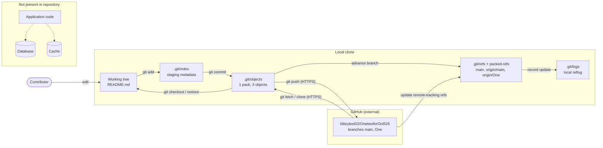

4.4.4 shows the same interactions as a message sequence.

#### Caching Policies

No cache is configured, so there are no TTLs, eviction rules, or invalidation policies. Two built-in Git structures behave like caches (5.3.4 Caching Strategy Justification):

| Structure | Cached Data | Invalidation |
|---|---|---|
| Remote-tracking refs (`origin/main`, `origin/One`) | Last known position of each GitHub branch | Refreshed only by `git fetch`; stale in between |
| `.git/index` | File stat data for `README.md` (mtime, ctime, inode, size 17) | Rewritten by `git add`, commit, and checkout |

### 6.2.4 Compliance Considerations

The repository declares no regulatory, contractual, or organisational data requirements (2.6 Assumptions, Constraints, and Requirement Versioning), and it holds no application data that such requirements could apply to. The controls below are the ones currently in effect on the Git data.

#### Data Retention Rules

No retention policy is defined. No `gc.*` or `pack.*` settings appear in the local or global Git configuration, so Git's built-in housekeeping defaults apply. These govern only the local clone.

| Data | Retention in Effect | Scope |
|---|---|---|
| Reachable commits, trees, blobs | Kept indefinitely; never expired | Local clone and GitHub |
| Reflog entries (`.git/logs`) | Git default: 90 days for reachable entries, 30 days for unreachable ones, expired during `git gc` | Local clone only |
| Unreachable objects | Git default: pruned by `git gc` once older than 2 weeks | Local clone only |
| Data on GitHub | Governed by GitHub, not by the repository | Remote |

Today the history has no unreachable objects, and the reflog records only the clone and two checkouts.

#### Backup and Fault Tolerance Policies

| Area | Status | Equivalent Today |
|---|---|---|
| Backup policy (schedule, retention, off-site copy) | Not defined | Two full copies: the local `.git` and the GitHub remote (6.2.2 Backup Architecture) |
| Integrity verification | Not scheduled | Can be run by hand: `git fsck --full` reports no errors and `git verify-pack` reports the pack `ok` |
| Fault tolerance | No automated mechanism | Manual recovery: re-clone, restore from `HEAD`, or push to a replacement remote (6.1.4, 5.4.6) |

#### Privacy Controls

| Concern | Observed State |
|---|---|
| Personal or sensitive data domains | None: the only tracked content is `# OnetwoforOct526` |
| Personal metadata | Commit `0e301a6` holds the author name `blitzytest02` and an e-mail address. The local reflog holds the identity of the cloning agent. This document does not reproduce the e-mail addresses. |
| Encryption in transit | HTTPS to `github.com` |
| Encryption at rest | None configured in the repository; on GitHub it is whatever GitHub provides |
| Credentials | A credential is embedded in plain text in `remote.origin.url` in `.git/config`. That file is untracked but world-readable (`-rw-r--r--`). This document does not reproduce the credential (see 5.3.5 Security Mechanism Selection). |
| Data masking, anonymisation, consent records | Not applicable: no application data |

#### Audit Mechanisms

There are no database audit logs, triggers, or change-data-capture streams. Git keeps two records of changes:

| Record | Content | Limitation |
|---|---|---|
| Commit history | Author `blitzytest02`, committer GitHub, timestamp, and message for `0e301a6`, plus a PGP signature | The local clone cannot verify the signature (status `E`: the signing key is not in the local keyring) |
| Reflog (`.git/logs/HEAD`, `refs/heads/main`, `refs/remotes/origin/HEAD`) | Every local ref movement (enabled by `core.logallrefupdates=true`) | Local only, never pushed, and expires under the retention defaults above |

#### Access Controls

| Layer | Control in Effect | Gap |
|---|---|---|
| Database roles and users | None (no database) | Not applicable |
| Local files | POSIX permissions: tracked files and `.git` metadata are `-rw-r--r--` (owner `root`); pack files are `-r--r--r--` | Any local user can read `.git/config`, including the embedded credential |
| Remote repository | GitHub account and repository permissions, managed outside the repository | The repository defines no CODEOWNERS file or branch protection |
| Authentication flow | HTTPS with the URL-embedded credential; `credential.helper` is empty and prompts are disabled (`credential.interactive=false`, `core.askpass=echo`) | A rejected credential makes the operation fail at once (6.1.4) |

### 6.2.5 Performance Optimization

No database workload exists, so there are no queries to optimise and no performance targets: the repository defines no SLAs or KPIs (5.4.5 Performance Requirements and SLAs). The table records, for each requested area, its status and the closest Git equivalent.

#### Optimization Coverage

| Area | Status | Equivalent Today |
|---|---|---|
| Query optimization patterns | Not present: no queries, query builder, or ORM | Object lookup by SHA-1 through the pack index (`.idx`), with no scanning |
| Caching strategy | Not present: no cache tier | Remote-tracking refs and `.git/index` (6.2.3 Caching Policies) |
| Connection pooling | Not present: no database driver or pool configuration | Each `git fetch` or `git push` opens its own HTTPS session to `github.com`; nothing is pooled |
| Read/write splitting | Not present: no primary or read replicas | One endpoint for both: `remote.origin.url` serves fetch and push, and no `pushurl` is set |
| Batch processing approach | Not present: no batch jobs, bulk loaders, or schedulers | Git transfers objects in packs; all 3 objects sit in one pack |

#### Observed Storage Profile

| Object | Logical Size (bytes) | Size in Pack (bytes) |
|---|---|---|
| Commit `0e301a6` | 1,003 | 773 |
| Tree `bf77f53` | 37 | 48 |
| Blob `a41f3cb` | 17 | 27 |
| Pack file total | — | 880 (no delta chains: 3 non-delta objects) |

At this size no performance tuning is needed. No compression, packing, or garbage-collection settings are overridden (`core.compression`, `pack.*`, `gc.*` are unset), so Git's defaults apply. The Git-level levers available as the repository grows (Git LFS, shallow or partial clones, sparse checkout) are listed in 6.1.3 Scalability Design. Database-level tuning becomes relevant only once ADR-006 picks a data store.

### 6.2.6 References

#### Repository Files and Folders

- `README.md` - The only tracked file (blob `a41f3cb`, 17 bytes, content `# OnetwoforOct526`); declares no database, schema, or storage.
- `` (repository root) - Contains only `README.md` and `.git/`; no SQL, migrations, ORM models, Compose/Kubernetes manifests, IaC, or `.env` files.
- `.git/objects/pack/` (local) - One pack `pack-cf9f78db…` (`.pack` 880 bytes, `.idx` 1,156 bytes, `.rev` 64 bytes, all read-only) holding 3 non-delta objects; source of the data model, indexing, and storage profile.
- `.git/index` (local) - Staging index with one entry (`README.md`, stage 0, size 17).
- `.git/packed-refs` (local) - Sorted ref file; `origin/main` and `origin/One` at `0e301a6`.
- `.git/refs/` (local) - `heads/main`, `remotes/origin/HEAD`; `tags/` empty.
- `.git/logs/` (local) - Reflog of the clone and checkout events; the local audit trail.
- `.git/config` (local, untracked) - Single HTTPS remote `origin`, fetch refspec, `branch.main` tracking, disabled credential prompts; no `pushurl`, `gc.*`, or `pack.*` settings.
- `.git/HEAD` (local) - Symbolic ref to `refs/heads/main`.

#### Technical Specification Cross-References

- 1.3.1 In-Scope - No data domains.
- 2.6 Assumptions, Constraints, and Requirement Versioning - No regulatory or technical constraints declared.
- 3.5 Databases & Storage - No databases, caches, or storage; Git is the only persisted data.
- 4.4.4 - Sequence diagram of contributor, working tree, local `.git`, and GitHub interactions.
- 5.3 TECHNICAL DECISIONS - Data storage rationale (5.3.3), cache-like Git structures (5.3.4), security mechanisms (5.3.5), and ADR-006 Undecided (5.3.7).
- 5.4 CROSS-CUTTING CONCERNS - No SLAs (5.4.5); disaster recovery procedures (5.4.6).
- 6.1 Core Services Architecture - Scalability levers (6.1.3) and resilience/failure recovery (6.1.4).

## 6.3 Integration Architecture

### 6.3.1 Applicability Assessment

**Integration Architecture is not applicable for this system.**

The repository contains no software that exposes or consumes an interface. Every ref (`main`, `origin/main`, `origin/One`) points to the single commit `0e301a6` ("Initial commit"). That commit's tree holds one file, `README.md`, whose entire content is `# OnetwoforOct526` (17 bytes). Nothing in the repository defines an API, a message flow, or a third-party integration. Section 5.3.6 classifies the repository as a **source-hosted repository scaffold (Git + GitHub only)**.

#### Evidence Supporting the Verdict

| Integration Criterion | Repository Evidence | Result |
|---|---|---|
| Exposed APIs (routes, handlers, schemas, RPC definitions) | No source files; `README.md` is the only tracked file on every branch | Absent |
| Outbound clients or SDKs for third-party services | No dependency manifest, lockfile, or client code | Absent |
| Messaging (brokers, queues, streams, event handlers, webhooks) | No configuration; no `.github/` folder; `.git/hooks` holds only `.sample` files | Absent |
| Batch or scheduled jobs | No scheduler, cron, or job definitions | Absent |
| API gateway, proxy, or service-mesh configuration | None tracked; no `http.proxy`, `url.*.insteadOf`, or `pushurl` in the local Git configuration | Absent |
| Integration endpoints or secrets in tracked files (`.env`, config files) | None (see 3.4 Third-Party Services) | Absent |

#### What Exists Instead

One interface crosses the repository boundary: **Git's smart HTTP protocol between the local Git client and GitHub**, the transport behind `git clone`, `git fetch`, `git ls-remote`, and `git push`. Git and GitHub implement it; the repository defines none of it. Its behaviour was observed directly on 2026-10-05 by tracing a `git ls-remote origin` exchange. Sub-sections 6.3.2–6.3.4 document that boundary under each requested heading and mark every application-level element as absent.

#### Reassessment Trigger

The communication pattern is an open decision (ADR-005 in 5.3.7 Architecture Decision Records). This section should be rewritten when the repository gains code that exposes or consumes an API, messaging infrastructure, or a third-party SDK or service configuration.

### 6.3.2 API Design

The repository exposes no application API. The only API in use is GitHub's Git smart HTTP interface, which the local Git client consumes. Each area below states what the repository defines (nothing) and what was observed at the Git boundary.

#### Protocol Specifications

| Attribute | Observed Value | Evidence |
|---|---|---|
| Transport | HTTPS over HTTP/2 to `github.com` | Request lines `... HTTP/2`; responses `HTTP/2 200` |
| Application protocol | Git smart HTTP, wire protocol version 2 | Client header `Git-Protocol: version=2`; server advertisement begins `version 2` |
| Client | User agent `git/2.43.0` | `git --version`; `protocol.version` unset, so Git's default applies |
| Server | GitHub's Git service (`server: GitHub-Babel/3.0`, `agent=git/github-<build>-Linux`) | Response headers and capability advertisement |
| Object format | `sha1` on both client and server | Capability `object-format=sha1`; repository format version 0 |
| Endpoint base | `https://github.com/blitzytest02/OnetwoforOct526.git` | `remote.origin.url` in local `.git/config` (credential omitted here) |

**Endpoints.** Paths are relative to `/blitzytest02/OnetwoforOct526.git`.

| Endpoint | Method | Purpose | Content Type |
|---|---|---|---|
| `/info/refs?service=git-upload-pack` | GET | Capability and ref advertisement for reads | `application/x-git-upload-pack-advertisement` (observed) |
| `/git-upload-pack` | POST | `ls-refs` and `fetch` commands | Request `application/x-git-upload-pack-request`; response `application/x-git-upload-pack-result` (observed) |
| `/info/refs?service=git-receive-pack` | GET | Ref advertisement for pushes | Not exercised |
| `/git-receive-pack` | POST | Ref update commands and packfile upload | Not exercised |

**Server capabilities advertised by GitHub**

| Capability | Meaning for This Integration |
|---|---|
| `ls-refs=unborn` | Lists refs and can report an unborn default branch |
| `fetch=shallow wait-for-done filter` | Shallow and partial-clone fetches are available; none is configured locally (see 6.1.3) |
| `server-option` | Clients may send server options; none are used |
| `object-format=sha1` | Matches the local repository's object format |

The observed `ls-refs` response listed `HEAD` (symbolic ref to `refs/heads/main`), `refs/heads/main`, and `refs/heads/One`, all at `0e301a63ba2224519532822a315ee6e29b809511`. This matches the local `origin/main` and `origin/One`, so the clone is in sync with GitHub.

#### Authentication Methods

| Operation | Mechanism | Evidence |
|---|---|---|
| Read (clone, fetch, ls-remote) | None required | An anonymous `ls-remote` with no credential and prompts disabled succeeded, so the repository is publicly readable |
| Write (push) | Credential embedded in the local `remote.origin.url`, sent over HTTPS | Not exercised. The credential is stored in plain text in the untracked `.git/config` and is not reproduced (see 5.3.5) |
| Credential acquisition | No credential helper; no prompting | `credential.helper` empty, `credential.interactive=false`, `core.askpass=echo`; a rejected credential fails the command at once |
| Application authentication | Not present | No identity provider, tokens, sessions, or API keys; Auth0 from the default stack is absent (see 3.4) |

#### Authorization Framework

The repository defines no authorization model: no roles, scopes, policies, or permission checks. Access to the repository is governed by GitHub:

- **Read:** open to anyone, as the anonymous `ls-remote` demonstrated.
- **Write:** controlled by GitHub permissions on `blitzytest02/OnetwoforOct526`, configured outside the repository.
- **Change control:** no CODEOWNERS file, pull-request templates, or branch-protection definitions exist in the repository (no `.github/` folder; see 5.4.4).

#### Rate Limiting Strategy

The repository defines no rate limiting. There is no client-side throttling, gateway, or quota configuration, and no code calls GitHub's REST or GraphQL APIs. GitHub's observed Git HTTP responses carried no `x-ratelimit-*` or `retry-after` headers. Any limits GitHub enforces on Git traffic are server-side and outside the repository. Load is minimal: commands run on demand by a contributor against a single pack of three objects.

#### Versioning Approach

| Layer | Versioning in Effect |
|---|---|
| Wire protocol | Negotiated per request: the client sends `Git-Protocol: version=2` and the server confirms `version 2` |
| Object format | `sha1`, repository format version 0 |
| Content | Git commits only: one commit (`0e301a6`), no tags, no release or semantic-versioning scheme |
| Application API | Not present: no URL, header, or schema versions |

#### Documentation Standards

No API documentation exists: no OpenAPI or Swagger file, GraphQL schema, protobuf definition, AsyncAPI document, or request collection. `README.md` contains only the project title. The Git smart HTTP protocol is specified by the Git project, outside the repository. This section and 5.1.4 External Integration Points are the only integration documentation.

#### API Architecture Diagram

Solid elements were observed or configured; dotted elements are typical API-tier components that the repository does not define.

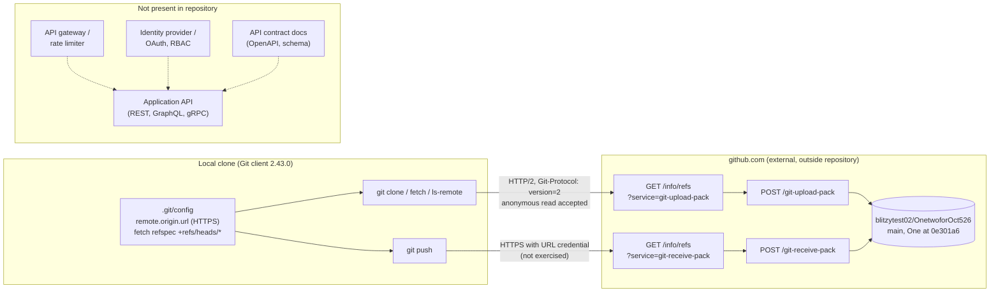

#### Read Path Sequence (Observed)

This is the exchange traced for `git ls-remote origin`; `git fetch` follows the same path and adds the `fetch` command when objects are missing.

```mermaid
sequenceDiagram
    autonumber
    actor Dev as Contributor
    participant Git as Git client 2.43.0
    participant GH as GitHub smart HTTP
    participant Repo as blitzytest02/OnetwoforOct526
    Dev->>Git: git fetch origin (or ls-remote)
    Git->>GH: GET /info/refs?service=git-upload-pack<br/>Git-Protocol: version=2
    GH-->>Git: 200 upload-pack-advertisement<br/>version 2, ls-refs=unborn, fetch=shallow wait-for-done filter,<br/>server-option, object-format=sha1
    Git->>GH: POST /git-upload-pack command=ls-refs
    GH->>Repo: read refs
    Repo-->>GH: HEAD to main, main, One at 0e301a6
    GH-->>Git: 200 upload-pack-result (ref list)
    alt Remote has commits the clone lacks
        Git->>GH: POST /git-upload-pack command=fetch (want / have)
        GH-->>Git: 200 packfile with missing objects
        Git->>Git: store objects, update origin/main and origin/One
    else Clone already up to date (observed state)
        Git->>Git: no objects transferred
    end
    Git-->>Dev: exit status 0 or error message
```

### 6.3.3 Message Processing

The repository implements no message processing. All data exchange is synchronous: each Git command opens its own HTTPS requests, receives its responses on the same connection, and ends. Between commands, no message persists anywhere except the local `.git` store and GitHub's copy of the repository.

#### Processing Pattern Coverage

| Area | Status | Equivalent Today |
|---|---|---|
| Event processing patterns | Not present: no event handlers, webhooks, or GitHub Actions workflows (no `.github/`); `.git/hooks` holds only `.sample` files | None. A commit or push triggers nothing that the repository defines. |
| Message queue architecture | Not present: no broker, queue client, topic, or queue configuration | None |
| Stream processing design | Not present: no stream platform or consumer code | Git sends packfile data in the body of a single HTTP response during a fetch. This is internal to Git, not a stream-processing design. |
| Batch processing flows | Not present: no scheduler, cron entry, or job definition | Each fetch or push moves the objects it needs as one packfile, started by hand. Today the whole history is one pack of three objects. |
| Error handling strategy | No retry, backoff, dead-letter queue, or idempotency keys (see 5.4.3) | Git fails the command and prints an error; the contributor reruns it |

#### Message Units in the Git Exchange

These are the only "messages" that cross the boundary, all encoded as Git pkt-lines inside HTTP bodies.

| Unit | Direction | Observed in This Repository |
|---|---|---|
| Capability advertisement | GitHub to client | `version 2`, `ls-refs=unborn`, `fetch=shallow wait-for-done filter`, `server-option`, `object-format=sha1` |
| `ls-refs` command | Client to GitHub | `command=ls-refs`, `agent=git/2.43.0`, `object-format=sha1` |
| Ref list | GitHub to client | Three refs (`HEAD`, `main`, `One`) at `0e301a6` |
| `fetch` command and packfile | Both directions | Not needed: the clone already holds every object |
| Push commands and `report-status` | Both directions | Not exercised |

#### Error Handling Strategy

| Failure | Detection | Handling |
|---|---|---|
| Network or TLS failure reaching `github.com` | Git command exits with an error | Rerun by hand once connectivity returns |
| Credential rejected on push (HTTP 401 or 403) | HTTP status | Fails at once (no helper, prompts disabled); correct the credential or GitHub access |
| Non-fast-forward push | Client compares local and advertised refs | Fetch, rebase or merge, then push again |
| Server-side rejection of a ref | `report-status` reply | No server-side rules are defined in the repository; a rejection would show as a failed ref |
| Interrupted fetch | Git command exits with an error | Rerun. Objects are content-addressed and the want/have negotiation skips objects already present, so a rerun is safe. |

Errors appear only on the contributor's terminal. Nothing is logged centrally, queued for retry, or sent as a notification.

#### Message Flow Diagram

Solid elements show the synchronous exchange that exists; dotted elements are asynchronous-processing components that the repository does not define.

```mermaid
flowchart LR
    subgraph Observed["Observed: synchronous Git exchange"]
        Req["Client request<br/>pkt-line commands<br/>(ls-refs, fetch, push)"]
        Srv["GitHub smart HTTP<br/>service handler"]
        Resp["Response<br/>ref list or packfile,<br/>push status"]
        Apply["Local apply<br/>objects + ref update"]
        Fail["Error on terminal<br/>manual rerun"]
    end
    subgraph Missing["Not present: asynchronous processing"]
        Prod["Event producer"]
        Broker["Queue / broker /<br/>stream"]
        Cons["Consumer / worker"]
        Dlq["Dead-letter queue"]
        Sched["Batch scheduler<br/>(cron)"]
    end
    Req -->|"HTTP POST"| Srv
    Srv -->|"same connection"| Resp
    Resp --> Apply
    Srv -->|"4xx / 5xx, rejected ref"| Fail
    Prod -.-> Broker -.-> Cons
    Cons -.-> Dlq
    Sched -.-> Cons
```

### 6.3.4 External Systems

GitHub is the only external system. The repository reaches it through the `origin` remote and integrates with nothing else.

#### Third-Party Integration Patterns

| Pattern | Used | Evidence |
|---|---|---|
| Git remote over smart HTTP (GitHub) | Yes | `remote.origin.url`; observed upload-pack exchange (6.3.2) |
| Third-party REST or GraphQL APIs, SDKs | No | No dependency manifest, lockfile, or client code |
| Inbound webhooks or callbacks | No | No endpoint exists to receive them; no `.github/` configuration |
| CI/CD integration (GitHub Actions or other) | No | No `.github/` folder or pipeline files (see 3.6) |
| Cloud, identity, or monitoring services (AWS, Auth0) | No | No SDKs, account settings, or resource definitions (see 3.4) |

The integration is **client-initiated and pull-based**: the clone receives remote changes only on `git fetch` (refspec `+refs/heads/*:refs/remotes/origin/*`) and publishes only on `git push`. GitHub never contacts the clone.

#### Legacy System Interfaces

None. The repository has no file-transfer jobs, database links, SOAP or mainframe adapters, or data-migration scripts. `README.md` names no predecessor system.

#### API Gateway Configuration

None. No gateway, reverse proxy, ingress, or service mesh is defined. The Git client reaches `github.com` directly:

- No `http.proxy`, `url.*.insteadOf` rewrite, or `pushurl` is set in the local, global, or system Git configuration, so fetch and push share the single endpoint in `remote.origin.url`.
- GitHub's own edge infrastructure, indicated by the `x-github-edge-region` and `strict-transport-security` response headers, is outside the repository.

#### External Service Contracts

The repository records no formal contract with GitHub. The effective contract, as observed:

| Contract Element | Value | Source |
|---|---|---|
| Provider and resource | GitHub, repository `blitzytest02/OnetwoforOct526` | `remote.origin.url` |
| Published refs | `main` (default, `HEAD`) and `One`, both at `0e301a6` | Observed `ls-refs` response |
| Interface | Git smart HTTP over HTTPS (HTTP/2); protocol v2 for reads | Request and response traces |
| Access model | Public read; credentialed write | Anonymous `ls-remote` succeeded; push credential in local config |
| Data exchanged | Ref lists and packfiles; current history is 3 objects (commit `0e301a6`, tree `bf77f53`, blob `a41f3cb`) | `.git/objects` pack contents |
| Service levels | None defined in the repository; governed by GitHub's own terms | See 5.1.4 External Integration Points |

#### External Dependency Inventory

| Dependency | Type | Declared In | Status |
|---|---|---|---|
| GitHub (`github.com`) | Hosted Git service | Local `.git/config` (untracked, environment-specific) | In use |
| Git client 2.43.0 | Local command-line tool | Environment only; the repository pins no version | In use |
| Third-party APIs, SDKs, packages | Not applicable | No manifest or lockfile exists | None |
| Identity provider, cloud platform, monitoring service | Not applicable | No configuration exists | None |

#### Integration Flow Diagram

```mermaid
flowchart TB
    Dev(["Contributor"])
    subgraph Local["Local environment"]
        Cli["Git CLI 2.43.0"]
        Store[".git object store<br/>3 objects, 1 pack"]
        Tracking["Remote-tracking refs<br/>origin/main, origin/One"]
    end
    subgraph External["External system"]
        GH["GitHub<br/>blitzytest02/OnetwoforOct526"]
    end
    subgraph NotPresent["Not present: no integration code or configuration"]
        ThirdParty["Third-party APIs / SDKs"]
        Hooks["Webhooks / GitHub Actions"]
        Legacy["Legacy systems /<br/>file drops"]
        Cloud["Cloud services (AWS)<br/>Auth0, monitoring"]
    end
    Dev -->|"runs command"| Cli
    Cli <-->|"read / write objects"| Store
    Cli -->|"Git smart HTTP over HTTPS<br/>client-initiated, synchronous"| GH
    GH -->|"ref advertisement,<br/>packfile"| Cli
    Cli -->|"update on fetch"| Tracking
    GH -. "no outbound calls" .-> Hooks
    Cli -. "no clients" .-> ThirdParty
    Cli -. "no adapters" .-> Legacy
    Cli -. "no SDKs" .-> Cloud
```

#### Write Path Sequence (Not Exercised)

The push path follows standard Git smart HTTP behaviour combined with the local credential settings. It was not run, so no write to GitHub was made. The fast-forward check happens on the client, against the refs GitHub advertises.

```mermaid
sequenceDiagram
    autonumber
    actor Dev as Contributor
    participant Git as Git client 2.43.0
    participant GH as GitHub smart HTTP
    participant Repo as blitzytest02/OnetwoforOct526
    Note over Git,GH: Push path from standard Git smart HTTP behaviour, not exercised
    Dev->>Git: git push origin main
    Git->>GH: GET /info/refs?service=git-receive-pack<br/>credential from remote.origin.url
    alt Credential rejected
        GH-->>Git: 401 or 403
        Git-->>Dev: fail fast (no helper, prompts disabled)
    else Credential accepted
        GH-->>Git: 200 receive-pack ref advertisement
        Git->>Git: compare advertised main with local main
        alt Not a fast-forward
            Git-->>Dev: rejected locally, fetch then rebase or merge
        else Fast-forward
            Git->>GH: POST /git-receive-pack<br/>ref update command + packfile
            GH->>Repo: write objects, update refs/heads/main
            Repo-->>GH: ref updated
            GH-->>Git: report-status ok
            Git-->>Dev: push complete
        end
    end
```

4.4.4 shows the full contributor-to-GitHub interaction, including the working tree and local `.git` steps.

### 6.3.5 References

#### Repository Files and Folders

- `README.md` - The only tracked file on every branch (17 bytes, content `# OnetwoforOct526`); declares no API, messaging, or third-party integration.
- `` (repository root) - Contains only `README.md` and `.git/`; no source code, manifests, API specifications, `.env` or config files, gateway definitions, or `.github/` folder.
- `.git/config` (local, untracked) - Single remote `origin` over HTTPS with an embedded credential (not reproduced), fetch refspec `+refs/heads/*:refs/remotes/origin/*`, `branch.main` tracking, empty `credential.helper`, `credential.interactive=false`, `core.askpass=echo`; no proxy, URL rewrite, `pushurl`, or `protocol.version` settings.
- `.git/packed-refs` (local) - `origin/main` and `origin/One` at `0e301a6`, matching the refs GitHub advertised.
- `.git/hooks/` (local) - Sample hooks only; no event-driven automation.
- `.git/objects/` (local) - One pack of three objects (commit `0e301a6`, tree `bf77f53`, blob `a41f3cb`), the full payload any integration exchange could carry.

#### Observed Integration Behaviour

- `git ls-remote origin` with packet and HTTP tracing (2026-10-05) - Confirmed Git smart HTTP over HTTP/2, protocol v2 negotiation, endpoint paths and content types, GitHub's capability advertisement, and the remote ref list at `0e301a6`.
- Anonymous `git ls-remote` against the public URL with no credential (2026-10-05) - Confirmed public read access; the response headers carried no rate-limit fields.
- `git --version` - Git client 2.43.0.

#### Technical Specification Cross-References

- 3.4 Third-Party Services - GitHub is the only external service; no APIs, SDKs, webhooks, Auth0, AWS, or monitoring.
- 3.6 Development & Deployment - No CI/CD or `.github/` configuration.
- 4.4.4 - Sequence diagram of the contributor, working tree, local `.git`, and GitHub interactions.
- 5.1 HIGH-LEVEL ARCHITECTURE - System boundaries and 5.1.4 External Integration Points (GitHub, no SLA).
- 5.3 TECHNICAL DECISIONS - Communication patterns (5.3.2), security mechanisms (5.3.5), classification (5.3.6), and open ADR-005 (5.3.7).
- 5.4 CROSS-CUTTING CONCERNS - Error handling patterns (5.4.3) and the authentication and authorization framework (5.4.4).
- 6.1 Core Services Architecture - Not-applicable verdict, static endpoint, no retry or circuit breaker, and partial-clone and shallow-clone levers (6.1.3).

## 6.4 Security Architecture

### 6.4.1 Applicability Assessment

**Detailed Security Architecture is not applicable for this system.**

The repository contains no software to secure. Every ref (`main`, `origin/main`, `origin/One`) points to the single commit `0e301a6` ("Initial commit"), whose tree holds one file, `README.md`, with the content `# OnetwoforOct526` (17 bytes). The repository has no users, identities, sessions, roles, protected resources, or data domains, so it needs no application authentication, authorization, or data-protection design. Section 5.3.6 classifies it as a **source-hosted repository scaffold (Git + GitHub only)**. The open decision ADR-007 "Application security mechanism" (5.3.7) remains undecided.

#### Evidence Supporting the Verdict

| Security Criterion | Repository Evidence | Result |
|---|---|---|
| Authentication code, identity provider, or login flow | No source files, dependency manifests, or Auth0 configuration; `README.md` is the only tracked file | Absent |
| Authorization model (roles, scopes, policies, middleware) | No code or policy files; no `.github/` folder, so no CODEOWNERS file or branch-protection definitions | Absent |
| Secrets, keys, or certificates in tracked content | No `.env*`, `*.pem`, `*.key`, `*.crt`, or `*secret*` files | Absent |
| Security policy and vulnerability tooling | No `SECURITY.md`, Dependabot configuration, or CI security scans; `.git/hooks` holds only `.sample` files | Absent |
| Sensitive data to protect | No data stores or data domains (see 6.2 Database Design and 1.3 Scope) | Absent |
| Regulatory or compliance constraints | None declared (see 2.6 Assumptions, Constraints, and Requirement Versioning) | Absent |

#### What Exists Instead

Security controls exist only at the boundary between the local Git client and GitHub, and Git and GitHub supply all of them. None is defined in tracked content. The local Git configuration and a traced anonymous `git ls-remote` (2026-10-05) show them in effect:

- **Transport:** TLS 1.3 over HTTP/2 to `github.com`, with server certificate verification enabled.
- **Access model:** public read access; writes need an HTTP Basic credential, enforced by GitHub.
- **Credential:** a GitHub App installation access token (`ghs_` prefix, user name `x-access-token`) embedded in plain text in the local, untracked `remote.origin.url`. This document never reproduces the token.
- **Integrity:** SHA-1 content addressing, plus GitHub's PGP signature on commit `0e301a6`.

Sub-sections 6.4.2–6.4.4 cover each requested area, separating what Git and GitHub supply from what is absent.

#### Standard Security Practices Followed Instead

The table separates practices already in effect from standard practices that apply to this repository but are not configured in it. "Not configured" items are recommendations; the repository does not contain them.

| Practice | Scope | Status |
|---|---|---|
| Use encrypted transport (HTTPS, TLS 1.3) for every remote operation | Git ↔ GitHub | In effect: HTTPS remote; TLS 1.3 observed |
| Keep certificate verification on (`http.sslVerify` default `true`) | Local Git client | In effect: no `http.*` overrides in local, global, or system config |
| Keep secrets out of tracked content | Repository content | In effect: no secrets in tracked files |
| Require authentication for writes | GitHub repository | In effect: anonymous `git-receive-pack` probe returned HTTP 401 |
| Store the remote credential in a credential helper or OS keychain, not in `remote.origin.url` | Local clone | Not configured: token in plain text in a world-readable `.git/config` (`0644`) |
| Protect `main` with branch protection or rulesets, and assign CODEOWNERS | GitHub settings / `.github/` | Not defined in the repository; GitHub-side settings not visible |
| Publish `SECURITY.md`, and enable secret scanning and dependency alerts once dependencies exist | Repository / GitHub | Not configured |
| Verify commit signatures against GitHub's published key | Local clone | Not configured: signature status `E` (key not in local keyring) |

#### Reassessment Trigger

Rewrite this section as a full security architecture when the repository gains application code, user-facing interfaces, persisted data, third-party service credentials, or deployment configuration, or when ADR-007 is decided.

### 6.4.2 Authentication Framework

The repository implements no authentication. The only authentication in use is GitHub's check on Git smart HTTP requests, which the local Git client satisfies with a credential from its own configuration.

#### Identity Management

| Identity | Where It Appears | Managed By |
|---|---|---|
| Application users | Not present: no user store, registration, or identity provider (Auth0 from the default stack is absent; see 3.4) | Not applicable |
| Commit author `blitzytest02` | Author field of commit `0e301a6` | GitHub account, outside the repository |
| Committer `GitHub` | Committer field of commit `0e301a6`; the commit was created through GitHub | GitHub |
| Write identity of the local clone | User name `x-access-token` with a GitHub App installation token in `remote.origin.url` | The GitHub App installation that issued the token, outside the repository |
| Local reflog identity `Blitzy Agent` | `.git/logs/` entries for the clone and checkouts | Local environment; never pushed |

Email addresses in commit and reflog metadata are omitted from this specification.

#### Multi-Factor Authentication

No MFA mechanism exists in the repository: no login flow, OTP, WebAuthn, or step-up challenge. Git operations do not prompt for a second factor, because the write path presents a bearer-style token rather than an interactive login. MFA for the `blitzytest02` GitHub account, or any organization-level MFA requirement, is configured in GitHub and cannot be seen from the repository.

#### Session Management

| Aspect | Observed Behaviour |
|---|---|
| Application sessions, cookies, or session stores | Not present |
| Git client state | None between commands: each command opens its own HTTPS requests, authenticates them, and exits |
| Credential caching | Disabled: `credential.helper` is empty, so no `cache` or `store` helper keeps credentials in memory or on disk beyond `.git/config` |
| Re-authentication | Not possible interactively: `credential.interactive=false` and `core.askpass=echo` stop Git from asking, so a rejected credential fails the command at once |

#### Token Handling

| Attribute | Observed Value | Assessment |
|---|---|---|
| Token type | GitHub App installation access token (`ghs_` prefix) | Issued by GitHub for an App installation; scoped to the installation's repository permissions |
| Storage location | Embedded in `remote.origin.url` in local `.git/config` (untracked, environment-specific) | Not committed, so never pushed with the repository |
| Storage protection | Plain text; `.git/config` is mode `0644` (world-readable), owned by `root` | Anyone who can read or copy the file obtains the token |
| Transmission | HTTP Basic credential (`x-access-token:<token>`), sent only over TLS 1.3 to `github.com` | Encrypted in transit; never sent on the read path (the traced anonymous request carried no `Authorization` header) |
| Lifetime and rotation | Not managed by the repository; no refresh or rotation mechanism exists locally | Installation tokens are short-lived by GitHub design; once the token expires, pushes fail until `remote.origin.url` is updated |
| Revocation | Through GitHub (App installation or account settings) | Procedure in 5.4.6 ("Remote credential leaked") |

This specification never reproduces the token. Wherever the remote URL appears it is written without the credential, or masked as `https://***@github.com/blitzytest02/OnetwoforOct526.git`.

#### Password Policies

No passwords exist in the repository: no user accounts, password hashing, complexity rules, rotation intervals, or lockout thresholds. The Git write path uses a token, not an account password. Password and account-security policy for `blitzytest02` is governed by GitHub account settings, outside the repository.

#### Authentication Flow Diagram

The read path and the anonymous `401` challenge were observed on 2026-10-05. The rest of the write path shows standard Git smart HTTP behaviour under the local credential settings; it was not run, so nothing was written to GitHub.

```mermaid
sequenceDiagram
    autonumber
    actor Dev as Contributor
    participant Git as Git client 2.43.0
    participant Cfg as .git/config
    participant GH as GitHub smart HTTP
    Note over Dev,GH: No application identity provider, login, session, or MFA exists in the repository
    rect rgb(235, 245, 235)
        Note over Git,GH: Read path (observed 2026-10-05)
        Dev->>Git: git fetch / ls-remote
        Git->>GH: GET /info/refs?service=git-upload-pack<br/>TLS 1.3, no Authorization header
        GH-->>Git: HTTP/2 200 ref advertisement
        Git-->>Dev: refs at 0e301a6
    end
    rect rgb(245, 235, 235)
        Note over Git,GH: Write path (challenge observed, credential use not exercised)
        Dev->>Git: git push origin main
        Git->>GH: GET /info/refs?service=git-receive-pack
        GH-->>Git: HTTP/2 401, WWW-Authenticate: Basic realm="GitHub"
        Git->>Cfg: read remote.origin.url
        Cfg-->>Git: user x-access-token + ghs_ token (plaintext)
        Git->>GH: repeat request with HTTP Basic credential over TLS 1.3
        alt Token expired, revoked, or lacks write access
            GH-->>Git: 401 or 403
            Git-->>Dev: fail fast: credential.helper empty,<br/>credential.interactive=false, core.askpass=echo
        else Token accepted
            GH-->>Git: 200 receive-pack advertisement
            Git->>GH: POST /git-receive-pack (ref update + packfile)
            GH-->>Git: report-status
            Git-->>Dev: push result
        end
    end
```

### 6.4.3 Authorization System

The repository defines no authorization model. GitHub makes every access decision on the repository `blitzytest02/OnetwoforOct526`, using settings held outside the repository.

#### Role-Based Access Control

| RBAC Element | Repository Evidence | Effective Control |
|---|---|---|
| Application roles and role assignments | Not present: no code, policy files, or user store | None |
| Repository roles (read, write, maintain, admin) | Not defined in tracked content | GitHub repository and account settings |
| Machine identity permissions | The local clone writes as a GitHub App installation (`x-access-token`) | The installation's repository permissions, set in GitHub |
| Code ownership roles | No CODEOWNERS file (no `.github/` folder) | None: no required reviewers per path |

#### Permission Management

The repository has no permission grants, scopes, or policy-as-code to manage. Permissions change only in GitHub: repository collaborators, organization roles, and App installation permissions. None of these is visible from the clone. Git changes are not tied to any change-management process: there are no pull-request templates, required reviews, or status checks in the repository (see 5.4.4).

#### Resource Authorization

| Resource | Operation | Observed Decision |
|---|---|---|
| Repository refs and objects | Read (`git-upload-pack`) | Allowed anonymously: `HTTP/2 200` with no `Authorization` header, so the repository is public |
| Repository refs and objects | Write (`git-receive-pack`) without a credential | Denied: `HTTP/2 401`, `WWW-Authenticate: Basic realm="GitHub"` |
| Repository refs and objects | Write with the installation token | Not exercised. Granted or refused by GitHub according to the installation's permissions |
| Branches `main` and `One` | Protected-branch rules | Not defined in the repository; GitHub-side rules could not be inspected from the clone |
| Application resources (APIs, records, files) | Any | Not present |

#### Policy Enforcement Points

| Enforcement Point | Location | Policy Enforced |
|---|---|---|
| GitHub smart HTTP endpoint | `github.com`, external | Public read; credentialed write; any server-side branch rules |
| Git client fast-forward check | Local Git 2.43.0 | Rejects a non-fast-forward push of an advertised ref unless forced |
| Git hooks (`pre-commit`, `pre-push`) | `.git/hooks` | None active: only `.sample` files |
| CI or GitHub Actions gates | `.github/workflows` | Not present |
| Application middleware or guards | Not present | Not applicable |

The client-side fast-forward check protects history consistency, not access, and `--force` bypasses it. Only GitHub can enforce a real access policy.

#### Audit Logging

The repository has no application audit log. Three records capture security-relevant activity, and only the first is shared:

| Record | Contents | Scope and Retention |
|---|---|---|
| Commit history | Commit `0e301a6`: author `blitzytest02`, committer `GitHub`, 2026-10-05 12:57:49 +0530, PGP-signed | Replicated to every clone and GitHub; permanent while the commit is reachable |
| Reflog (`.git/logs/`, `core.logallrefupdates=true`) | Local ref movements: the clone of `origin` and later checkouts of `main` | This clone only; never pushed; expires under Git's default reflog expiry because no `gc.*` settings exist |
| GitHub audit and security logs | Pushes, permission changes, token use | Held by GitHub, outside the repository; not inspected |

No log records authentication failures locally. A rejected push shows only on the contributor's terminal (see 5.4.3).

#### Authorization Flow Diagram

Outcomes marked "observed" were seen in traced requests on 2026-10-05. The dotted subgraph shows application-level enforcement that the repository does not define.

```mermaid
flowchart TD
    Req(["Git request reaches github.com"])
    Op{"Service<br/>requested?"}
    Pub{"Repository<br/>visibility?"}
    ReadOk(["Read allowed<br/>anonymous upload-pack 200 (observed)"])
    Cred{"HTTP Basic<br/>credential sent?"}
    Deny401(["HTTP 401<br/>Basic realm GitHub (observed)"])
    Valid{"Token valid and<br/>installation granted<br/>write access?"}
    Deny403(["401 or 403<br/>command fails at once"])
    Rules{"Server-side rules<br/>(branch protection, rulesets)"}
    FF{"Client check:<br/>fast-forward of<br/>advertised ref?"}
    Reject(["Push rejected locally<br/>fetch, then rebase or merge"])
    Done(["Ref updated on GitHub"])
    Req --> Op
    Op -->|"git-upload-pack (read)"| Pub
    Pub -->|"Public"| ReadOk
    Op -->|"git-receive-pack (write)"| Cred
    Cred -->|"No"| Deny401
    Cred -->|"Yes"| Valid
    Valid -->|"No"| Deny403
    Valid -->|"Yes"| Rules
    Rules -->|"None defined in repository,<br/>GitHub settings not visible"| FF
    FF -->|"No"| Reject
    FF -->|"Yes"| Done
    subgraph AppPEP["Not present: application policy enforcement"]
        Mw["Auth middleware"]
        Rbac["Role / permission checks"]
        Audit["Application audit log"]
    end
    Mw -.-> Rbac -.-> Audit
```

In practice the client checks fast-forward against the refs GitHub advertises before it sends the push, and GitHub applies any server-side rules when it receives the ref update. The diagram groups both checks after authorization for readability.

### 6.4.4 Data Protection

The only data in the repository is the 17-byte `README.md`, its commit metadata, and Git's internal files. Nothing is classified as sensitive except the push token in the local `.git/config`.

#### Data Inventory and Classification

| Data | Location | Classification |
|---|---|---|
| `README.md` (`# OnetwoforOct526`) | Tracked; blob `a41f3cb` | Public: readable anonymously from GitHub |
| Commit metadata (author and committer names and emails, timestamps, PGP signature) | Commit `0e301a6` | Public; the emails are personal data and are omitted here |
| GitHub App installation token | Local `.git/config`, inside `remote.origin.url` | Secret, untracked, environment-specific |
| Reflog entries (local identity, ref movements) | Local `.git/logs/` | Internal, never shared |
| Application or user data | Not present | Not applicable |

#### Encryption Standards

| Data State | Mechanism | Observed Detail |
|---|---|---|
| In transit (Git ↔ GitHub) | TLS via libcurl with GnuTLS (`libcurl-gnutls.so.4`, `libgnutls.so.30`) | TLS 1.3, cipher reported as `ECDHE_RSA_AES_128_GCM_SHA256`, ALPN `h2` accepted |
| At rest, local clone | None configured by the repository | Files stored unencrypted. Disk-level encryption of the host cannot be determined from the repository. |
| At rest, GitHub | Provider-managed | Outside the repository |
| Content integrity | SHA-1 object IDs (repository format version 0) | `git fsck --full` reports no errors; pack files are read-only (`0444`) |
| Commit authenticity | PGP signature added by GitHub | Key ID `B5690EEEBB952194`; local status `E` because the public key is not in the local keyring |

SHA-1 object IDs provide integrity checking and deduplication, not confidentiality. The repository does not use the SHA-256 object format.

#### Key Management

The repository holds no cryptographic keys, certificates, or key-management configuration: no KMS, vault, HSM, or rotation schedule.

| Key or Credential | Custodian | Lifecycle Observed |
|---|---|---|
| TLS server certificate `CN=github.com` | GitHub | Issued by Sectigo Public Server Authentication CA DV E36; valid until 2026-11-29 23:59:59 GMT; verified by the client |
| Commit-signing key `B5690EEEBB952194` | GitHub | Signs commits created through GitHub; the local clone does not import it |
| GitHub App installation token | GitHub App installation; stored locally in plain text | No local rotation, helper, or expiry tracking; revoke and reissue through GitHub (5.4.6) |
| Developer SSH or GPG keys | Not used | No SSH remote, `user.signingkey`, or `commit.gpgsign` configured |

#### Data Masking Rules

The repository processes no personal or regulated data, so no runtime masking, tokenization, or redaction exists. This specification applies the following masking rules to repository metadata:

| Data Element | Rule Applied in This Specification |
|---|---|
| Credential in `remote.origin.url` | Never reproduced; shown only as `https://***@github.com/...` or described by type (`ghs_` installation token) |
| Author, committer, and reflog email addresses | Omitted; names are kept |
| Token length, scopes, and expiry | Not reported or queried |
| Debug traces (`GIT_TRACE_CURL`) | Collected only on anonymous requests, so no `Authorization` header appeared in them |

#### Secure Communication

| Control | Status | Evidence |
|---|---|---|
| HTTPS-only remote | In effect | `remote.origin.url` uses `https://`; no `pushurl`, `url.*.insteadOf`, or `http.proxy` overrides |
| Server certificate validation | In effect | `http.sslVerify` unset (default `true`); trace reports "server certificate verification OK" and valid activation and expiry dates |
| Certificate revocation status | Not checked by the client | Trace reports "server certificate status verification SKIPPED" |
| HTTP Strict Transport Security | Sent by GitHub | `strict-transport-security: max-age=31536000` (one year) on every response observed. Git does not act on HSTS; it matters to browsers. |
| Protocol version | HTTP/2 with Git wire protocol v2 on reads | See 6.3.2 Protocol Specifications |
| Plain HTTP, SSH, or Git daemon transports | Not used | Only one remote, over HTTPS |

#### Compliance Controls

The repository declares no regulatory, contractual, or certification requirements (2.6). It processes no personal, payment, or health data, so no data-protection regime applies to its content today. Compliance-related controls are limited to:

- **Licensing and disclosure:** no `LICENSE` or `SECURITY.md` file; reuse terms and a vulnerability-reporting channel are undefined.
- **Change traceability:** commit history and the GitHub PGP signature provide authorship evidence (6.4.3 Audit Logging).
- **Secret hygiene:** no secrets in tracked content, but the push token is held in plain text locally (6.4.5).

#### Security Zone Diagram

Solid elements are observed. The dotted zone lists security tiers the repository does not define.

```mermaid
flowchart LR
    subgraph Z1["Zone 1: Contributor workstation (local trust)"]
        Dev(["Contributor"])
        WT["Working tree<br/>README.md 0644"]
        Conf["Local .git/config 0644<br/>plaintext ghs_ token<br/>in remote.origin.url"]
        Obj[".git/objects pack 0444<br/>SHA-1 content addressing"]
        Log["Reflog .git/logs<br/>local-only audit"]
    end
    subgraph Z2["Zone 2: Public internet (untrusted transit)"]
        Tls["TLS 1.3, HTTP/2 (ALPN h2)<br/>certificate CN=github.com verified<br/>HSTS max-age=31536000"]
    end
    subgraph Z3["Zone 3: GitHub (external provider)"]
        Edge["github.com Git smart HTTP"]
        AuthN["Credential check<br/>Basic realm GitHub"]
        Repo[("blitzytest02/OnetwoforOct526<br/>public read, credentialed write")]
    end
    subgraph Z4["Not present in repository"]
        App["Application tier"]
        Idp["Identity provider (Auth0)"]
        Vault["Secrets vault / KMS"]
        Waf["WAF / API gateway"]
    end
    Dev --> WT
    Dev --> Conf
    WT --> Obj
    Obj --> Log
    Conf --> Tls
    Obj --> Tls
    Tls --> Edge
    Edge --> AuthN
    AuthN --> Repo
    Waf -.-> App
    Idp -.-> App
    Vault -.-> App
```

Trust boundaries: the Zone 1 → Zone 2 crossing is protected only by TLS. The Zone 2 → Zone 3 crossing is where GitHub authenticates writes. Inside Zone 1, any local account that can read `.git/config` can obtain write access to GitHub.

### 6.4.5 Security Control Matrix and Compliance Requirements

#### Security Control Matrix

| Control | Domain | Status | Evidence |
|---|---|---|---|
| Encrypted transport (TLS 1.3) | Data protection | In effect | Anonymous `git ls-remote` trace, 2026-10-05 |
| Server certificate verification | Secure communication | In effect | `http.sslVerify` default; "verification OK" |
| Certificate revocation checking | Secure communication | Not performed | "status verification SKIPPED" |
| HSTS | Secure communication | Sent by GitHub | `max-age=31536000` |
| Write authentication | Authentication | In effect (GitHub) | Anonymous receive-pack probe: `401`, Basic realm `GitHub` |
| Read access restriction | Authorization | None: public repository | Anonymous upload-pack: `200` |
| Credential storage | Secrets management | Weak | Plain-text token in `.git/config`, mode `0644` |
| Credential prompting and caching | Authentication | Disabled | `credential.helper` empty; `credential.interactive=false`; `core.askpass=echo` |
| MFA, sessions, password policy | Authentication | Not present | No application; GitHub account settings not visible |
| RBAC and policy-as-code | Authorization | Not present | No code, policy files, or `.github/` |
| Branch protection and CODEOWNERS | Authorization | Not defined in repository | No `.github/`; GitHub settings not visible |
| Secret detection hooks | Prevention | Not present | `.git/hooks` holds only `.sample` files |
| Secret scanning and dependency alerts | Vulnerability management | Not configured | No `.github/`, no manifests |
| Security disclosure policy | Governance | Not present | No `SECURITY.md` |
| Content integrity | Integrity | In effect | SHA-1 object IDs; `git fsck --full` clean |
| Commit signature verification | Integrity | Signed, not verifiable locally | Key `B5690EEEBB952194`, status `E` |
| Encryption at rest | Data protection | Not configured | No repository-level mechanism |
| Shared audit trail | Audit | Commit history only | Commit `0e301a6`; reflog is local-only |

#### Control Ownership Matrix

| Control Area | Repository (Tracked) | Local Environment | GitHub |
|---|---|---|---|
| Authentication | — | Supplies the token from `remote.origin.url` | Validates the credential |
| Authorization | — | Fast-forward check only | Permissions and server-side rules |
| Transport security | — | Verifies the certificate (Git defaults) | Terminates TLS; sends HSTS |
| Secrets | No secrets tracked | Holds the token in plain text | Issues and revokes the token |
| Integrity | Content-addressed objects | `git fsck` | Signs web-created commits |
| Audit | Commit history | Reflog | Account and repository logs |

#### Security Findings

Risk ratings are this specification's assessment of the current state. They are not recorded in the repository.

| Finding | Risk | Standard Practice to Apply |
|---|---|---|
| Push token stored in plain text in a world-readable `.git/config` | High on shared hosts; lower in single-user, short-lived environments | Move the token to a credential helper or OS keychain; restrict `.git/config` to mode `0600`; revoke the token if the file was copied (5.4.6) |
| No branch protection or CODEOWNERS defined in the repository | Medium: any write-capable identity can update `main` | Configure branch protection or rulesets in GitHub; add `.github/CODEOWNERS` |
| No secret-prevention or scanning controls | Medium once code is added | Enable GitHub secret scanning and push protection; add a pre-commit secret scanner |
| Commit signatures not verified locally | Low | Import GitHub's web-flow public key, or verify signatures in GitHub's interface |
| No `SECURITY.md` or `LICENSE` | Low | Publish a disclosure policy and license before external contributions |
| Public read access | Informational: content is one title line | Confirm that public visibility is intended before adding sensitive material |

#### Compliance Requirements

The repository declares no compliance obligations (2.6). The table records each common regime's applicability and the evidence behind it.

| Requirement | Applies Today | Basis |
|---|---|---|
| GDPR or similar privacy law | Minimal: only commit-author metadata | No user data or data stores; author name and email in commit `0e301a6` are personal data held on GitHub |
| PCI DSS | No | No payment data or processing |
| HIPAA | No | No health data |
| SOC 2 / ISO 27001 | Not declared | No policies, controls documentation, or audit artefacts in the repository |
| Open-source licence compliance | Not determinable | No `LICENSE` file and no third-party dependencies |
| Export or cryptography regulation | No | The repository implements no cryptography; TLS comes from system libraries |

Any compliance requirement adopted later must be recorded in 2.6 and reflected in this section when it is rewritten (see the 6.4.1 Reassessment Trigger).

### 6.4.6 References

#### Repository Files and Folders

- `README.md` - The only tracked file on every branch (17 bytes, content `# OnetwoforOct526`); states no security requirement, policy, or mechanism.
- `` (repository root) - Contains only `README.md` and `.git/`; no source code, manifests, `.env` or key files, `SECURITY.md`, `LICENSE`, or `.github/` folder (so no CODEOWNERS, Dependabot, or workflows).
- `.git/config` (local, untracked) - HTTPS `remote.origin.url` with an embedded GitHub App installation token (user `x-access-token`, `ghs_` prefix; value never reproduced); empty `credential.helper`, `credential.interactive=false`, `core.askpass=echo`; no `http.*`, `url.*`, `pushurl`, signing, or `gc.*` settings; mode `0644`. No global or system Git configuration exists.
- `.git/hooks/` (local) - Only `.sample` files; no active pre-commit or pre-push enforcement.
- `.git/logs/` (local) - Reflog of the clone and checkouts; local-only audit record.
- `.git/objects/pack/` (local) - One read-only (`0444`) pack of three objects (commit `0e301a6`, tree `bf77f53`, blob `a41f3cb`); `git fsck --full` reports no errors.
- Commit `0e301a6` - Author `blitzytest02`, committer `GitHub`, PGP signature by key `B5690EEEBB952194`, local verification status `E`; no tags.

#### Observed Security Behaviour (2026-10-05)

- Anonymous `git ls-remote` with `GIT_TRACE_CURL` - Confirmed TLS 1.3 (`ECDHE_RSA_AES_128_GCM_SHA256`), ALPN `h2`, certificate `CN=github.com` issued by Sectigo Public Server Authentication CA DV E36 (valid to 2026-11-29), certificate verification OK, revocation-status check skipped, `strict-transport-security: max-age=31536000`, and public read access with no `Authorization` header sent.
- Anonymous `GET /info/refs?service=git-receive-pack` - Confirmed GitHub enforces write authentication: `HTTP/2 401`, `WWW-Authenticate: Basic realm="GitHub"`.
- `git --version` and `git-remote-https` linkage - Git 2.43.0 using libcurl with GnuTLS.

#### Technical Specification Cross-References

- 1.3 Scope - No data domains or user groups.
- 2.6 Assumptions, Constraints, and Requirement Versioning - No regulatory or technical constraints declared.
- 3.4 Third-Party Services - GitHub is the only external service; Auth0, AWS, and monitoring are absent.
- 5.3 TECHNICAL DECISIONS - Security mechanism selection (5.3.5), classification (5.3.6), open ADR-007 (5.3.7).
- 5.4 CROSS-CUTTING CONCERNS - Audit trails (5.4.2), error handling (5.4.3), authentication and authorization layers (5.4.4), credential-leak recovery (5.4.6).
- 6.2 Database Design - No data stores to protect.
- 6.3 Integration Architecture - Git smart HTTP endpoints, authentication methods, and authorization framework at the GitHub boundary (6.3.2).

#### Web Sources

- None. External facts were confirmed by direct observation of GitHub's responses, not by web sources.

## 6.5 Monitoring and Observability

### 6.5.1 Applicability Assessment

**Detailed Monitoring Architecture is not applicable for this system.**

The repository contains no running software to monitor. Every ref (`main`, `origin/main`, `origin/One`) points to the single commit `0e301a6` ("Initial commit"), whose tree holds one file, `README.md`, with the content `# OnetwoforOct526` (17 bytes). There is no process to instrument, no endpoint to probe, no log stream to collect, and no user traffic to measure. Section 5.3.6 classifies the repository as a **source-hosted repository scaffold (Git + GitHub only)**, and 5.4.1 records metrics, dashboards, and alerting as not present.

#### Evidence Supporting the Verdict

| Monitoring Criterion | Repository Evidence | Result |
|---|---|---|
| Instrumentation libraries (Prometheus, StatsD, OpenTelemetry, Datadog, New Relic, Sentry) | No source files or dependency manifests; no file names matching these tools | Absent |
| Logging configuration, log files, or log shippers | No `*log*` files or configuration in the working tree | Absent |
| Health or readiness endpoints, container probes | No services, Dockerfiles, Compose files, or `*.yaml`/`*.yml` manifests | Absent |
| Alert rules, notification channels, CI failure reports | No `*alert*` files; no `.github/` folder, so no workflows | Absent |
| Dashboard definitions | No `*dashboard*` or Grafana files | Absent |
| Local automation that could emit signals | `.git/hooks` holds only `.sample` files; no `trace2.*`, `maintenance.*`, or `gc.*` settings; no global or system Git configuration | Absent |
| SLAs, SLOs, or KPIs | None defined (1.2.3 Success Criteria, 5.4.5) | Absent |

#### What Exists Instead

The only observable components are the local Git clone and the GitHub repository `blitzytest02/OnetwoforOct526`. Each exposes state through standard commands and responses that a contributor can query on demand:

- **Local clone:** `git status`, `git fsck --full`, `git count-objects -vH`, and the reflog in `.git/logs/` (enabled by `core.logallrefupdates=true`).
- **GitHub remote:** the ref advertisement returned by `git ls-remote`, the per-request `x-github-request-id` response header, and repository metadata from the GitHub REST API.
- **Error output:** messages printed to the terminal of the contributor who ran a failing Git command (5.4.3). Nothing persists or forwards them.

A baseline of these signals was captured on 2026-10-05, and every check was healthy:

| Signal | Observed Result |
|---|---|
| Working tree | Clean (`git status --short` empty) |
| Object integrity | `git fsck --full` exit 0, no errors |
| Local–remote sync | GitHub `HEAD`, `refs/heads/main`, and `refs/heads/One` all at `0e301a6`, matching local `HEAD`, `origin/main`, and `origin/One` |
| Remote reachability | Anonymous `git ls-remote` exit 0 in 3 of 3 runs (201, 213, and 233 ms) |
| Repository status on GitHub | Public, not archived, not a fork, default branch `main`, issues enabled with 0 open |

Sub-sections 6.5.2–6.5.4 cover each requested area. Each one separates what Git and GitHub supply today from what is absent. 6.5.5 defines the basic monitoring practices and the health-view layout that apply in place of a monitoring architecture. Thresholds, escalation levels, and runbooks proposed in those sub-sections are this specification's recommendations; the repository does not define any of them.

#### Reassessment Trigger

Rewrite this section as a full monitoring architecture when the repository gains executable code, deployment descriptors, or CI workflows, or when the open decisions ADR-004 (architecture style), ADR-005 (communication), or ADR-006 (data storage) in 5.3.7 are made. A running service creates real health endpoints, metrics, and logs to collect.

### 6.5.2 Monitoring Infrastructure

The repository defines no monitoring infrastructure. The table summarizes each requested capability; the sub-sections that follow describe the equivalent that exists today.

| Capability | Status | Equivalent Today |
|---|---|---|
| Metrics collection | Not present | On-demand Git commands and timed requests to GitHub (6.5.3) |
| Log aggregation | Not present | Terminal output, local reflog, shared commit history, GitHub-held logs |
| Distributed tracing | Not present | Single client-to-GitHub hop; Git's own trace facilities exist but are not configured |
| Alert management | Not present | A contributor reads errors on the terminal |
| Dashboard design | Not present | Recommended health-view layout in 6.5.5 |

#### Metrics Collection

No instrumentation library, exporter, scrape target, or push gateway exists. The repository has no runtime process to emit metrics. The only quantitative signals come from commands a contributor runs by hand. 6.5.3 defines them and records their 2026-10-05 values:

- **Local state:** `git status`, `git count-objects -vH`, `git fsck --full`, `git rev-list`.
- **Remote state:** `git ls-remote` (ref advertisement and wall-clock latency).
- **Hosting metadata:** the GitHub REST endpoint `GET /repos/blitzytest02/OnetwoforOct526` (visibility, open issues, push time). Anonymous access to this endpoint is limited to 60 requests per hour (`x-ratelimit-limit: 60` observed), which caps any future unauthenticated polling.

Nothing stores these values over time. Each measurement exists only in the terminal session that produced it.

#### Log Aggregation

No log shipper, central store, or retention policy exists. Four records hold operational history. Each is separate, and none is aggregated:

| Log Source | Content | Location | Retention |
|---|---|---|---|
| Git command output | Errors and progress for clone, fetch, push, and other commands | Invoking terminal only | Not persisted |
| Reflog (`core.logallrefupdates=true`) | Local ref movements: 3 entries on 2026-10-05 07:34:08 UTC (clone from GitHub, two checkouts) | `.git/logs/`, local clone only | Git default reflog expiry; no `gc.*` settings |
| Commit history | Commit `0e301a6`: author, committer, timestamps, PGP signature | Every clone and GitHub | Permanent while reachable |
| GitHub-side logs | Pushes, permission changes, token use | GitHub, outside the repository | Governed by GitHub; not inspected |

No record captures failed operations. A rejected push or an unreachable remote leaves no trace once the terminal closes (5.4.3).

#### Distributed Tracing

There is no distributed call chain to trace. Every operation is one synchronous hop from the Git client to `github.com` (6.3). The repository propagates no trace context, spans, or correlation identifiers. Two facilities could serve as tracing aids, and both are idle by default:

| Facility | Provided By | Current State |
|---|---|---|
| `x-github-request-id` response header | GitHub, on every HTTP response (observed on `info/refs`) | Returned by GitHub but captured only when HTTP tracing is enabled for a command |
| Git trace output (`GIT_TRACE*` environment variables, `trace2.*` targets) | Git 2.43.0 | Not configured: no `GIT_TRACE*` variables set and no `trace2.*` keys in local, global, or system configuration |

If an incident needs GitHub's help, the request ID from a traced command is the only identifier that links a client operation to GitHub's records. Traces should be collected only on anonymous requests, as in 6.4.4, so that no credential reaches the trace output.

#### Alert Management

No alert rules, thresholds, notification channels, or acknowledgement process exist in the repository. No CI exists to report failures, and no active hook (`pre-commit`, `pre-push`) checks anything locally. Detection depends on a contributor reading a failed command's output. GitHub notification settings for the `blitzytest02` account are outside the repository and were not inspected. 6.5.3 gives a proposed threshold matrix for manual checks, and 6.5.4 gives the routing and escalation path.

#### Dashboard Design

No dashboard exists, and no store holds metrics a dashboard could read. 6.5.5 gives a recommended single-page health-view layout built from the signals in 6.5.3, so that any future implementation (for example, a scheduled CI job publishing a status page) starts from a defined panel set.

#### Monitoring Architecture Diagram

Solid elements exist today. Dotted elements are standard monitoring components that the repository does not define.

```mermaid
flowchart LR
    subgraph Sources["Signal sources (observed)"]
        Term["Git command output<br/>stderr on the invoking terminal"]
        LocalRepo["Local .git<br/>status, fsck, count-objects,<br/>reflog (.git/logs)"]
        Remote["GitHub remote<br/>ls-remote ref advertisement,<br/>x-github-request-id header"]
        GhApi["GitHub REST API<br/>repo metadata, issues<br/>(anonymous: 60 req/h)"]
    end
    subgraph Collect["Collection today: manual, on demand"]
        Dev(["Contributor"])
        Check["Ad-hoc health-check<br/>commands (6.5.3)"]
    end
    subgraph Absent["Not present in repository"]
        Exp["Metrics exporter /<br/>Prometheus scrape"]
        Agg["Log shipper and<br/>aggregator"]
        Otel["Trace collector<br/>(OpenTelemetry), Git trace2 sink"]
        Am["Alert manager /<br/>alert rules"]
        Dash["Dashboards"]
        Page["Notification and<br/>on-call paging"]
    end
    Term -->|"read by eye"| Dev
    Dev -->|"runs"| Check
    Check --> LocalRepo
    Check --> Remote
    Check --> GhApi
    LocalRepo -->|"result on terminal"| Dev
    Remote -->|"result on terminal"| Dev
    Exp -.-> Am
    Agg -.-> Am
    Otel -.-> Dash
    Exp -.-> Dash
    Am -.-> Page
```

The contributor is the only collector, correlator, and alert channel. Every signal travels from its source to that person's terminal and goes nowhere else.

### 6.5.3 Observability Patterns

The repository implements no observability patterns. This sub-section defines the basic checks that apply to a Git-and-GitHub-only repository and records the values observed on 2026-10-05. Every check is a standard Git command or GitHub request, run by hand; none is scheduled or stored.

#### Health Checks

No service health, liveness, or readiness endpoints exist (5.4.1). The repository-level health checks are:

| Check | Command | Healthy Result | Observed 2026-10-05 |
|---|---|---|---|
| Working tree state | `git status --short` | Empty, or only intended changes | Empty (clean) |
| Object integrity | `git fsck --full` | Exit 0 with no missing or corrupt objects | Exit 0, no errors |
| Remote reachability | `git ls-remote origin` | Exit 0 with a ref list | Exit 0 in 3 of 3 anonymous runs |
| Local–remote sync | `git fetch origin`, then `git rev-list --left-right --count main...origin/main` | `0	0` for `main` (and for `One`, if checked out) | All refs at `0e301a6`: 0 ahead, 0 behind |
| Write path | `git push --dry-run origin main` | Exit 0 | Not exercised; an anonymous `git-receive-pack` probe returned the expected `401` (6.4.3) |
| Hosting status | `GET /repos/blitzytest02/OnetwoforOct526` | HTTP 200, `archived` false | HTTP 200; public, not archived |

#### Performance Metrics

The repository defines no performance metrics. The only measurable latency is between the Git client and GitHub:

| Metric | How Measured | Unit | Observed 2026-10-05 |
|---|---|---|---|
| Ref-advertisement latency | Wall-clock time of anonymous `git ls-remote`, 3 runs | ms | 233, 201, 213 (mean 216) |
| Smart HTTP discovery response | `curl` `time_total` for `GET info/refs?service=git-upload-pack` | s | 0.144 (HTTP/2 200, edge region `iad`) |
| REST API response | `curl` `time_total` for repository metadata | s | 0.226 (HTTP 200) |
| Fetch and push throughput | Not measured | — | No transfer beyond the initial clone has occurred |
| Command error rate | Not recorded anywhere | — | Not collected |

These are single samples from one host and one session, not a statistical baseline. They are used only to set the proposed latency thresholds below.

#### Business Metrics

No product, user, or transaction metrics exist, because no application exists (1.2.3 defines no KPIs). Repository activity is the only measurable "business" signal:

| Metric | Source | Observed |
|---|---|---|
| Commits (all branches) | `git rev-list --all --count` | 1 (`0e301a6`, "Initial commit") |
| Branches | Remote ref advertisement | 2 (`main`, `One`), identical |
| Distinct commit authors | Commit metadata | 1 (`blitzytest02`) |
| Tags and releases | `refs/tags` | 0 |
| Open issues | GitHub REST `open_issues_count` | 0 |
| Last push to GitHub | GitHub REST `pushed_at` | 2026-10-05T07:30:16Z |
| Application KPIs | 1.2.3 Success Criteria | None defined |

#### SLA Monitoring

The repository defines no SLAs, SLOs, error budgets, or recovery objectives (5.4.5, 5.4.6). Nothing is monitored against a target. The table documents each SLA element, whether a target exists, and the current basis:

| SLA Element | Target Defined | Current Basis |
|---|---|---|
| Availability of the GitHub remote | None | GitHub's own service terms (5.4.5); reachable in 3 of 3 checks |
| Read latency | None | Observed 201–233 ms for `git ls-remote` |
| Recovery Time Objective (RTO) | None | Manual re-clone, or push to a replacement remote (5.4.6) |
| Recovery Point Objective (RPO) | None | Effectively the last successful push; unpushed commits are at risk |
| Incident acknowledgement and resolution time | None | No on-call rotation, paging, or ticket workflow |
| Error budget or SLO | None | No service-level indicators are collected |

Any SLA adopted later should be recorded first in 1.2.3 and 2.6, and then monitored with the checks in this sub-section, automated as described in 6.5.5.

#### Capacity Tracking

No capacity monitoring exists. The current footprint, from 6.1.3 and the 2026-10-05 measurements, is:

| Dimension | Source Command | Observed |
|---|---|---|
| Tracked files | `git ls-files` | 1 (`README.md`, 17 bytes) |
| Git objects | `git count-objects -vH` | 3 in 1 pack; 0 loose; 0 prune-packable; 0 garbage |
| Pack storage on disk | `git count-objects -vH` (`size-pack`) | 1.99 KiB (pack plus index) |
| Branches and remotes | `git for-each-ref` | 2 branches (`main`, `One`); 1 remote (`origin`) |
| GitHub-reported size | GitHub REST `size` | 0 |
| Anonymous REST API quota | `x-ratelimit-limit` / `x-ratelimit-remaining` headers | 60 per hour; 59 remaining after one call |

At this size no capacity limit is in reach. Growth levers (Git LFS, shallow or partial clones, sparse checkout) are listed in 6.1.3; none is configured.

#### Alert Threshold Matrix

The repository defines no thresholds. The matrix below is this specification's proposal for the manual checks above. Latency thresholds are set from the observed baseline of roughly 200 ms.

| Signal | Warning | Critical | Observed 2026-10-05 |
|---|---|---|---|
| `git ls-remote` exit code | One failed run | Failure persists after a manual rerun (RB-01) | Exit 0, 3 of 3 |
| `git ls-remote` latency | Above 1 s | Above 10 s, or the command times out | 201–233 ms |
| Ref drift, `main` and `One` vs GitHub | Ahead or behind by 1 or more commits at the end of a work session | Diverged (both ahead and behind), or push rejected as non-fast-forward (RB-03) | 0 ahead, 0 behind |
| `git fsck --full` | Dangling objects only (informational) | Any missing or corrupt object (RB-04) | 0 errors |
| `git count-objects` garbage | — | `garbage` above 0 | 0 |
| Write authentication | — | `401` or `403` on push (RB-02) | Not exercised |
| TLS certificate verification | — | Any verification failure; never work around it by disabling `http.sslVerify` (RB-01) | Verified; GitHub certificate valid until 2026-11-29 |
| Credential exposure | — | Push token found outside the local `.git/config`, or that file copied or shared (RB-05) | Token held in plain text in `.git/config`, mode `0644` (6.4.5 finding) |
| Anonymous REST quota (scripted checks only) | Fewer than 20 requests remaining | Quota exhausted | 59 of 60 |
| Working tree | Uncommitted changes left at the end of a session | — | Clean |

A Critical result invokes the runbook named in the row (6.5.4). A Warning means rerun the check, or resolve the condition, before ending the session.

### 6.5.4 Incident Response

The repository defines no incident-response process: no on-call rotation, escalation policy, runbooks, post-mortem template, or issue templates (no `.github/` folder). Incidents can arise only from Git operations, the GitHub remote, or the local credential. This sub-section records the response path that exists today and gives a proposed minimal process built on observed identities and existing recovery procedures (5.4.6).

#### Alert Routing

No signal is routed automatically. Each failure surfaces where it occurs:

| Signal | Detected By | Routed To | Automation |
|---|---|---|---|
| Failed Git command (transport, TLS, authentication, rejected push) | Git client exit status and stderr | Terminal of the contributor who ran it | None |
| Health-check breach (6.5.3 threshold matrix) | Contributor running the check | Same contributor | None: checks are not scheduled |
| Credential exposure | Nothing detects it; no secret scanning or hooks (6.4.5) | — | None |
| GitHub platform incident | GitHub | GitHub's own channels, outside the repository | None in the repository |
| Repository events (pushes, issues) | GitHub | GitHub notification settings of the `blitzytest02` account, not inspected | Not defined in the repository |

If the contributor is not watching the terminal, the signal is lost. No retry, buffer, or second channel exists.

#### Escalation Procedures

No escalation policy exists. The proposed matrix uses only identities and authorities observed in the repository and its hosting:

| Level | Responder | Authority | Escalate When |
|---|---|---|---|
| L0 | Contributor who ran the command | Local clone; runbooks RB-01 to RB-05 | The runbook's recheck still fails, or a decision about history or access is needed |
| L1 | Repository owner `blitzytest02` (GitHub user account, per the REST `owner.type`) | Repository settings, collaborators, which history is authoritative | A new token or installation permissions are needed (L2), or GitHub itself is failing (L3) |
| L2 | Administrator of the GitHub App installation that issued the `ghs_` token | Token issuance, revocation, installation permissions | Not resolvable at L2; escalate to L3 |
| L3 | GitHub (provider) | `github.com` availability and platform-side data | Final level; quote the `x-github-request-id` from a traced request |

A suspected credential leak goes straight to L1 and L2, with no L0 troubleshooting. No time-based escalation exists, because there is no paging or acknowledgement timer.

#### Runbooks

No runbooks exist in the repository. The following minimal runbooks consolidate the recovery procedures already recorded in 4.3.2, 5.4.3, and 5.4.6:

| ID | Trigger | Procedure | Recheck |
|---|---|---|---|
| RB-01 Remote unreachable | `ls-remote`, fetch, or push fails with a connection, DNS, timeout, or TLS error | Rerun once by hand. Check local network and DNS. For TLS errors, check the system clock and CA store and keep `http.sslVerify` enabled. If GitHub itself is down, wait, or escalate to L3. Local commits continue offline. | `git ls-remote origin` exits 0 |
| RB-02 Credential rejected | Push returns `401` or `403`. Prompts are disabled, so the command fails at once. | Assume the installation token has expired or been revoked. Get a new token through L2 and update `remote.origin.url` locally; never commit it. Prefer a credential helper (6.4.5). | `git push --dry-run origin main` exits 0 |
| RB-03 Ref drift or push rejected | Drift threshold breached, or push rejected as non-fast-forward | `git fetch origin`, inspect with `git rev-list --left-right --count main...origin/main`, rebase or merge, then push. Escalate to L1 if both sides hold commits that must be kept. | Drift `0	0` |
| RB-04 Integrity error | `git fsck --full` reports missing or corrupt objects | Stop writing to the clone. Copy uncommitted files elsewhere. Re-clone from GitHub, confirm refs against `git ls-remote`, and re-apply the work. | `git fsck --full` clean in the new clone |
| RB-05 Loss or leak | Local clone lost, GitHub remote lost, or push token exposed | Clone lost: re-clone. Remote lost: push the full local history to a replacement remote (L1). Token exposed: revoke it immediately (L2), issue a new one, and update `remote.origin.url`. | Remote refs match the expected local commit |

The procedure for every runbook is manual. No script, alias, or hook in the repository automates any step.

#### Post-Mortem Processes

No post-mortem process, template, or storage location is defined. No incident has been recorded: the repository has one commit, and GitHub reports 0 open issues. The proposed lightweight process is:

1. **Record:** open a GitHub issue (issues are enabled) within one working day of resolution.
2. **Timeline:** reconstruct it from terminal output, reflog timestamps (`git reflog --date=iso`), commit times, and any captured `x-github-request-id`.
3. **Impact:** state the data at risk using the categories in 5.4.6 (uncommitted edits, unpushed commits, commits only on GitHub, credential exposure window).
4. **Cause and response:** name the runbook used, where it worked, and where it fell short.
5. **Actions:** list follow-up changes as separate issues, each with an owner.

This process is blameless and suits a single-owner repository. Local reflog entries are not shared and expire under Git's defaults, so copy any needed timestamps into the issue promptly.

#### Improvement Tracking

The repository holds no improvement backlog, labels, milestones, or issue templates. GitHub-side tracking features are enabled but unused:

| Facility | State (GitHub REST, 2026-10-05) | Proposed Use |
|---|---|---|
| Issues | Enabled; 0 open | One issue per post-mortem action, closed by the commit that fixes it |
| Projects | Enabled | Optional board for open reliability and security findings |
| Wiki | Enabled; contents not inspected | Not recommended for runbooks: keep them in tracked files so changes are versioned with the repository |
| Discussions | Disabled | — |

The open findings already recorded in 6.4.5 (plain-text push token, no branch protection or CODEOWNERS, no secret scanning) and the absence of automated checks (6.5.5) are the first candidates for this backlog.

#### Alert Flow Diagram

Solid elements are the response path available today; the proposed runbooks and escalation steps are drawn in it. The dotted subgraph is the automated alert pipeline the repository does not have.

```mermaid
flowchart TD
    Trig(["Git command fails or a<br/>health check breaches a threshold"])
    Out["Message printed to the<br/>invoking terminal only"]
    Seen{"Contributor watching<br/>the terminal?"}
    Lost(["Signal lost: nothing is<br/>persisted, forwarded, or retried"])
    Cls{"Classify against the<br/>threshold matrix (6.5.3)"}
    Rb1["RB-01 Remote unreachable"]
    Rb2["RB-02 Credential rejected"]
    Rb3["RB-03 Ref drift or<br/>push rejected"]
    Rb4["RB-04 Integrity error"]
    Rb5["RB-05 Clone or remote lost,<br/>credential leaked"]
    Fixed{"Recheck<br/>healthy?"}
    Esc["Escalate to next level<br/>(escalation matrix 6.5.4)"]
    Rec["Optional: open a GitHub issue<br/>for follow-up (issues enabled,<br/>0 open)"]
    Done(["Resolved"])
    Trig --> Out --> Seen
    Seen -->|"No"| Lost
    Seen -->|"Yes"| Cls
    Cls -->|"transport"| Rb1
    Cls -->|"auth 401/403"| Rb2
    Cls -->|"non-fast-forward, drift"| Rb3
    Cls -->|"fsck error"| Rb4
    Cls -->|"loss or leak"| Rb5
    Rb1 --> Fixed
    Rb2 --> Fixed
    Rb3 --> Fixed
    Rb4 --> Fixed
    Rb5 --> Fixed
    Fixed -->|"Yes"| Rec --> Done
    Fixed -->|"No"| Esc --> Cls
    subgraph Missing["Not present: automated alert pipeline"]
        Rule["Alert rule"]
        Route["Router / grouping"]
        Chan["Email, chat, or pager"]
        Ack["Acknowledgement and<br/>auto-escalation timer"]
    end
    Rule -.-> Route -.-> Chan -.-> Ack
```

The "Signal lost" branch is the main operational risk: without persistence or a second channel, any failure nobody is watching goes unrecorded.

### 6.5.5 Basic Monitoring Practices and Health View Layout

Basic, repository-level monitoring practices replace a monitoring architecture. Each practice uses a standard Git command or GitHub request from 6.5.3. "In effect" means the repository's current configuration already supports the practice. "Not configured" items are recommendations; the repository does not contain them.

#### Practices

| Practice | Cadence | Status |
|---|---|---|
| Check working-tree and branch state with `git status` | Start and end of every work session | Available; manual |
| Confirm GitHub is reachable and compare refs (`git fetch origin`, drift count) | Start and end of every work session | Available; manual. Drift 0 on 2026-10-05 |
| Verify object integrity with `git fsck --full` | After any crash, disk fault, or interrupted operation, and before a recovery push | Available; manual. Clean on 2026-10-05 |
| Track storage with `git count-objects -vH` | Whenever large or binary files are added | Available; manual. 1.99 KiB |
| Keep ref history in the reflog | Continuous | In effect: `core.logallrefupdates=true` |
| Capture HTTP traces (`GIT_TRACE_CURL`) only for diagnosis, only on anonymous requests, and keep the `x-github-request-id` | During an incident | Available; off by default |
| Record incidents and follow-ups as GitHub issues (6.5.4) | Per incident | Issues enabled; no template |
| Run the health checks on a schedule (for example, a scheduled CI workflow) and keep their output | Daily or on each push | Not configured: no `.github/` folder or workflows |
| Notify a channel when a scheduled check fails | On failure | Not configured |
| Scan pushes for secrets | On each push | Not configured (6.4.5) |

The session-boundary checks need three commands:

```bash
git status --short && git fetch origin && git rev-list --left-right --count main...origin/main
git fsck --full && git count-objects -vH
```

#### Health View Layout

No dashboard exists. The layout below is the recommended single-page health view for any future implementation, such as a status page produced by a scheduled CI job. Panels are grouped by the 6.5.3 pattern they report on, and each panel shows the value observed on 2026-10-05.

```mermaid
flowchart TB
    subgraph Head["Repository health view: blitzytest02/OnetwoforOct526 (recommended layout, not implemented)"]
        Overall["Overall status<br/>Healthy at 2026-10-05 check"]
    end
    subgraph Row1["Row 1: Availability and sync"]
        P1["Remote reachability<br/>ls-remote exit 0 (3 of 3)<br/>201-233 ms"]
        P2["Ref drift<br/>main and One: 0 ahead, 0 behind<br/>all at 0e301a6"]
        P3["Write authentication<br/>not exercised<br/>anonymous probe 401"]
    end
    subgraph Row2["Row 2: Integrity and capacity"]
        P4["Object integrity<br/>git fsck --full: 0 errors"]
        P5["Object store<br/>3 objects, 1 pack, 0 loose"]
        P6["Pack size<br/>1.99 KiB, garbage 0"]
    end
    subgraph Row3["Row 3: Activity and audit"]
        P7["Latest commit<br/>0e301a6 Initial commit"]
        P8["Working tree<br/>clean, 0 changes"]
        P9["Open issues<br/>0 (issues enabled)"]
    end
    Overall ~~~ P2
    P1 ~~~ P4
    P2 ~~~ P5
    P3 ~~~ P6
    P4 ~~~ P7
    P5 ~~~ P8
    P6 ~~~ P9
```

| Panel Group | Panels | Status Rule |
|---|---|---|
| Header | Overall status | Worst status of any panel below |
| Row 1: Availability and sync | Remote reachability, ref drift, write authentication | Thresholds from the 6.5.3 matrix; Critical links to RB-01, RB-03, or RB-02 |
| Row 2: Integrity and capacity | Object integrity, object store, pack size | `fsck` error or `garbage` above 0 is Critical (RB-04) |
| Row 3: Activity and audit | Latest commit, working tree, open issues | Informational; a dirty working tree at session end is a Warning |

Panels are ordered by consequence. A failure in Row 1 blocks collaboration, a failure in Row 2 puts history at risk, and Row 3 gives context for both.

### 6.5.6 References

#### Repository Files and Folders

- `README.md` - The only tracked file on every branch (17 bytes, content `# OnetwoforOct526`); states no monitoring, logging, or service-level requirement.
- `` (repository root) - Contains only `README.md` and `.git/`; no source code, dependency manifests, logging or metrics configuration, Dockerfiles, Compose or `*.yaml`/`*.yml` manifests, dashboard or alert files, or `.github/` folder (so no workflows or issue templates).
- `.git/config` (local, untracked) - `core.logallrefupdates=true`, `core.askpass=echo`, empty `credential.helper`, `credential.interactive=false`; no `trace2.*`, `maintenance.*`, `gc.*`, `fetch.*`, or `http.*` settings. No global or system Git configuration exists.
- `.git/hooks/` (local) - Only `.sample` files; no active hook emits or checks any signal.
- `.git/logs/` (local) - Reflog with 3 entries (clone and two checkouts, 2026-10-05 07:34:08 UTC); the only local operational history.
- `.git/objects/pack/` (local) - One pack holding 3 objects (commit `0e301a6`, tree `bf77f53`, blob `a41f3cb`); `git count-objects -vH` reports `size-pack` 1.99 KiB, 0 loose objects, 0 garbage; `git fsck --full` reports no errors.
- Commit `0e301a6` - The only commit: "Initial commit", author `blitzytest02`, committer `GitHub`; source for the activity metrics.

#### Observed Behaviour (2026-10-05)

- Anonymous `git ls-remote https://github.com/blitzytest02/OnetwoforOct526.git`, 3 runs - Exit 0 each time; 233, 201, and 213 ms; remote `HEAD`, `refs/heads/main`, and `refs/heads/One` all at `0e301a6`, matching the local refs.
- Anonymous `GET /blitzytest02/OnetwoforOct526.git/info/refs?service=git-upload-pack` - HTTP/2 200 in 0.144 s; headers `x-github-request-id` and `x-github-edge-region: iad`; no rate-limit headers.
- Anonymous `GET https://api.github.com/repos/blitzytest02/OnetwoforOct526` - HTTP 200 in 0.226 s; public, not archived, not a fork, default branch `main`, issues enabled (0 open), projects and wiki enabled, discussions disabled, owner type `User`, `pushed_at` 2026-10-05T07:30:16Z, `size` 0; `x-ratelimit-limit: 60`.
- `git --version` - Git 2.43.0; no `GIT_TRACE*` environment variables set.

#### Technical Specification Cross-References

- 1.2.3 Success Criteria - No KPIs or success metrics defined.
- 2.6 Assumptions, Constraints, and Requirement Versioning - No technical or regulatory constraints declared; target location for any future SLA.
- 4.3.2 Error Handling - Manual recovery procedures consolidated into runbooks RB-01 to RB-05.
- 5.3 TECHNICAL DECISIONS - Classification as a source-hosted repository scaffold (5.3.6); open ADR-004 to ADR-007 (5.3.7).
- 5.4 CROSS-CUTTING CONCERNS - Monitoring approach (5.4.1), logging and audit trails (5.4.2), error surfacing on the terminal only (5.4.3), no SLAs (5.4.5), disaster recovery procedures (5.4.6).
- 6.1 Core Services Architecture - No services; capacity profile and growth levers (6.1.3); failure scenarios (6.1.4).
- 6.3 Integration Architecture - Single Git smart HTTP hop to GitHub.
- 6.4 Security Architecture - Token handling and expiry (6.4.2), audit logging (6.4.3), trace-collection masking rules and TLS certificate validity (6.4.4), open security findings (6.4.5).

#### Web Sources

- None. External facts were confirmed by direct observation of GitHub's responses; a web search on GitHub repository size limits returned no results, so no such limits are stated.

## 6.6 Testing Strategy

### 6.6.1 Applicability Assessment

**Detailed Testing Strategy is not applicable for this system.**

The repository contains no executable code to test. Every ref (`main`, `origin/main`, `origin/One`) points to the single commit `0e301a6` ("Initial commit"), whose tree `bf77f53` holds one file, `README.md`, with the content `# OnetwoforOct526` (17 bytes, no trailing newline). The repository has no functions to unit test, no services or databases to integrate, no user interface to drive end to end, and no workload to load-test. Section 3.6 records testing as "No test files or test framework" and CI/CD as not present. Section 5.3.6 classifies the repository as a **source-hosted repository scaffold (Git + GitHub only)**, and 2.6 records 0 features and 0 requirements, so no acceptance criteria exist to verify.

#### Evidence Supporting the Verdict

| Testing Criterion | Repository Evidence | Result |
|---|---|---|
| Test code (test folders, `*test*` or `*spec*` files) | None in the working tree or in the trees of `main`, `origin/main`, and `origin/One`; all three hold only `README.md` (blob `a41f3cb`) | Absent |
| Test framework configuration (`pytest.ini`, `tox.ini`, `setup.cfg`, `pyproject.toml`, Jest, Vitest, Karma, Cypress, or Playwright configs) | No matching files | Absent |
| Coverage configuration (`.coveragerc`, `.nycrc`, Codecov) | No matching files | Absent |
| Build or test entry points (`Makefile`, `package.json` scripts, `go.mod`, `Cargo.toml`) | No matching files | Absent |
| Linters and local gates (ESLint config, `.pre-commit-config.yaml`, Git hooks) | No linter or pre-commit config; `.git/hooks` holds only `.sample` files | Absent |
| CI workflows | No `.github/` folder. GitHub REST (2026-10-05): `actions/workflows` `total_count` 0, `actions/runs` `total_count` 0 | Absent |
| Checks reported on commit `0e301a6` | `check-runs` `total_count` 0; combined `status` has 0 statuses (state `pending`, meaning nothing has ever reported) | None |
| Required status checks and branch protection | `main` and `One`: `protected` false, protection `enabled` false, `required_status_checks.enforcement_level` `off` | Not enforced |
| Performance tooling and test infrastructure (k6, JMeter, Locust, Dockerfile, Compose, `*.yml`/`*.yaml`) | No matching files | Absent |
| Testable requirements and service levels | 0 features, 0 requirements (2.6); no KPIs or SLAs (1.2.3, 5.4.5) | None defined |

#### What Exists Instead

The repository's only verifiable surface has three parts: the tracked content (`README.md`), the local Git object store (3 objects in 1 pack), and the ref state on GitHub (`main` and `One`). These can be checked with standard Git commands. In place of a detailed strategy, this section defines a **repository verification suite** of nine pass/fail checks (T01–T09) as the basic unit testing approach. The suite was run on 2026-10-05 against the clone at `0e301a6`: **9 passed, 0 failed, in 0.452 s**.

The suite, its thresholds, and its automation proposals are this specification's recommendations; the repository contains none of them. The checks overlap with the health checks in 6.5.3, but the purpose differs: 6.5 reports operational status, while 6.6 defines assertions that must hold before a change is pushed.

#### Reassessment Trigger

Rewrite this section as a full testing strategy when the repository gains source code, a dependency manifest, or CI workflows, or when the open decisions ADR-004 to ADR-007 in 5.3.7 (architecture style, communication, data storage, security mechanism) are made. The first language chosen determines the unit test framework (6.6.2), and the first service or data store determines the integration test scope.

### 6.6.2 Testing Approach

No test level exists in the repository today. The matrix shows, for each level, whether it applies now, why, and the approach this specification defines.

#### Test Strategy Matrix

| Test Level | Applies Today | Basis | Approach |
|---|---|---|---|
| Unit | Yes, in reduced form | Tracked content and Git objects are the only units | Repository verification suite T01–T07 (offline) |
| Integration: Git client ↔ GitHub | Yes, read path only | GitHub is the only external system (3.4, 6.3) | T08–T09 anonymous ref comparison; write path by dry run only |
| Integration: API | No application API | No routes, handlers, or clients (6.3) | GitHub REST used only for configuration assertions |
| Integration: database | No | No database or data store (6.2) | Not applicable |
| End-to-end | Reduced: read-only round trip | No user journeys (1.3) | Fresh anonymous clone reproduces `0e301a6` (E2E-01) |
| UI automation and cross-browser | No | No UI | Not applicable |
| Performance | Baseline only | No performance requirements (1.2.3) | Timings recorded; thresholds aligned with 6.5.3 |
| Security | Yes, repository hygiene | Findings in 6.4.5 | Checks S01–S05 |

#### Unit Testing

#### Testing Frameworks and Tools

The repository declares no test framework, runner, or assertion library. The basic approach uses only tools already required to work with the repository:

| Tool | Version Observed | Role | Status |
|---|---|---|---|
| Git | 2.43.0 | Runs every assertion (`ls-files`, `fsck`, `rev-parse`, `grep`, `status`, `ls-remote`) | Required |
| POSIX `sh` with `test` | System shell | Runner, assertions, PASS/FAIL output, exit code | Required |
| `curl` | System package | Anonymous GitHub REST configuration queries (6.6.3) | Optional |
| Unit test framework | — | No language exists to test | Not present |

Once a language is adopted, the conventional unit framework for it should replace or extend the shell suite. The mapping covers the default-stack languages listed in Section 3, none of which is present:

| Language (Default Stack) | Conventional Unit Framework | Status |
|---|---|---|
| Python (Flask services) | pytest | Recommendation; not present |
| TypeScript (React, React Native, Electron) | Jest or Vitest, with React Testing Library for components | Recommendation; not present |
| Swift / Objective-C | XCTest | Recommendation; not present |
| Kotlin | JUnit | Recommendation; not present |

Framework versions should be pinned in the dependency manifest that introduces them; none exists today.

#### Test Organization Structure

The suite has two tiers so that offline checks can run without network access:

| ID | Assertion | Command (abridged) | Result 2026-10-05 |
|---|---|---|---|
| T01 | `README.md` exists | `test -f README.md` | Pass |
| T02 | First line is the project title | `head -n 1 README.md` equals `# OnetwoforOct526` | Pass |
| T03 | `README.md` is the only tracked file | `git ls-files` equals `README.md` | Pass |
| T04 | Object store is intact | `git fsck --full` exits 0 (5 ms) | Pass |
| T05 | `main` and `One` have identical trees | `origin/main^{tree}` equals `origin/One^{tree}` | Pass |
| T06 | No secrets in tracked content | `git grep` for token and key patterns finds nothing | Pass |
| T07 | Working tree is clean | `git status --porcelain` is empty | Pass |
| T08 | GitHub `main` matches local `main` | Anonymous `git ls-remote` hash equals `git rev-parse main` | Pass |
| T09 | GitHub `One` matches `origin/One` | Anonymous `git ls-remote` hash equals `git rev-parse origin/One` | Pass |

Tier 1 (T01–T07) reads only the local clone. Tier 2 (T08–T09) needs anonymous HTTPS access to `github.com`. T03 and T05 encode the current state and must be updated when files or branch differences are added deliberately. The suite should live in a tracked script, for example `tests/repo_checks.sh`. That path is a proposal; no such file exists.

#### Mocking Strategy

The offline tier has no dependencies, so it needs no mocks. The online tier talks to the real GitHub endpoint, read-only and without credentials. To run it without network access, point T08–T09 at a local bare clone (`git clone --bare` into a temporary directory) used as a stand-in remote. GitHub serves standard Git smart HTTP (6.3), so an HTTP-level mock adds nothing. No test may read or replay the push token in `remote.origin.url`. Write-path tests are limited to `git push --dry-run` (6.6.2 Integration Testing).

#### Code Coverage Requirements

No code exists, so line or branch coverage is undefined and no target is set. Coverage is measured instead as the share of repository elements under assertion: 1 of 1 tracked files (T01–T03, T06), 3 of 3 objects (T04), and 2 of 2 remote branches (T05, T08, T09), all 100%. Code coverage targets for future code are proposed in 6.6.4.

#### Test Naming Conventions

- Check IDs take the form `Tnn_snake_case_description` (for example `T02_readme_h1`), and security checks use `Snn`. Each result line starts with `PASS` or `FAIL`, followed by the ID.
- IDs are never reused. A retired check keeps its number.
- When features exist, test names should include the requirement ID they verify (`F-XXX-RQ-YYY`, defined in 2.6), so that the traceability matrix in 2.5 can link requirements to tests.

#### Test Data Management

The tracked content is the only fixture. Expected values are fixed constants taken from the repository: the title `# OnetwoforOct526`, commit `0e301a6`, tree `bf77f53`, and blob `a41f3cb`. T06 uses fixed patterns for GitHub tokens (`ghs_`, `ghp_`, `github_pat_`), AWS access keys, and PEM private keys. No data is generated, and no personal data is used; commit email addresses are never read by any check. Changing an expected value is a reviewed change to the suite, not a runtime parameter.

#### Example Test Patterns

Each check wraps one command; a non-zero exit is a failure:

```sh
chk() { n="$1"; shift; if sh -c "$*" >/dev/null 2>&1; then echo "PASS $n"; else echo "FAIL $n"; fi; }
chk T02_readme_h1 'test "$(head -n 1 README.md)" = "# OnetwoforOct526"'
chk T05_branch_parity 'test "$(git rev-parse origin/main^{tree})" = "$(git rev-parse origin/One^{tree})"'
```

A check written as `! git grep -q …` (T06) also passes if `git grep` fails with an error (exit 128). A production version should treat exit codes other than 0 and 1 as failures.

#### Integration Testing

#### Service Integration Test Approach

The repository has no internal services. Its one integration is the Git smart HTTP boundary between the local Git client and GitHub (6.3):

| Boundary Path | Test | Mode | Observed 2026-10-05 |
|---|---|---|---|
| Read (`git-upload-pack`) | T08–T09: compare remote ref hashes with local refs | Anonymous, read-only | Pass; ls-remote 203–250 ms |
| Read, full transfer | E2E-01: fresh anonymous clone | Anonymous, read-only | Pass; 321 ms |
| Write authentication | Anonymous `info/refs?service=git-receive-pack` must return `401` | Anonymous probe | `401` (recorded in 6.4.3) |
| Write (`git-receive-pack`) | `git push --dry-run origin main` must exit 0 | Uses the push token | Not exercised |

A real push is not used as a test, because it changes the shared repository.

#### API Testing Strategy

No application API exists. The GitHub REST API is used only for configuration assertions, which detect changes to repository settings that affect testing:

| Endpoint (anonymous GET) | Assertion | Observed 2026-10-05 |
|---|---|---|
| `/repos/blitzytest02/OnetwoforOct526/actions/workflows` | `total_count` matches the number of workflow files in `.github/workflows` | 0, matching no `.github/` folder |
| `/repos/blitzytest02/OnetwoforOct526/branches/main` | `protected` matches the intended policy | `false` |
| `/repos/blitzytest02/OnetwoforOct526/commits/{sha}/check-runs` | Required checks are present on the head commit, once defined | 0 check runs |

Each call took about 0.1 s. Anonymous REST access is limited to 60 requests per hour (6.5.2), so scheduled API checks need either a low frequency or an authenticated read-only token.

#### Database Integration Testing

Not applicable. The repository has no database, schema, migrations, or data store (6.2).

#### External Service Mocking

GitHub is the only external service. For offline or isolated runs, a local bare repository used as a `file://` remote replaces it: it supports the same `ls-remote`, fetch, and push operations without network access or credentials. No HTTP stubbing, contract tests, or service virtualization are needed while the integration is limited to Git smart HTTP.

#### Test Environment Management

The contributor's host is the only test environment. Tests that modify content run in a disposable sandbox clone:

1. **Setup:** `git clone --no-hardlinks <clone> <temp dir>` (7 ms observed), so the sandbox shares no object files with the original clone.
2. **Exercise:** change content in the sandbox only.
3. **Teardown:** `git checkout -- README.md` to restore, then delete the temporary directory.

No staging repository, test GitHub organization, or ephemeral CI environment exists. Write-path tests should use a separate scratch repository, never `main` of `blitzytest02/OnetwoforOct526`.

#### End-to-End Testing

#### E2E Test Scenarios

No user journeys exist (1.3). The equivalent end-to-end flow is the repository round trip:

| ID | Scenario | Expected Result | Status 2026-10-05 |
|---|---|---|---|
| E2E-01 | Anonymous fresh clone from GitHub, then `fsck` | HEAD `0e301a6`, tree `bf77f53`, branches `main` and `One`, `fsck` clean, README title intact | Pass (321 ms; clone deleted afterwards) |
| E2E-02 | Edit, commit, push, then fetch into a second clone | Second clone sees the new commit; T01–T09 pass with updated expected values | Not exercised: writes to the shared repository |
| E2E-03 | Negative control: mutate `README.md` in a sandbox clone | T02 and T07 fail; teardown restores a clean tree | Pass: both failed as expected, tree restored |

E2E-03 shows that the suite detects the changes it is meant to detect, not only that it passes.

#### UI Automation Approach

Not applicable. The repository has no user interface. The GitHub web interface is a third-party product outside the repository's scope.

#### Test Data Setup and Teardown

Read-only tests (T01–T09, E2E-01) need no setup or teardown. Mutating tests (E2E-03) use the sandbox procedure under Test Environment Management. Every temporary clone is deleted after the run, and nothing is written to the tracked repository or to GitHub.

#### Performance Testing Requirements

No performance requirements, SLAs, or load profiles are defined (1.2.3, 5.4.5), and no load-testing tool is present. Only single-sample baselines exist:

| Measurement | Observed 2026-10-05 |
|---|---|
| Full suite T01–T09 | 0.452 s wall clock; 0.057 s user CPU, 0.040 s system CPU |
| `git fsck --full` (T04) | 5 ms |
| Anonymous `git ls-remote` (3 runs) | 250, 214, and 203 ms |
| Anonymous fresh clone (E2E-01) | 321 ms |

Thresholds based on these values are in 6.6.4. Load and stress testing do not apply until a service exists.

#### Cross-Browser Testing Strategy

Not applicable. The repository contains no web front end.

#### Security Testing

Security tests cover the repository-hygiene findings in 6.4.5. They read local state or make anonymous requests, so they never expose the push token.

| ID | Requirement | Method | Result 2026-10-05 |
|---|---|---|---|
| S01 | No secrets in tracked content | T06 pattern scan of all tracked files | Pass |
| S02 | Local `.git/config` readable only by its owner (mode `0600`), because it holds the push token | `stat -c %a .git/config` | Would fail: mode `644` (known finding, 6.4.5) |
| S03 | GitHub refuses anonymous writes | Anonymous `info/refs?service=git-receive-pack` returns `401` | Pass (6.4.3) |
| S04 | TLS certificate verification stays enabled | `git config --get http.sslVerify` is unset or `true` | Pass: unset (default `true`) |
| S05 | Commit signatures verifiable locally | `git log --format=%G?` returns `G` | Not met: `E` (GitHub key not in local keyring) |

S02 and S05 are not part of the passing suite. They are known gaps and become blocking gates only after the 6.4.5 remediations are applied.

### 6.6.3 Test Automation

No test automation exists. GitHub reports 0 workflows and 0 workflow runs for the repository, 0 check runs and 0 commit statuses on `0e301a6`, and required status checks switched off on both branches. Locally, `.git/hooks` holds only `.sample` files. Every check in 6.6.2 is run by hand.

#### CI/CD Integration

| Element | Status | Evidence |
|---|---|---|
| CI pipeline (GitHub Actions or other) | Not present | No `.github/workflows/`; REST `actions/workflows` `total_count` 0 |
| Pipeline history | None | REST `actions/runs` `total_count` 0 |
| External CI reporting to GitHub | None | `check-runs` `total_count` 0; combined status has 0 statuses |
| Merge or push gate | None | `main` and `One` unprotected; `required_status_checks.enforcement_level` `off` |
| Deployment pipeline | Not present | Nothing to build or deploy (3.6) |

The recommended integration, which the repository does not contain, has three steps:

1. Add a GitHub Actions workflow that runs Tier 1 (T01–T07) and Tier 2 (T08–T09) on every push and pull request.
2. Add a scheduled run of the same workflow, so that GitHub-side drift is detected between pushes (6.5.5 lists the same need for health checks).
3. Make the workflow's job a required status check on `main` through branch protection or rulesets.

A CI runner checks out the repository with its own short-lived token, so the suite never needs the local push token.

#### Automated Test Triggers

| Trigger | Mechanism | Status |
|---|---|---|
| Before each commit | `pre-commit` hook running T01, T02, and T06 | Not configured |
| Before each push | `pre-push` hook running Tier 1 | Not configured |
| On push and pull request | GitHub Actions `push` and `pull_request` events | Not configured |
| Scheduled | GitHub Actions `schedule` event | Not configured |
| Manual | Contributor runs the suite | Available; the only trigger today |

Hooks in `.git/hooks` are not versioned, so a tracked hook script plus a setup step (for example `git config core.hooksPath`) would be needed to share them. A minimal hook would be:

```sh
#!/bin/sh
# .git/hooks/pre-push (recommended; not present)

exec sh tests/repo_checks.sh
```

#### Parallel Test Execution

Parallel execution is not needed. The full suite runs sequentially in 0.452 s. The checks share no state and could run in parallel. The only useful split is by tier: Tier 1 runs offline, and Tier 2 waits on the network. Once code-level tests exist, parallelism should be set by the chosen framework (for example, pytest workers or Jest workers) and by CI job matrices.

#### Test Reporting Requirements

| Output | Current Form | Requirement Once Automated |
|---|---|---|
| Per-check result | `PASS Tnn_name` or `FAIL Tnn_name` on stdout | Same lines in the CI job log |
| Run summary | `summary pass=N fail=M` | Job summary on the workflow run |
| Exit status | 0 when all pass, non-zero otherwise | Drives the required status check |
| Machine-readable report | None | JUnit XML or TAP, kept as a workflow artifact |
| History and trends | None; output exists only in the terminal session | Workflow run history on GitHub |

Reports and logs must never contain the push token. The suite reads no credential, and any HTTP tracing used for diagnosis follows the masking rules in 6.4.4: anonymous requests only.

#### Failed Test Handling

A failed check stops the push. The contributor resolves it with the runbook named in the table (6.5.4), then reruns the whole suite.

| Failing Check | Likely Cause | Action |
|---|---|---|
| T01–T03 | File removed, renamed, or added; title changed | Restore the file, or update the expected value in a reviewed change |
| T04 | Missing or corrupt objects | RB-04: stop writing, re-clone, re-apply the work |
| T05 | `main` and `One` diverged | Confirm the divergence is intended; update T05, or reconcile the branches |
| T06 | Secret pattern in tracked content | Remove the secret before committing; if already pushed, revoke it at once (RB-05) |
| T07 | Uncommitted changes | Commit or discard them before pushing |
| T08–T09 | Network failure, or local and remote refs differ | RB-01 for network or TLS errors; RB-03 for drift |

#### Flaky Test Management

Tier 1 checks are deterministic: they read only local files and objects, so they must never be retried, and a failure always means a real problem. T08 and T09 depend on the network and on GitHub's availability. They passed in every observed run (3 timed runs and the suite run on 2026-10-05). The policy for them is:

- Rerun once on a transport error, consistent with the Warning level in the 6.5.3 threshold matrix.
- A second failure is a real failure and goes to RB-01.
- A hash mismatch is never retried. It indicates drift (RB-03), not flakiness.
- Quarantining a check is not permitted while the suite has fewer than ten checks; a check that cannot be made reliable is removed or rewritten.

### 6.6.4 Quality Metrics

The repository defines no quality metrics, targets, or gates. The values below are this specification's proposals, set against the measurements of 2026-10-05.

#### Code Coverage Targets

| Scope | Target | Current |
|---|---|---|
| Repository elements under assertion (tracked files, objects, remote branches) | 100% | 100%: 1 of 1 files, 3 of 3 objects, 2 of 2 branches |
| Line coverage of source code | Set when the first code is added, and recorded in 2.6; this specification proposes 80% lines as the starting gate | Not measurable: no code |
| Branch coverage of source code | Set together with line coverage | Not measurable: no code |
| New or changed code in a pull request | No decrease from the base branch | Not measurable: no code or pull requests |

#### Test Success Rate Requirements

| Check Group | Required Pass Rate | Observed 2026-10-05 |
|---|---|---|
| Tier 1 (T01–T07), deterministic | 100% on every run; no retries | 7 of 7 |
| Tier 2 (T08–T09), network-dependent | 100% after at most one rerun | 2 of 2 on the first attempt |
| Negative control (E2E-03) | Mutated content must fail T02 and T07 | Both failed as expected |
| Security checks S01, S03, S04 | 100% | 3 of 3 |
| Security checks S02, S05 | Tracked as known gaps until fixed (6.4.5) | Not met |

#### Performance Test Thresholds

| Measurement | Warning | Critical | Observed 2026-10-05 |
|---|---|---|---|
| Full suite wall-clock time | Above 5 s | Above 30 s | 0.452 s |
| `git ls-remote` latency (T08–T09) | Above 1 s | Above 10 s, or timeout | 203–250 ms |
| Anonymous fresh clone (E2E-01) | Above 5 s | Above 60 s | 321 ms |
| `git fsck --full` (T04) | Above 1 s | Above 10 s | 5 ms |

The `ls-remote` thresholds match the 6.5.3 alert threshold matrix. The others are set at least ten times above the observed values, which are single samples from one host. A Warning means rerun and watch for repeat occurrences; a Critical result stops the push and follows the runbook for the failing check (6.6.3).

#### Quality Gates

| Gate | Enforcement Point | Status |
|---|---|---|
| Tier 1 checks pass before commit or push | `pre-commit` or `pre-push` hook | Not configured |
| Full suite passes on every push and pull request | GitHub Actions workflow | Not configured: 0 workflows |
| Merge to `main` requires passing checks | Required status checks on `main` | Off: `enforcement_level` `off` |
| Review before merge | Branch protection, CODEOWNERS | Not defined: `main` unprotected, no `.github/CODEOWNERS` |
| No secrets pushed | T06, plus GitHub secret scanning and push protection | T06 manual only; GitHub features not configured (6.4.5) |
| Coverage does not fall | Coverage tool in CI | Not applicable until code exists |

No gate is enforced today. Any identity with write access can push to `main` without running a check.

#### Documentation Requirements

| Document | Requirement | Current State |
|---|---|---|
| `README.md` | Describe how to run the checks, and which ones need network access | Title line only |
| Check script | Header comment per check giving its ID, purpose, and the runbook to use on failure | No script tracked |
| Traceability | Map each future requirement ID (`F-XXX-RQ-YYY`) to its tests in 2.5 | 0 requirements to map |
| Contribution guide | Require tests for new code and explain the gates | No `CONTRIBUTING.md` |
| This section | Re-record every observed value when the suite or the repository changes | Baseline commit `0e301a6`, 2026-10-05 |

#### Test Environment and Resource Requirements

| Resource | Requirement | Observed 2026-10-05 |
|---|---|---|
| Software | Git (observed 2.43.0) and a POSIX shell; `curl` only for REST configuration checks | Present on the test host |
| CPU | Negligible; a single core is sufficient | 0.057 s user and 0.040 s system CPU for the full suite |
| Memory | Under 64 MB | About 17 MB peak resident size (child processes) |
| Disk | Space for the clone plus one sandbox clone | Pack 1.99 KiB; the sandbox is deleted after each run |
| Network | Outbound HTTPS to `github.com` on port 443 for T08–T09 and E2E-01; none for Tier 1 | Anonymous reads succeeded over TLS 1.3 |
| GitHub REST quota | No more than 60 anonymous requests per hour, per source address | Well within the limit |
| Credentials | None. Tests must not read the push token in `remote.origin.url` | No check reads it |
| Isolation | Mutating tests run only in a disposable sandbox clone | Applied in E2E-03 |

### 6.6.5 Required Diagrams

In each diagram, solid elements exist today or were run on 2026-10-05. Dotted elements are standard testing components that the repository does not define.

#### Test Execution Flow

The suite runs offline checks first, so a local problem is found before any network request is made. After a successful run, a push reaches GitHub, but no workflow, required check, or status report follows it.

```mermaid
flowchart TD
    Start(["Contributor starts a check run<br/>session start, before push, after recovery"])
    subgraph Offline["Tier 1: offline checks, local clone only"]
        T1["T01-T03 content checks<br/>README.md exists, H1 text, only tracked file"]
        T2["T04 git fsck --full<br/>T05 main and One tree parity"]
        T3["T06 tracked-secret grep<br/>T07 clean working tree"]
    end
    OffOk{"All Tier 1<br/>checks pass?"}
    Fix["Fix locally:<br/>restore file, re-clone (RB-04),<br/>remove secret before commit"]
    subgraph Online["Tier 2: online checks, anonymous HTTPS"]
        T4["T08 remote main = local main<br/>T09 remote One = origin/One"]
    end
    OnOk{"All Tier 2<br/>checks pass?"}
    Cls{"Failure type?"}
    Rb1["RB-01 remote unreachable"]
    Rb3["RB-03 ref drift:<br/>fetch, rebase or merge"]
    Push["git push origin main"]
    subgraph NoCI["Not present on GitHub"]
        Wf["GitHub Actions workflow<br/>0 workflows, 0 runs"]
        Req["Required status checks<br/>enforcement off"]
        Rep["Check runs and statuses<br/>0 reported for 0e301a6"]
    end
    Done(["Run complete: summary on terminal only"])
    Start --> T1 --> T2 --> T3 --> OffOk
    OffOk -->|"No"| Fix --> Start
    OffOk -->|"Yes"| T4 --> OnOk
    OnOk -->|"No"| Cls
    Cls -->|"network or TLS"| Rb1 --> Start
    Cls -->|"hash mismatch"| Rb3 --> Start
    OnOk -->|"Yes"| Push --> Done
    Push -.-> Wf -.-> Req -.-> Rep
```

#### Test Environment Architecture

The contributor's host is the only test environment. GitHub is read anonymously, both for ref comparison and for configuration queries. CI runners, service containers, staging, browser grids, and load generators do not exist.

```mermaid
flowchart LR
    subgraph HostEnv["Contributor host: the only test environment"]
        Tools["Toolchain<br/>Git 2.43.0, POSIX sh, curl"]
        Clone["Local clone<br/>README.md, .git (3 objects, 1 pack)"]
        Sandbox["Disposable sandbox clone<br/>git clone --no-hardlinks to a temp dir<br/>used for negative tests, then deleted"]
        Tools --> Clone
        Clone -->|"local clone, 7 ms"| Sandbox
    end
    subgraph GitHubEnv["GitHub: external, read anonymously"]
        Smart["Git smart HTTP<br/>upload-pack, public read"]
        Rest["REST API<br/>anonymous, 60 requests per hour"]
        Act["Actions<br/>0 workflows, 0 runs"]
        Prot["Branch protection on main and One<br/>disabled, status checks off"]
    end
    subgraph Absent["Not present in repository"]
        Runner["CI runner"]
        Svc["Service containers,<br/>test database"]
        Stage["Staging environment"]
        Grid["Browser grid"]
        Load["Load generator"]
    end
    Clone -->|"T08-T09 ls-remote over TLS 1.3"| Smart
    Tools -->|"status and settings queries"| Rest
    Rest --> Act
    Rest --> Prot
    Runner -.-> Svc
    Runner -.-> Stage
    Stage -.-> Grid
    Stage -.-> Load
```

#### Test Data Flow

Fixed expected values and live ref data feed a single comparison step. Results go only to stdout. The negative control mutates a sandbox copy of the fixture, never the tracked file.

```mermaid
flowchart LR
    subgraph Fixtures["Test data: tracked content and expected values"]
        Blob["README.md<br/>blob a41f3cb, 17 bytes"]
        Exp["Expected values<br/>H1 '# OnetwoforOct526'<br/>commit 0e301a6, tree bf77f53"]
        Pat["Secret patterns<br/>ghs_, ghp_, github_pat_,<br/>AKIA keys, PEM private keys"]
    end
    subgraph Live["Live inputs"]
        Local["Local refs<br/>main, origin/main, origin/One"]
        Adv["GitHub ref advertisement<br/>HEAD, main, One"]
    end
    subgraph Run["Check run (T01-T09)"]
        Cmp["Compare actual<br/>with expected"]
    end
    subgraph Neg["Negative control in sandbox clone"]
        Mut["Mutate README.md"]
        Fail["T02 and T07 fail<br/>as expected"]
        Rest["git checkout -- README.md,<br/>then delete sandbox"]
    end
    Out["PASS or FAIL lines and summary<br/>stdout only"]
    subgraph NoStore["Not present: result storage"]
        Junit["JUnit XML or TAP reports"]
        Cov["Coverage reports"]
        Hist["Run history and trends"]
    end
    Blob --> Cmp
    Exp --> Cmp
    Pat --> Cmp
    Local --> Cmp
    Adv --> Cmp
    Cmp --> Out
    Blob --> Mut --> Fail --> Rest
    Out -.-> Junit
    Out -.-> Cov
    Out -.-> Hist
```

Because no result is stored, a failure seen once and not acted on leaves no record. 6.5.4 identifies the same "signal lost" risk for operational failures.

### 6.6.6 References

#### Repository Files and Folders

- `README.md` - The only tracked file on every branch (blob `a41f3cb`, 17 bytes, content `# OnetwoforOct526`, no trailing newline); states no testing requirement or procedure; the fixture for T01–T03, T06, and E2E-03.
- `` (repository root) - Contains only `README.md` and `.git/`; no test folders or files, framework or coverage configuration, build manifests, linter or pre-commit configuration, Dockerfiles, `*.yml`/`*.yaml` files, or `.github/` folder.
- `.git/hooks/` (local) - Only `.sample` files; no active `pre-commit` or `pre-push` check.
- `.git/config` (local, untracked) - Mode `644`; holds the push token in `remote.origin.url` (never reproduced, never read by any check); `http.sslVerify` unset (default `true`); basis for S02 and S04.
- `.git/objects/pack/` (local) - One pack of 3 objects (commit `0e301a6`, tree `bf77f53`, blob `a41f3cb`), `size-pack` 1.99 KiB; `git fsck --full` clean in 5 ms (T04).
- Commit `0e301a6` - The only commit on `main`, `origin/main`, and `origin/One`; signature status `E` (S05); source of the expected values.

#### Observed Behaviour (2026-10-05)

- Repository verification suite T01–T09, a script outside the repository - 9 passed, 0 failed; 0.452 s wall clock, 0.057 s user and 0.040 s system CPU, about 17 MB peak resident size.
- Negative control in a `git clone --no-hardlinks` sandbox (7 ms) - Mutating `README.md` made T02 and T07 fail; `git checkout -- README.md` restored a clean tree; the sandbox was deleted.
- Anonymous `git ls-remote https://github.com/blitzytest02/OnetwoforOct526.git`, 3 runs - Exit 0; 250, 214, and 203 ms; remote `HEAD`, `refs/heads/main`, and `refs/heads/One` all at `0e301a6`.
- Anonymous fresh clone of the same URL - Exit 0 in 321 ms; HEAD `0e301a6`, tree `bf77f53`, `fsck` clean, branches `main` and `One`; clone deleted afterwards (E2E-01).
- Anonymous GitHub REST requests, about 0.1 s each - `actions/workflows` and `actions/runs` both `total_count` 0; `commits/0e301a6…/check-runs` `total_count` 0; `commits/0e301a6…/status` with 0 statuses (state `pending`); `branches/main` and `branches/One` with `protected` false and `required_status_checks.enforcement_level` `off`.
- `git --version` - Git 2.43.0.

#### Technical Specification Cross-References

- 1.2.3 Success Criteria - No KPIs or performance targets to test against.
- 1.3 Scope - No user workflows, user groups, or data domains.
- 2.5 Traceability Matrix - Target for future requirement-to-test mapping.
- 2.6 Assumptions, Constraints, and Requirement Versioning - 0 features and 0 requirements; ID convention `F-XXX-RQ-YYY` used in test naming.
- 3.4 Third-Party Services - GitHub is the only external service.
- 3.6 Development & Deployment - Testing and CI/CD recorded as not present; no automated quality or security gates.
- 5.3 TECHNICAL DECISIONS - Repository classification (5.3.6); open ADR-004 to ADR-007 (5.3.7) as reassessment triggers.
- 5.4 CROSS-CUTTING CONCERNS - Error surfacing (5.4.3) and absence of SLAs (5.4.5).
- 6.2 Database Design - No database, so no database integration testing.
- 6.3 Integration Architecture - Git smart HTTP boundary tested by T08–T09 and E2E-01.
- 6.4 Security Architecture - Anonymous write probe returning `401` (6.4.3), trace masking rules (6.4.4), and security findings behind S01–S05 (6.4.5).
- 6.5 Monitoring and Observability - Health checks and alert threshold matrix (6.5.3), runbooks RB-01 to RB-05 (6.5.4), and the scheduled-check recommendation (6.5.5).

#### Web Sources

- None. All external facts were confirmed by direct observation of GitHub's responses.

# 7. User Interface Design

## 7.1 User Interface Applicability

**No user interface required.**

The repository defines no user interface. Its only tracked file, `README.md`, is the same on branches `main` and `One` (commit `0e301a6`), and its entire content is:

```
# OnetwoforOct526

```

No screens exist to reference. The table maps each requested UI topic to what the repository contains.

| UI Topic | Repository Evidence | Status |
|---|---|---|
| Core UI technologies | No HTML, stylesheets, JavaScript/TypeScript, or frontend manifests (`package.json`, bundler, Tailwind/PostCSS configuration). 3.2 Frameworks & Libraries records React with TypeScript, TailwindCSS, React Native, and ElectronJS as not present. | None |
| UI use cases | No features or user workflows. 1.3.1 In-Scope lists no UI, CLI, API routes, or workflow definitions, and user groups are undetermined. | None |
| UI/backend interaction boundaries | No frontend and no backend. In 5.1.1 System Overview, the application-runtime boundary contains nothing. | None |
| UI schemas | No view models, form definitions, API contracts, or data schemas | None |
| Screens | No templates, pages, components, or image assets on any branch | None |
| User interactions | No GUI or CLI entry point. Contributors interact with the repository only through Git commands (5.1.1). | Outside UI scope |
| Visual design considerations | No themes, fonts, icons, or design tokens. No localization files (1.3.1). | None |

The GitHub web pages for `blitzytest02/OnetwoforOct526` come from GitHub, not from this repository, so this section does not cover them.

**Reassessment trigger:** Rewrite this section once the repository gains frontend source, templates, static assets, or a CLI entry point.

## 7.2 References

- `README.md` - The repository's only tracked file. Its content is just `# OnetwoforOct526`, with no UI, screens, or interactions described.
- `/` (repository root) - Contains only `README.md` besides `.git/`. There are no frontend, template, static-asset, or CLI folders.
- Git refs `main`, `origin/main`, `origin/One` (commit `0e301a6`) - Every branch's tree contains only `README.md`, and the full object history holds no UI artifacts.
- 1.3 Scope - Records no user interface, CLI, API routes, or workflow definitions. User groups and localization are undetermined.
- 3.2 Frameworks & Libraries - Records React with TypeScript, TailwindCSS, React Native, and ElectronJS as not present.
- 5.1 HIGH-LEVEL ARCHITECTURE - Records that the application-runtime boundary contains nothing (no UI, API, CLI, jobs, or data tier).

# 8. Infrastructure

## 8.1 Infrastructure Applicability Assessment

**Detailed Infrastructure Architecture is not applicable for this system.**

The repository contains nothing to build, package, deploy, or run. Every ref (`main`, `origin/main`, `origin/One`) points to the single commit `0e301a6` ("Initial commit"). Its tree `bf77f53` holds one file, `README.md`, with the content `# OnetwoforOct526` (17 bytes). There is no source code, entry point, dependency manifest, deployment descriptor, or runtime requirement, so no server, container, cluster, cloud account, or pipeline is needed. Section 5.3.6 classifies the repository as a **source-hosted repository scaffold (Git + GitHub only)**, and 3.6 Development & Deployment records Docker, Terraform, GitHub Actions, and AWS from the default stack as not present.

The only infrastructure in use is the GitHub repository `blitzytest02/OnetwoforOct526`, which GitHub provisions and operates. The repository itself defines none of it. 8.2 therefore documents only the minimal build and distribution requirements.

### 8.1.1 Evidence Supporting the Verdict

Every ref and every Git object was checked, together with GitHub's anonymous REST responses, on 2026-10-05.

| Infrastructure Criterion | Repository and Hosting Evidence | Result |
|---|---|---|
| Deployable software (source files, entry points, package manifests, lockfiles) | `README.md` is the only tracked file on `main` and `One`; the object store holds 3 objects (commit, tree, blob) | Absent |
| Infrastructure as Code (Terraform `*.tf`, state backend, other IaC) | No matching file in any ref | Absent |
| Container definitions (`Dockerfile`, Compose file, `.dockerignore`) | No matching file in any ref | Absent |
| Orchestration manifests (Kubernetes, Helm, `*.yaml`/`*.yml`) | No matching file in any ref | Absent |
| CI/CD definitions (`.github/workflows`, Jenkins, GitLab CI, CircleCI, Azure Pipelines, Bitbucket, Cloud Build) | No matching file; GitHub reports 0 workflows and 0 workflow runs | Absent |
| Platform-as-a-service descriptors (`Procfile`, serverless, Vercel, Netlify, Fly, Render, App Engine) | No matching file in any ref | Absent |
| Environment configuration (`.env*`, per-environment settings) | No matching file; GitHub reports 0 environments | Absent |
| Release artifacts (tags, releases, packages, Pages, build artifacts, caches) | 0 tags, 0 releases, 0 Actions artifacts, 0 Actions caches; Packages and Pages endpoints return `404`; `has_pages` false | Absent |
| Deployment records | GitHub deployments list is empty | Absent |
| Capacity, availability, or compliance requirements | No SLAs, KPIs, or constraints declared (1.2.3, 2.6, 5.4.5) | Absent |

GitHub Actions secrets, variables, self-hosted runners, and webhooks require authentication to list (`401`), so they were not inspected. Without workflows, nothing in the repository could consume them.

### 8.1.2 Infrastructure Area Status

Each area the infrastructure template covers is listed below with its status and the reason.

| Area | Status | Reason |
|---|---|---|
| Deployment environment (on-premises, cloud, hybrid) | Not applicable | Nothing executes. Work happens in a local Git clone on any host, and the shared copy lives on GitHub. |
| Geographic distribution | Not applicable | No service to place or replicate. GitHub serves the repository from its own edge network (region `iad` reported on 2026-10-05 responses). |
| Infrastructure as Code | Not present | No IaC files. GitHub repository settings are managed outside the repository. |
| Configuration management | Local Git configuration only | `.git/config` holds the remote, fetch refspec, branch tracking, and credential settings. It is untracked and environment-specific. |
| Environment promotion (dev, staging, prod) | Not present | No environments are defined. Branches `main` and `One` are identical and have no promotion rule (8.2.5). |
| Backup and disaster recovery | Covered by Git replication only | The local clone and GitHub each hold the full history (8.2.6, 5.4.6). |
| Cloud services | Not used | No cloud account, region, or resource definition exists, and AWS from the default stack is not present (3.6). GitHub is used as a hosted code service, not as provisioned cloud infrastructure. |
| Containerization | Not used | No application or runtime exists to package into an image. |
| Orchestration | Not required | No services or containers exist to schedule, scale, or heal. |
| CI/CD pipeline | Not present | 0 workflows and no build or deployment stage. A push is the whole delivery process (8.2.1, 8.2.5). |
| Infrastructure monitoring | Not applicable | No provisioned resources exist. Repository-level health checks are defined in 6.5.3. |

### 8.1.3 What Exists Instead

The deployed footprint has two parts, joined by one protocol:

- **Contributor workstation:** any host with a Git client holding a local clone (`README.md` plus `.git`, about 196 KiB on disk after a fresh clone).
- **GitHub repository `blitzytest02/OnetwoforOct526`:** public, default branch `main`, branches `main` and `One` at `0e301a6`. It uses no hosted delivery features: no workflows, releases, deployments, environments, packages, or Pages site.
- **Connection:** Git smart HTTP over HTTPS (TLS 1.3, HTTP/2), described in 6.3 Integration Architecture and 6.4 Security Architecture.

#### Infrastructure Architecture Diagram

Solid elements exist today. Dotted elements are the default-stack infrastructure the repository does not define.

```mermaid
flowchart LR
    subgraph Workstation["Contributor workstation (any host with Git)"]
        Dev(["Contributor"])
        Clone["Local clone<br/>README.md + .git<br/>about 196 KiB on disk"]
    end
    subgraph Hosting["GitHub (external provider)"]
        Repo[("blitzytest02/OnetwoforOct526<br/>public, default branch main<br/>main and One at 0e301a6")]
        Feat["Hosted features in use: none<br/>0 workflows, 0 releases,<br/>0 deployments, 0 environments,<br/>Pages and Packages absent"]
    end
    subgraph Absent["Not present in repository"]
        Ci["CI/CD pipeline"]
        Img["Container image and registry"]
        Orch["Orchestrator or cluster"]
        Cloud["Cloud account and region<br/>(AWS proposed by default stack)"]
        Iac["Terraform IaC"]
        Mon["Infrastructure monitoring"]
    end
    Dev --> Clone
    Clone <-->|"Git smart HTTP over TLS 1.3"| Repo
    Repo --- Feat
    Ci -.-> Img
    Img -.-> Orch
    Orch -.-> Cloud
    Iac -.-> Cloud
    Mon -.-> Cloud
```

### 8.1.4 Reassessment Trigger

Rewrite this section as a full infrastructure architecture when the repository gains any of the following:

- executable code with a runtime or build toolchain;
- container, IaC, orchestration, or CI/CD definitions;
- a decision on a deployment target, or on the open decisions ADR-004 (architecture style), ADR-005 (communication), or ADR-006 (data storage) in 5.3.7.

At that point, the default-stack proposals recorded in 3.6 (AWS, Docker, Terraform, GitHub Actions) become candidates to evaluate. Real workloads will then supply the inputs this section currently lacks: resource sizing, environments, cost, and monitoring targets.

## 8.2 Minimal Build and Distribution Requirements

The repository is built and distributed only through Git. Committing creates the artifact, pushing to GitHub publishes it, and cloning or fetching consumes it. This sub-section records what each step needs and which infrastructure concerns (sizing, dependencies, cost, promotion, maintenance, recovery) apply at this scale. Items marked "Not configured" or "Recommended" are this specification's guidance; the repository does not contain them.

### 8.2.1 Build Requirements

No build step exists. Nothing is compiled, bundled, tested, or packaged, and no tool beyond Git is needed.

| Build Pipeline Aspect | Current State | Evidence |
|---|---|---|
| Source control triggers | None. A push starts no automated job. | GitHub reports 0 workflows and 0 workflow runs; no `.github/` folder |
| Build environment | Any host with a Git client. No compiler, interpreter, SDK, or package manager is required. | No manifests or build scripts (3.6); verified with Git 2.43.0 on Ubuntu 24.04.5 LTS |
| Dependency management | None. No third-party packages or registries. | No manifests or lockfiles in any ref |
| Artifact generation | The Git commit is the only artifact: commit `0e301a6`, tree `bf77f53`, blob `a41f3cb` | `git rev-list --all --objects` lists exactly these 3 objects |
| Artifact storage | The local object store (1 pack, 1.99 KiB) and the GitHub repository | `git count-objects -vH`; no tags, releases, packages, Actions artifacts, or caches |
| Quality gates | None. No active hooks, CI checks, or required status checks; both branches report `protected: false` | `.git/hooks` holds only `.sample` files; GitHub branches endpoint (see 6.6) |

The complete "build and publish" sequence is two commands:

```bash
git add README.md && git commit -m "<message>"
git push origin main
```

### 8.2.2 Distribution Channel

GitHub is the single distribution point. Consumers need no account to read.

| Channel Attribute | Value |
|---|---|
| Host repository | `blitzytest02/OnetwoforOct526` on GitHub (owner type: user account) |
| Clone URL | `https://github.com/blitzytest02/OnetwoforOct526.git` |
| Visibility | Public; anonymous clone and fetch succeed |
| Branches | `main` (default) and `One`, both at `0e301a6` |
| Transport | Git smart HTTP over HTTPS: TLS 1.3, HTTP/2, Git wire protocol v2 on reads (6.3) |
| Write access | HTTP Basic credential (GitHub App installation token) in the local, untracked `remote.origin.url`, never reproduced here. Anonymous write is refused with `401` (6.4.3). |
| Versioned releases | None: 0 tags, 0 releases, no package registry, no Pages site |
| License | None declared (GitHub reports `license: null`); reuse terms are undefined (6.4.5) |

A consumer retrieves and verifies the repository with:

```bash
git clone https://github.com/blitzytest02/OnetwoforOct526.git
git -C OnetwoforOct526 rev-parse HEAD    # expected: 0e301a63ba2224519532822a315ee6e29b809511
```

An anonymous fresh clone on 2026-10-05 completed in 341 ms, received 3 objects ("Total 3 (delta 0)"), and created the branches `main`, `origin/main`, and `origin/One`.

#### Network Architecture Diagram

Only outbound HTTPS connections from the contributor's host exist. The repository defines no inbound ports, private networks, load balancers, DNS records, or CDN.

```mermaid
flowchart LR
    subgraph Host["Contributor host (outbound connections only)"]
        GitCli["Git 2.43.0<br/>libcurl with GnuTLS"]
        Http["HTTP client (optional)<br/>repository metadata checks"]
    end
    subgraph Net["Public internet"]
        Tls["HTTPS port 443<br/>TLS 1.3, HTTP/2 (h2)"]
    end
    subgraph Provider["GitHub (edge region iad observed)"]
        Smart["github.com Git smart HTTP<br/>info/refs, git-upload-pack,<br/>git-receive-pack"]
        Rest["api.github.com REST<br/>anonymous limit 60 req/h"]
        Store[("Repository storage<br/>provider-managed")]
    end
    subgraph NoNet["Not present in repository"]
        Vpc["VPC, subnets,<br/>security groups"]
        Lb["Load balancer or ingress"]
        Edge["Custom DNS or CDN"]
    end
    GitCli --> Tls
    Http --> Tls
    Tls --> Smart
    Tls --> Rest
    Smart --> Store
    Rest --> Store
    Edge -.-> Lb
    Lb -.-> Vpc
```

| Network Requirement | Value |
|---|---|
| Outbound destinations | `github.com:443` (required); `api.github.com:443` (optional metadata checks in 6.5.3) |
| Inbound ports | None |
| Proxy or URL rewriting | None configured: no `http.proxy`, `url.*.insteadOf`, or `pushurl` |
| Certificate validation | On: `http.sslVerify` is unset, so Git's default applies. GitHub's certificate is valid until 2026-11-29 23:59:59 GMT (6.4.4). |

### 8.2.3 Client Requirements and Resource Sizing

The resource needs are negligible. The 2026-10-05 measurements are listed as a sizing baseline. The validation host's own capacity is not a requirement.

| Resource | Minimum Requirement | Observed Basis |
|---|---|---|
| Software | A Git client with HTTPS support | Verified with Git 2.43.0 (libcurl with GnuTLS) |
| Operating system | None declared | Verified on Ubuntu 24.04.5 LTS |
| CPU | A single core; nothing is compiled or executed | Anonymous clone in 341 ms |
| Memory | Tens of megabytes | The nine repository checks in 6.6 peaked at about 17 MB resident memory |
| Disk | Under 1 MiB per clone | Fresh clone 196 KiB on disk, mostly Git's sample hooks; pack 1.99 KiB |
| Network | Outbound HTTPS to GitHub; bandwidth is immaterial | 3 objects per clone; anonymous `git ls-remote` about 200 ms |
| Credentials | None to read; a GitHub credential with write permission to push | Anonymous read `200`; anonymous write probe `401` |

#### Sizing and Scalability Guidelines

| Growth Condition | Guideline |
|---|---|
| Current state (1 file, 3 objects, 2 branches) | No sizing or scaling action needed |
| Large or binary files are added | Track pack growth with `git count-objects -vH`; evaluate Git LFS (6.1.3). Not configured. |
| History or clone time grows | Offer shallow or partial clones, or sparse checkout, to consumers (6.1.3). Not configured. |
| Many automated readers poll GitHub's REST API | Authenticate, or cache results; the anonymous limit is 60 requests per hour |
| Deployable code appears | Derive compute, memory, and storage sizing from the real workload, and replace this table (8.1.4) |

### 8.2.4 External Dependencies and Cost Estimates

#### External Dependencies

| Dependency | Role | Required For | Status |
|---|---|---|---|
| GitHub Git smart HTTP (`github.com`) | Source hosting and distribution | Clone, fetch, push | In use |
| GitHub REST API (`api.github.com`) | Repository metadata | Optional health checks (6.5.3) | Optional; anonymous limit 60 requests per hour |
| GitHub App installation | Issues the write token | Push | External; token lifetime managed by GitHub (6.4.2) |
| Git client | Version control | Every operation | Required locally; 2.43.0 verified |
| System TLS stack (`libcurl-gnutls`, `libgnutls`) | HTTPS transport | Every remote operation | Provided by the host OS |
| Sectigo-issued `github.com` certificate | Server identity | TLS verification | Provider-managed; valid until 2026-11-29 |
| Package registries, cloud providers, container registries | — | — | Not used |

#### Infrastructure Cost Estimates

The repository defines no billable resource. The estimates below cover only the cost the repository's own configuration creates.

| Cost Item | Current Estimate | Basis |
|---|---|---|
| Compute (servers, functions, containers) | $0 | No resources defined |
| Storage | $0 incremental | 1.99 KiB pack; GitHub reports repository `size` 0 |
| Network egress from owned infrastructure | $0 | No owned infrastructure; clone traffic is served by GitHub |
| CI/CD minutes and runners | $0 | 0 workflows, 0 runs |
| Artifact and container registries | $0 | 0 packages, 0 artifacts, 0 caches |
| Cloud provider (AWS in the default stack) | $0 | Not provisioned (3.6) |
| Monitoring and logging tooling | $0 | None configured (6.5) |
| GitHub account or plan charges | Not determinable | Billing for the `blitzytest02` user account is not visible from the repository |

Costs can be estimated once a deployment target is chosen (8.1.4). The drivers to price at that point are CI minutes, compute hours, storage, data egress, and monitoring ingestion.

### 8.2.5 Release and Environment Promotion Flow

No deployment strategy, environments, or release process are defined. A successful push that updates a branch on GitHub is the release, and consumers receive it on their next clone or fetch.

| Deployment Pipeline Aspect | Current Practice | Status |
|---|---|---|
| Deployment strategy (blue-green, canary, rolling) | None. A push replaces the branch tip, and every consumer sees the new commit on the next fetch. | Not applicable |
| Environment promotion workflow | None. `main` and `One` point to the same commit (tree `bf77f53`) with no merge or promotion rule. The purpose of `One` is undetermined (1.3). | Not defined |
| Rollback procedure | `git revert` the faulty commit and push. This keeps history intact. Rewriting history with a force-push is not recommended. | Manual |
| Post-deployment validation | Compare `git ls-remote origin` with the local ref; optionally clone fresh and run `git fsck --full` | Manual |
| Release management | No version scheme, tags, releases, or changelog | Not defined |

Neither branch reports protection (`protected: false`), so the repository defines no guard against force-pushes. GitHub rulesets were not inspected (6.4.3). The rollback and validation steps are:

```bash
git revert --no-edit <commit> && git push origin main
git ls-remote origin refs/heads/main     # must equal: git rev-parse main
```

#### Deployment Workflow Diagram

Solid elements show the delivery path available today, with the runbooks from 6.5.4 on its failure branches. Dotted elements are pipeline stages the repository does not define.

```mermaid
flowchart TD
    Edit["Edit tracked files<br/>(today: README.md only)"]
    Commit["git commit<br/>no build step, no active hooks"]
    Push["git push origin branch<br/>HTTP Basic with installation token"]
    Auth{"GitHub accepts<br/>the credential?"}
    FF{"Fast-forward of the<br/>advertised ref?"}
    Upd["Ref updated on GitHub<br/>(this is the release)"]
    Verify["Post-push check:<br/>git ls-remote ref equals local ref"]
    Consume(["Consumers clone or fetch<br/>anonymously (public read)"])
    Fail(["401 or 403: renew token<br/>and retry (RB-02)"])
    Sync["Fetch, then rebase or merge<br/>(RB-03)"]
    subgraph NotDefined["Not present: build and deployment stages"]
        Bld["Build and package"]
        Gate["Tests and quality gates"]
        Reg["Artifact or image registry"]
        Dep["Deploy to an environment"]
    end
    Edit --> Commit --> Push --> Auth
    Auth -->|"No"| Fail
    Auth -->|"Yes"| FF
    FF -->|"No"| Sync --> Push
    FF -->|"Yes"| Upd --> Verify --> Consume
    Upd -.-> Bld
    Bld -.-> Gate
    Gate -.-> Reg
    Reg -.-> Dep
```

#### Environment Promotion Flow Diagram

```mermaid
flowchart LR
    subgraph Observed["Observed branch model (2026-10-05)"]
        Local["Local main<br/>tracks origin/main<br/>0e301a6"]
        Main["GitHub main (default)<br/>0e301a6, not protected"]
        One["GitHub One<br/>0e301a6, not protected"]
    end
    subgraph Missing["Not defined: deployment environments"]
        DevEnv["dev"]
        Stg["staging"]
        Prod["production"]
    end
    Local -->|"git push"| Main
    Main <-.->|"no merge or promotion rule,<br/>identical tree bf77f53"| One
    Main -.->|"0 GitHub environments,<br/>0 deployments"| DevEnv
    DevEnv -.-> Stg
    Stg -.-> Prod
```

### 8.2.6 Maintenance, Backup, and Disaster Recovery

#### Maintenance Procedures

Every procedure is manual. No script, hook, or schedule in the repository automates any of them.

| Procedure | When | Action |
|---|---|---|
| Session health check | Start and end of each work session | `git status --short`, `git fetch origin`, drift count (6.5.5) |
| Integrity check | After a crash or interrupted operation, and before a recovery push | `git fsck --full` |
| Storage check | Whenever large or binary files are added | `git count-objects -vH` |
| Write-credential renewal | When a push returns `401` or `403` | RB-02 (6.5.4): obtain a new installation token and update `remote.origin.url` locally |
| Credential hardening | Once, then whenever the clone is copied | Move the token to a credential helper and restrict `.git/config` to mode `0600`. Recommended: the file is currently `0644` (6.4.5). |
| TLS certificate change | When GitHub's certificate is renewed (current one valid until 2026-11-29) | GitHub renews it. If verification fails, follow RB-01 and keep `http.sslVerify` enabled. |
| Branch hygiene | When `One` gets a defined purpose | Document its role, or delete it. Not defined today. |
| Local housekeeping | Automatic | Git's default garbage collection; no `gc.*` or `maintenance.*` settings |

#### Backup and Disaster Recovery

No backup job, mirror, runbook file, RPO, or RTO is defined. Resilience comes from two complete, identical copies of the history: the local clone and the GitHub repository, both at `0e301a6`. 5.4.6 gives the full recovery table, and 6.5.4 consolidates it into runbooks RB-01 to RB-05.

| Recovery Aspect | Current Position |
|---|---|
| Backup copies | Two full copies (local clone, GitHub); no third copy or scheduled mirror |
| Recovery point | The last successful push; unpushed local commits are at risk |
| Recovery time | Minutes: an anonymous re-clone took 341 ms, plus time to re-apply any local work |
| Loss of the local clone | Re-clone from `https://github.com/blitzytest02/OnetwoforOct526.git` |
| Loss of the GitHub repository | Push the full local history to a replacement remote |
| Credential leak | Revoke and reissue the token through GitHub, then update `remote.origin.url` (RB-05) |
| Recommended improvement | A scheduled `git push --mirror` to a second remote, run by a future CI job. Not configured. |

## 8.3 References

### 8.3.1 Repository Files and Folders

- `README.md` - The only tracked file on every branch (17 bytes, content `# OnetwoforOct526`); states no build, deployment, or infrastructure requirement.
- `` (repository root) - Contains only `README.md` and `.git/`. No source code, manifests, Dockerfiles, Compose files, Kubernetes or Helm manifests, Terraform files, PaaS descriptors, `.env` files, or `.github/` folder exist in any ref.
- `.git/config` (local, untracked) - HTTPS `remote.origin.url` with an embedded installation token (never reproduced), fetch refspec, `main` tracking `origin/main`, empty `credential.helper`, `credential.interactive=false`; no `http.*`, `url.*`, `pushurl`, `gc.*`, or `maintenance.*` settings.
- `.git/hooks/` (local) - Only `.sample` files; no build or quality gate runs on commit or push.
- `.git/objects/pack/` (local) - One pack holding the three objects (commit `0e301a6`, tree `bf77f53`, blob `a41f3cb`); `size-pack` 1.99 KiB, 0 loose objects, 0 garbage.
- `.git/packed-refs` and `.git/refs/` (local) - `origin/main` and `origin/One` at `0e301a6`; no tags.

### 8.3.2 Observed Behaviour (2026-10-05)

- Anonymous GitHub REST `GET /repos/blitzytest02/OnetwoforOct526` - Public, not archived, not a fork, default branch `main`, `size` 0, `license` null, `has_pages` false, owner type user; `x-ratelimit-limit: 60`.
- Anonymous GitHub REST hosted-delivery endpoints - `actions/workflows` 0, `actions/runs` 0, `releases` empty, `tags` empty, `deployments` empty, `environments` 0, `actions/artifacts` 0, `actions/caches` 0; `pages` and `packages` return `404`; `actions/secrets`, `actions/variables`, `actions/runners`, and `hooks` return `401` (not inspected).
- Anonymous GitHub REST `branches` - `main` and `One` at `0e301a6`, both `protected: false`.
- Anonymous `git clone` of `https://github.com/blitzytest02/OnetwoforOct526.git` - Completed in 341 ms, 3 objects received, 196 KiB on disk; clone deleted afterwards.
- Host tooling check - Git 2.43.0 on Ubuntu 24.04.5 LTS; no Docker, kubectl, Terraform, Helm, AWS, gcloud, or Azure CLI installed.

### 8.3.3 Technical Specification Cross-References

- 1.2.3 Success Criteria - No KPIs or SLAs to size infrastructure against.
- 1.3 Scope - Branch `One` holds no separate work; no deployment scope.
- 2.6 Assumptions, Constraints, and Requirement Versioning - No technical, regulatory, budget, or schedule constraints.
- 3.6 Development & Deployment - Docker, Terraform, GitHub Actions, and AWS from the default stack are not present; no CI/CD requirements.
- 5.3 TECHNICAL DECISIONS - Classification as a source-hosted repository scaffold (5.3.6); open ADR-004 to ADR-007 (5.3.7).
- 5.4 CROSS-CUTTING CONCERNS - Capacity characteristics (5.4.5) and disaster recovery procedures (5.4.6).
- 6.1 Core Services Architecture - Growth levers: Git LFS, shallow or partial clones, sparse checkout (6.1.3).
- 6.3 Integration Architecture - Git smart HTTP endpoints and protocol details.
- 6.4 Security Architecture - Token handling (6.4.2), branch rules not inspectable (6.4.3), TLS and certificate details (6.4.4), security findings (6.4.5).
- 6.5 Monitoring and Observability - Repository health checks (6.5.3), runbooks RB-01 to RB-05 (6.5.4), basic monitoring practices (6.5.5).
- 6.6 Testing Strategy - No CI or required status checks; memory baseline of the repository checks.

### 8.3.4 Web Sources

- None. A web search on GitHub pricing for public repositories returned no results, so no GitHub plan or Actions pricing is stated; cost estimates rely only on observed repository and hosting state.

# 9. Appendices

## 9.1 Additional Technical Information

This sub-section records technical facts about the repository that sections 1–8 do not capture, and reconciles values that differ between sections. All observations were made on 2026-10-05 against commit `0e301a6`, the only commit on `main`, `origin/main`, and `origin/One`. Behaviours marked "verified" were reproduced in disposable sandbox repositories under `/tmp`, which were deleted afterwards; the tracked repository was not modified.

### 9.1.1 Object Identifier Reference

Earlier sections usually abbreviate object IDs. The full SHA-1 identifiers of all three objects in the repository are:

| Object | Short ID | Full SHA-1 ID | Notes |
|---|---|---|---|
| Commit | `0e301a6` | `0e301a63ba2224519532822a315ee6e29b809511` | Root commit (no parent); message `Initial commit` |
| Tree | `bf77f53` | `bf77f5302a6fd2e264312ad0dbaa9766f69c9c8b` | One entry: `100644 blob a41f3cb README.md` |
| Blob | `a41f3cb` | `a41f3cb80382aa91e55054b1544649f4995f8b4c` | Content of `README.md`, 17 bytes |

These values are the fixed expected constants behind the verification suite in 6.6 and the rollback checks in 8.2.5. A consumer can confirm them with `git rev-parse HEAD HEAD^{tree} HEAD:README.md`.

### 9.1.2 README.md Byte-Level Properties

| Property | Observed Value | Consequence |
|---|---|---|
| Size | 17 bytes | Matches the blob size in the tree and in `.git/index` |
| Character set | 7-bit ASCII only (0 bytes outside `0x00`–`0x7F`), so it is also valid UTF-8 | No encoding declaration or BOM is needed |
| Trailing newline | None: the last byte is `6` | `wc -l README.md` reports `0` lines. Any edit shows `\ No newline at end of file` in `git diff` (verified). `head -n 1` still returns the title, so check T02 is unaffected. |
| Line-ending handling | No `.gitattributes`; `core.autocrlf` and `core.eol` unset | Content is stored and checked out byte for byte, with no conversion |
| Markdown structure | One level-1 heading, `# OnetwoforOct526`; no front matter, links, or body | Renders as a title only |

Section 7.1 shows the README content in a code block that ends with a blank line. That blank line comes from the code-block formatting only. The file itself has no trailing newline, as 6.6.6 and a byte-level dump confirm.

### 9.1.3 Repository Creation Timeline

This timeline combines commit metadata, GitHub REST timestamps (6.5, 8.1), and the local reflog. Times are UTC.

| Time (UTC) | Event | Source |
|---|---|---|
| 07:27:48 | GitHub repository `blitzytest02/OnetwoforOct526` created | REST `created_at` |
| 07:27:49 | Commit `0e301a6` authored and committed (epoch `1791185269`, recorded with offset `+0530` as 12:57:49) | Commit object |
| 07:27:53 | Repository metadata last updated | REST `updated_at` |
| 07:30:16 | Last push to GitHub | REST `pushed_at` |
| 07:34:08 | Local clone created, then `main` checked out twice | `.git/logs/HEAD` (3 entries) |

The commit was written one second after the repository was created, with `GitHub` as committer and a GitHub PGP signature. This is consistent with GitHub generating the initial README commit when the repository was created. The repository does not record how it was created, so this is an inference. Both branches point to `0e301a6`, so the later push at 07:30:16 added no commit. It most plausibly corresponds to the creation of branch `One`, though nothing in the repository confirms it.

The commit object has no `encoding` header, so its message is UTF-8 by Git's default. The message is `Initial commit` followed by a line feed (15 bytes).

### 9.1.4 Local `.git` Directory Inventory

Sections 5.2 and 6.2 describe the object store, refs, and config. The complete local layout is:

| Path | Size / Mode | Content | Notes |
|---|---|---|---|
| `.git/HEAD` | 21 B, `0644` | `ref: refs/heads/main` | Symbolic ref to the current branch |
| `.git/branches/` | Empty directory | — | Legacy location for remote shorthands; unused |
| `.git/config` | 739 B, `0644` | Remote, refspec, tracking, credential settings | Holds the plain-text push token (6.4.2); never reproduced |
| `.git/description` | 73 B, `0644` | Default text: "Unnamed repository; edit this file 'description' to name the repository." | Local placeholder only; GitHub keeps its own repository description |
| `.git/hooks/` | 14 files, `-rwxr-xr-x` | Sample hooks only (listed below) | Inactive because of the `.sample` suffix |
| `.git/index` | 137 B, `0644` | Signature `DIRC`, index format version 2, 1 entry (`README.md`) | Format version 2 is Git's default; `index.version` is unset |
| `.git/info/exclude` | 240 B | Comment lines only | 0 active ignore patterns. With no `.gitignore`, no ignore rules apply. |
| `.git/logs/` | 3 files | `HEAD`, `refs/heads/main`, `refs/remotes/origin/HEAD` | Local reflog (5.4.2) |
| `.git/objects/pack/` | `.pack` 880 B, `.idx` 1,156 B, `.rev` 64 B; all `0444` | One pack, 3 objects | No loose objects |
| `.git/packed-refs` | 177 B | Header `# pack-refs with: peeled fully-peeled sorted`; `origin/One`, `origin/main` | Remote-tracking refs |
| `.git/refs/heads/main` | 41 B | Loose ref: commit hash plus newline | The only loose branch ref |
| `.git/refs/remotes/origin/HEAD` | 30 B | `ref: refs/remotes/origin/main` | Records the remote's default branch |
| `.git/refs/tags/` | Empty directory | — | No tags |

**Sample hooks present:** `applypatch-msg`, `commit-msg`, `fsmonitor-watchman`, `post-update`, `pre-applypatch`, `pre-commit`, `pre-merge-commit`, `pre-push`, `pre-rebase`, `pre-receive`, `prepare-commit-msg`, `push-to-checkout`, `sendemail-validate`, and `update`, each with the `.sample` suffix. The samples are already executable, so removing the suffix is enough to activate one. Hooks in `.git/hooks` are not versioned, as 6.6.3 notes.

**Pack size reconciliation.** Section 6.2 reports the pack as 880 bytes, while 6.5 and 8.2 report `size-pack` as 1.99 KiB. Both are correct. `git count-objects` counts the `.pack` and `.idx` files together (880 + 1,156 = 2,036 bytes, which is 1.99 KiB) and leaves out the 64-byte `.rev` file. The 880-byte pack holds 848 bytes of compressed object data (773 + 48 + 27, from 6.2.5), plus the pack format's 12-byte header and 20-byte SHA-1 trailer.

### 9.1.5 Unset Configuration and Effective Git Defaults

The local configuration sets only the 11 keys documented in 5.2.2 and 6.4. No global (`~/.gitconfig`) or system (`/etc/gitconfig`) configuration exists. Every other setting therefore takes Git's built-in default, which affects future work as follows:

| Setting | State | Effective Behaviour | Relevance |
|---|---|---|---|
| `user.name`, `user.email` | Unset | In the validation environment, commit identity came from the `GIT_AUTHOR_*` and `GIT_COMMITTER_*` environment variables. Without them, `git commit` fails with "Author identity unknown" and exit code 128 (verified). | Every new contributor environment must set an identity before committing |
| `pull.rebase`, `pull.ff` | Unset | `git pull` on divergent branches fails with exit code 128 and the hint "You have divergent branches and need to specify how to reconcile them" (verified) | Matches the manual fetch-then-rebase-or-merge path in 4.4.3 and RB-03 |
| `fetch.prune` | Unset | A branch deleted on GitHub stays as a stale remote-tracking ref after a plain `git fetch`, until `git fetch --prune` removes it (verified) | If `One` is deleted on GitHub, `origin/One` stays behind locally. T09 would then fail, because `ls-remote` returns no `refs/heads/One`. |
| `init.defaultBranch` | Unset | A new repository created with `git init --bare` gets `HEAD` set to `refs/heads/master` (verified) | When creating a replacement remote (5.4.6, RB-05), use `git init --bare --initial-branch=main` or set its `HEAD` so the default branch stays `main` |
| `push.default` | Unset | Git's built-in default (`simple`) applies: a bare `git push` publishes only the current branch to its same-named upstream | `main` tracks `origin/main`, so `git push` from `main` behaves as 4.1.1 describes |
| `commit.gpgsign`, `gpg.format`, `user.signingkey` | Unset | Local commits are unsigned | Future history would mix the GitHub-signed `0e301a6` with unsigned commits (see S05 in 6.6.2) |
| `core.hooksPath` | Unset | Hooks are read from `.git/hooks`, which holds only samples | A shared hook directory needs this key (6.6.3) |
| `core.autocrlf`, `core.eol` | Unset | No line-ending conversion | See 9.1.2 |
| `index.version`, `feature.manyFiles`, `core.fsmonitor` | Unset | Index format version 2; no filesystem monitor | No tuning is needed at the current size |

### 9.1.6 Specification Identifier Schemes

The specification defines the following identifiers. None of them appears in the repository itself.

| Scheme | Format / Range | Defined In | Current State |
|---|---|---|---|
| Feature ID | `F-XXX`, starting at `F-001` | 2.6 | None issued |
| Requirement ID | `F-XXX-RQ-YYY`, starting at `RQ-001` per feature | 2.6 | None issued |
| Architectural assumptions | `A1`–`A3` | 5.1.1 | Current-state assumptions |
| Architecture decision records | `ADR-001`–`ADR-007` | 5.3.7 | 001–003 In effect; 004–007 Undecided |
| Security zones | `Z1`–`Z4` | 6.4.4 | Z1–Z3 observed; Z4 not present |
| Runbooks | `RB-01`–`RB-05` | 6.5.4 | Proposed; not stored in the repository |
| Escalation levels | `L0`–`L3` | 6.5.4 | Proposed |
| Repository checks | `T01`–`T09` (Tier 1: T01–T07; Tier 2: T08–T09) | 6.6.2 | Proposed suite; 9 of 9 passed |
| Security checks | `S01`–`S05` | 6.6.2 | S02 and S05 are known gaps |
| End-to-end scenarios | `E2E-01`–`E2E-03` | 6.6.2 | E2E-01 and E2E-03 passed; E2E-02 not exercised |

### 9.1.7 Cross-Section Consistency Notes

| Topic | Values Reported | Reconciliation |
|---|---|---|
| README trailing newline | 7.1 shows a blank line after the title; 6.6.6 states no trailing newline | The file has no trailing newline (9.1.2). The blank line in 7.1 is formatting only. |
| Pack size | 880 B (6.2) vs 1.99 KiB (6.5, 8.2) | Different measures of the same pack (9.1.4) |
| `git ls-remote` latency | 201–233 ms (6.5.3) vs 203–250 ms (6.6.2) | Separate sampling runs on the same day; both are single-host samples, not baselines |
| Anonymous fresh clone time | 321 ms (6.6.2) vs 341 ms (8.2.2) | Separate runs; both well inside the 5-second Warning threshold in 6.6.4 |
| Reflog and prune retention periods | 90 days, 30 days, and 2 weeks (6.2.4) | Stated as Git's built-in defaults. No `gc.*` key is set, so these defaults apply, but the values could not be checked against local Git documentation: manual pages are not installed on the validation host. |

### 9.1.8 Validation Environment Notes

The facts below describe the host used to collect evidence. They are not project requirements, which 8.2.3 defines.

| Aspect | Observed |
|---|---|
| Operating system | Ubuntu 24.04.5 LTS |
| Git | 2.43.0, HTTPS through `libcurl-gnutls` and `libgnutls` |
| Infrastructure CLIs | Docker, kubectl, Terraform, Helm, and the AWS, gcloud, and az CLIs are not installed; this matches 8.1 |
| Documentation and utilities | Git manual pages and `xxd` are not installed; byte-level checks used `od` |
| Identity source | `GIT_AUTHOR_*` and `GIT_COMMITTER_*` environment variables (reflog identity "Blitzy Agent"; email addresses omitted) |
| Pager | `git var GIT_PAGER` resolves to `pager` |

## 9.2 Glossary

The glossary defines terms as this specification uses them. Terms are grouped by domain and listed alphabetically within each group. The "Where Used" column names the main sections; the list is not exhaustive. Acronyms are expanded in 9.3.

### 9.2.1 Git Repository Concepts

| Term | Definition | Where Used |
|---|---|---|
| askpass | Program Git runs to prompt for a credential. `core.askpass=echo` makes the prompt return nothing, so Git never waits for input. | 5.2.2, 6.4.2 |
| Bare repository | Repository with no working tree, typically used as a remote. The local clone is non-bare (`core.bare=false`). A bare repository can stand in for GitHub in offline tests. | 5.2.2, 6.6.2, 9.1.5 |
| Blob | Git object holding a file's content, without its name or mode. `README.md` is blob `a41f3cb`. | 5.1, 6.2.2 |
| Branch | Movable ref under `refs/heads/` that names a line of work. The repository has `main` and `One`. | Throughout |
| Clone, fetch, push, pull | Git transfer commands. Clone copies a whole repository. Fetch downloads new objects and updates remote-tracking refs. Push uploads objects and ref updates. Pull runs a fetch followed by a merge or rebase. | 4.1, 5.1.3, 6.3 |
| Commit | Git object recording a tree snapshot, parent commits, author, committer, timestamp, and message. | Throughout |
| Content addressing | Storing each object under the hash of its content, so the ID verifies integrity and identical content is stored once. | 5.1.1, 6.2.2 |
| Credential helper | Program that stores and supplies credentials to Git. `credential.helper` is empty, so none is used. | 5.2.2, 6.4.2 |
| Dangling / unreachable object | Object that no ref or reflog entry reaches. Garbage collection eventually prunes it. None exist today. | 6.2.4, 6.5.3 |
| Default branch | Branch that a remote's `HEAD` points to and that clones check out. On GitHub this is `main`. | 1.1, 5.2.3 |
| Delta compression | Storing an object in a pack as the difference from a similar object. All 3 objects here are stored whole (non-delta). | 5.1.3, 6.2.5 |
| Drift (ref drift) | Ahead/behind commit count between a local branch and its remote counterpart. Currently 0/0. | 6.5.3, 6.6.2 |
| Fast-forward | Ref update in which the new commit descends from the old one, so no commits are discarded. | 4.4.3, 6.4.3 |
| Garbage collection (`git gc`) | Housekeeping that repacks objects, prunes unreachable ones, and expires old reflog entries. | 6.2.4, 8.2.6 |
| `git fsck` | Command that checks object connectivity and integrity. `git fsck --full` reports no errors. | 6.2, 6.5, 6.6 |
| Git LFS | Git extension that keeps large files outside the object store and tracks pointer files instead. Not configured. | 5.4.5, 6.1.3 |
| HEAD | Symbolic ref naming the checked-out branch (`refs/heads/main`). `origin/HEAD` records the remote's default branch. | 4.3, 6.2.2 |
| Hook | Script Git runs at a defined event, such as `pre-commit` or `pre-push`. Only inactive `.sample` hooks exist. | 4.1, 6.6.3, 9.1.4 |
| Index (staging area) | Binary file `.git/index` holding the next commit's snapshot and file stat data. Format version 2 here. | 5.1.3, 6.2.2 |
| Loose object | Object stored as its own file rather than in a pack. There are none. | 5.2.2, 6.5.3 |
| Mirror push | `git push --mirror`, which copies every ref to another remote. Recommended in 8.2.6 as a backup; not configured. | 8.2.6 |
| Non-fast-forward | Ref update that would discard commits on the target. The client rejects it unless the push is forced. | 4.3.2, 6.3.3 |
| Object format | Hash algorithm used for object IDs: `sha1` here. The SHA-256 format is not in use. | 3.5, 5.3.3 |
| Object store | `.git/objects`, which holds every commit, tree, and blob. | 5.1, 6.2 |
| Pack index / reverse index | `.idx` maps object ID to pack offset. `.rev` maps pack offset back to object ID. | 6.2.2, 9.1.4 |
| Packfile | Compressed archive of Git objects, used for storage and for network transfer. | 5.1.3, 6.2 |
| `packed-refs` | Single sorted file that stores many refs. It holds `origin/main` and `origin/One`. | 5.1.3, 6.2.2 |
| Ref (reference) | Named pointer to an object, such as `refs/heads/main`. | Throughout |
| Reflog | Local, unshared log of every ref movement, enabled by `core.logallrefupdates=true`. | 5.4.2, 6.4.3 |
| Refspec | Rule that maps remote refs to local refs. The fetch refspec is `+refs/heads/*:refs/remotes/origin/*`; the leading `+` permits forced updates. | 5.1.1, 6.2.2 |
| Remote / `origin` | Named link to another repository. `origin` is the GitHub repository. | Throughout |
| Remote-tracking ref | Local record of a remote branch's last known position (`origin/main`, `origin/One`). Only `git fetch` updates it. | 4.3.1, 5.3.4 |
| Repository format version | `core.repositoryformatversion`. Version 0 means no repository extensions are in use. | 3.5, 5.2.2 |
| Revert | Commit that undoes an earlier commit while keeping history intact. The recommended rollback method. | 8.2.5 |
| Root commit | Commit with no parent. `0e301a6` is the repository's only commit and its root. | 6.2.2, 9.1.1 |
| Shallow clone / partial clone / sparse checkout | Clone with truncated history (`--depth`), clone that omits some objects (`--filter`), and checkout of a subset of paths. Growth levers; none is configured. | 6.1.3, 8.2.3 |
| Symbolic ref | Ref that points to another ref instead of an object, such as `HEAD` and `origin/HEAD`. | 6.2.2, 9.1.4 |
| Tree | Git object listing the names, modes, and object IDs of a directory's entries. Tree `bf77f53` has one entry. | 5.1, 6.2.2 |
| Unborn branch | Branch that `HEAD` names but that has no commit yet. GitHub's `ls-refs=unborn` capability can report one. | 6.3.2 |
| Upstream (tracking) branch | Remote branch that a local branch follows, set by `branch.main.remote` and `branch.main.merge`. | 5.2.2, 6.2.2 |
| Working tree | Checked-out files in the repository root that a contributor edits. | 4.4, 5.1 |

### 9.2.2 Git Transport Concepts

| Term | Definition | Where Used |
|---|---|---|
| Capability advertisement | Server's first response, listing the protocol features it supports, such as `ls-refs`, `fetch`, and `object-format`. | 6.3.2 |
| `git-receive-pack` | Server-side Git service that accepts pushes. GitHub requires authentication for it. | 6.3.2, 6.4.3 |
| `git-upload-pack` | Server-side Git service that serves clones and fetches. Anonymous use is allowed on this public repository. | 6.3.2, 6.4.3 |
| `ls-refs` | Protocol v2 command that lists a remote's refs. | 6.3.2, 6.3.3 |
| pkt-line | Git's length-prefixed framing for protocol messages inside HTTP bodies. | 6.3.3 |
| Ref advertisement | List of refs and their object IDs that a server returns before a fetch or push. | 5.1.3, 6.3 |
| `report-status` | Server reply to a push, giving the result for each ref. | 6.3.3, 6.4.2 |
| Smart HTTP | Git's HTTP transport, in which the server runs `upload-pack` or `receive-pack` and exchanges packfiles. The only network interface in use. | 6.3, 8.2.2 |
| Want/have negotiation | Fetch exchange in which the client states the objects it wants and has, so only missing objects are sent. | 6.3.3 |
| Wire protocol version 2 | Git protocol revision, negotiated with the `Git-Protocol: version=2` header. Observed on reads. | 6.3.2 |

### 9.2.3 GitHub Concepts

| Term | Definition | Where Used |
|---|---|---|
| Branch protection / rulesets | GitHub settings that restrict pushes or merges to a branch. Both branches report `protected: false`. | 6.4.5, 6.6.3 |
| Check run / commit status | GitHub records of CI results attached to a commit. A combined state of `pending` with 0 statuses means nothing has ever reported. | 6.6.1, 6.6.3 |
| CODEOWNERS | File (usually `.github/CODEOWNERS`) that assigns required reviewers by path. Not present. | 3.4, 6.4.3 |
| Dependabot | GitHub service that raises dependency-update pull requests. Not configured. | 3.3, 3.4 |
| GitHub Actions | GitHub's CI/CD service, driven by workflow files in `.github/workflows/`. 0 workflows and 0 runs. | 3.6, 6.6.3 |
| GitHub App installation access token | Short-lived token issued to a GitHub App installation. It has the prefix `ghs_` and is used with the user name `x-access-token`. It is the push credential in the local `remote.origin.url`. | 6.4.2, 6.5.4 |
| GitHub REST API | HTTP API at `api.github.com`. Anonymous access is limited to 60 requests per hour. | 6.5, 6.6, 8.1 |
| Required status checks | Branch rule requiring named checks to pass before a merge. Enforcement level `off`. | 6.6.1, 6.6.4 |
| Secret scanning / push protection | GitHub features that detect credentials in pushed content, or block such pushes. Not configured. | 6.4.5 |
| Token prefixes (`ghs_`, `ghp_`, `github_pat_`) | Prefixes of GitHub tokens: App installation token, classic personal access token, and fine-grained personal access token. Used as patterns in check T06. | 6.4, 6.6.2 |
| Web-flow commit | Commit created through GitHub itself, with `GitHub` as committer and GitHub's signing key. Commit `0e301a6` has these properties. | 5.1.3, 6.4.5 |
| `x-github-edge-region` | Response header naming the GitHub edge region that served a request (`iad` observed). | 6.3.4, 6.5.3 |
| `x-github-request-id` | Per-request identifier GitHub returns. The only identifier linking a client operation to GitHub's records. | 6.5.2, 6.5.4 |
| `x-ratelimit-limit` / `x-ratelimit-remaining` | REST API headers that report the request quota and how much of it is left. | 6.5.3 |

### 9.2.4 Transport Security and Access Concepts

| Term | Definition | Where Used |
|---|---|---|
| `AKIA` pattern | Prefix of AWS access key IDs. Used as a secret-detection pattern in check T06. | 6.6.2 |
| Certificate verification | Client check that the server certificate chains to a trusted CA and matches the host. Enabled, because `http.sslVerify` defaults to `true`. | 6.4.4 |
| Cipher suite | Negotiated set of TLS algorithms. Observed: `ECDHE_RSA_AES_128_GCM_SHA256`. | 6.4.4 |
| File mode (`0644`, `0600`, `0444`) | POSIX permissions: owner read/write with world read, owner-only read/write, and read-only for everyone, respectively. `.git/config` is `0644`; the recommendation is `0600`. | 6.2.4, 6.4.5 |
| HTTP Basic authentication | HTTP scheme that sends a user name and secret with each request. GitHub requests it with `WWW-Authenticate: Basic realm="GitHub"`. | 6.4.2, 6.4.3 |
| Keyring | Local store of public keys that GPG uses to verify signatures. It is empty, so signature status is `E`. | 5.3.5, 6.4.4 |
| libcurl / GnuTLS | HTTP client library and TLS library behind Git's HTTPS transport on the validation host. | 6.4.4, 8.2.3 |
| Masking rule | This specification's rule for sensitive values: the credential is shown only as `https://***@github.com/...`, and email addresses are omitted. | 6.4.4 |
| Revocation status check | Client check of whether a certificate has been revoked. Reported as skipped in the TLS trace. | 6.4.4 |
| Signature status `E` | Git's `%G?` code meaning a signature exists but cannot be checked, here because the signing key is missing locally. | 5.3.5, 6.6.2 |
| Trust boundary / security zone | Line between areas of different trust, such as the workstation, the public internet, and GitHub (Z1–Z4). | 6.4.4 |

### 9.2.5 Specification Conventions

| Term | Definition | Where Used |
|---|---|---|
| Applicability verdict | Bold statement at the start of a section that the topic does not apply ("… is not applicable for this system"), backed by an evidence table. | 6.1–6.6, 7.1, 8.1 |
| Baseline commit | Commit `0e301a6`, which every observation in this specification describes. | 2.6, 6.6.4 |
| Contributor | Person who runs Git commands against the local clone. The only actor in every workflow. | 4.1, 5.1 |
| Default technology stack | Technologies proposed by the specification template (Python/Flask, React with TypeScript, TailwindCSS, MongoDB, Auth0, AWS, Docker, Terraform, GitHub Actions, and others). All are recorded as "Not present". | 3.1–3.6 |
| Dotted-edge convention | In diagrams, solid elements exist or were observed, and dotted elements are typical components the repository does not define. | 4.4, 5.2.6, 6.x, 8.x |
| Health view | Recommended single-page layout of repository health panels. Not implemented. | 6.5.5 |
| Negative control | Deliberate mutation in a sandbox clone that confirms the checks detect change (E2E-03). | 6.6.2 |
| Reassessment trigger | Condition, such as the first source code or a decided ADR, under which a section must be rewritten. | 6.1–6.6, 7.1, 8.1.4 |
| Repository verification suite | The nine pass/fail checks T01–T09 that stand in for unit tests. | 6.6.2 |
| Sandbox clone | Disposable `git clone --no-hardlinks` copy used for tests that modify content. | 6.6.2 |
| Signal lost | Risk that a failure nobody is watching leaves no record, because errors go only to the terminal. | 6.5.4, 6.6.5 |
| Source-hosted repository scaffold | The classification from 5.3.6: a Git repository on GitHub with no code, dependencies, or runtime. | 5.3.6, 6.x, 8.1 |
| Swim lane | Diagram grouping that separates actors or systems (contributor, local clone, GitHub). | 4.4.1 |
| Threshold matrix | Table of Warning and Critical levels for manual checks, each linked to a runbook. | 6.5.3, 6.6.4 |
| Tier 1 / Tier 2 | Offline checks (T01–T07) and network-dependent checks (T08–T09). | 6.6.2 |

#### Status Vocabulary

Status columns throughout the specification use these values:

| Status | Meaning |
|---|---|
| Present / In use | Exists in the repository or its hosting and is actively used |
| In effect | Control or behaviour currently applies, usually through Git or GitHub defaults |
| Absent / Not present | No artifact for the item exists in any ref or in the hosting configuration |
| None | No instance of the item exists, and none is expected yet |
| Not applicable | The item has nothing to apply to, such as database tuning with no database |
| Not configured | A standard practice that applies to this repository but is not set up; a recommendation |
| Not defined | No rule or policy exists in the repository; any GitHub-side setting is not visible |
| Not exercised | Path identified but deliberately not run, such as a real push |
| Undetermined | The repository holds no evidence, so the value cannot be stated |
| Undecided | Open architectural decision (ADR-004 to ADR-007) |
| Proposed / Recommended | Content this specification defines (runbooks, checks, thresholds) that the repository does not contain |

## 9.3 Acronyms

Acronyms and abbreviations used in this specification are expanded below, in alphabetical order. The context column gives the main place or way each one is used. Prefixes that the specification itself defines for identifiers are listed separately in 9.3.2.

### 9.3.1 Acronym Expansions

| Acronym | Expansion | Context in This Document |
|---|---|---|
| ADR | Architecture Decision Record | ADR-001 to ADR-007 (5.3.7) |
| AES | Advanced Encryption Standard | Part of the observed TLS cipher suite (6.4.4) |
| AI | Artificial Intelligence | LangChain, from the default stack (3.2) |
| ALPN | Application-Layer Protocol Negotiation | TLS extension that selected `h2` (6.4.4) |
| API | Application Programming Interface | GitHub REST API; no application API exists (6.3) |
| ASCII | American Standard Code for Information Interchange | Character set of `README.md` (9.1.2) |
| AWS | Amazon Web Services | Default-stack cloud target; not present (3.6, 8.1) |
| BOM | Byte Order Mark | Not present in `README.md` (9.1.2) |
| CA | Certificate Authority | Sectigo CA that issued GitHub's certificate (6.4.4) |
| CDN | Content Delivery Network | Not present (8.2.2) |
| CI/CD | Continuous Integration / Continuous Delivery (or Deployment) | No pipeline exists (3.6, 6.6.3, 8.1) |
| CLI | Command-Line Interface | Git CLI; no application CLI exists (1.3, 7.1) |
| CN | Common Name | Certificate subject `CN=github.com` (6.4.4) |
| CPU | Central Processing Unit | Test resource measurements (6.6.4, 8.2.3) |
| CSS | Cascading Style Sheets | TailwindCSS, from the default stack (3.2) |
| DIRC | Directory cache | Signature at the start of `.git/index` (9.1.4) |
| DLQ | Dead-Letter Queue | Not present (6.3.3) |
| DNS | Domain Name System | No DNS-based discovery or custom DNS (6.1.2, 8.2.2) |
| DR | Disaster Recovery | Recovery procedures (5.4.6, 8.2.6) |
| DV | Domain Validation | Validation level of the issuing CA (6.4.4) |
| E2E | End-to-End | E2E-01 to E2E-03 scenarios (6.6.2) |
| ECDHE | Elliptic-Curve Diffie–Hellman Ephemeral | Key exchange in the observed cipher suite (6.4.4) |
| ETL | Extract, Transform, Load | No batch or ETL scripts (4.1.2) |
| FK | Foreign Key | Attribute marker in the Git object ERD-style diagram (6.2.2) |
| GCM | Galois/Counter Mode | AES mode in the observed cipher suite (6.4.4) |
| GDPR | General Data Protection Regulation | Compliance applicability table (6.4.5) |
| GMT | Greenwich Mean Time | Certificate expiry timestamp (6.4.4) |
| GNU | GNU's Not Unix | GnuTLS and GPG tool names (6.4.4) |
| GPG | GNU Privacy Guard | Signature verification and keyring (5.3.5, 6.4.4) |
| gRPC | gRPC Remote Procedure Calls (open-source RPC framework) | Not present (6.1.1, 6.3.2) |
| GUI | Graphical User Interface | Not present (7.1) |
| H1 | Heading level 1 | The single heading in `README.md` (3.1, 6.6) |
| HIPAA | Health Insurance Portability and Accountability Act | Compliance applicability table (6.4.5) |
| HSM | Hardware Security Module | Not present (6.4.4) |
| HSTS | HTTP Strict Transport Security | Header sent by GitHub (6.4.4) |
| HTML | HyperText Markup Language | No UI files (7.1) |
| HTTP / HTTPS | Hypertext Transfer Protocol / HTTP Secure (HTTP over TLS) | Git smart HTTP transport over HTTP/2 (6.3) |
| IaC | Infrastructure as Code | Terraform, from the default stack; not present (3.6, 8.1) |
| ID | Identifier | Object IDs, feature IDs, check IDs |
| IdP | Identity Provider | Not present; Auth0 absent (6.3.2, 6.4.4) |
| ISO | International Organization for Standardization | ISO 27001 row in the compliance table (6.4.5) |
| KiB / MiB / MB | Kibibyte (1,024 bytes) / Mebibyte (1,048,576 bytes) / Megabyte | Pack size, clone footprint, memory (6.5, 6.6, 8.2) |
| KMS | Key Management Service | Not present (6.4.4) |
| KPI | Key Performance Indicator | None defined (1.2.3) |
| LFS | Large File Storage (Git LFS) | Growth lever; not configured (6.1.3) |
| LLM | Large Language Model | No LLM integration (3.2) |
| LTS | Long-Term Support | Ubuntu 24.04.5 LTS validation host (8.2, 9.1.8) |
| MFA | Multi-Factor Authentication | Not present in the repository (6.4.2) |
| n/a | Not applicable | Table cells (4.2.1) |
| OAuth | Open Authorization | Not present (6.3.2 diagram) |
| ORM | Object-Relational Mapping | No ORM models (6.2) |
| OS | Operating System | OS keychain recommendation; host TLS stack (6.4, 8.2) |
| OTP | One-Time Password | Not present (6.4.2) |
| PaaS | Platform as a Service | No PaaS descriptors (8.1.1) |
| PAT | Personal Access Token | `ghp_` and `github_pat_` patterns in T06 (6.6.2) |
| PCI DSS | Payment Card Industry Data Security Standard | Compliance applicability table (6.4.5) |
| PEM | Privacy-Enhanced Mail (key and certificate file format) | Private-key pattern in T06 (6.6.2) |
| PEP | Policy Enforcement Point | Enforcement points table (6.4.3) |
| PGP | Pretty Good Privacy | GitHub's signature on commit `0e301a6` (5.3.5, 6.4) |
| PK | Primary Key | Attribute marker in the Git object diagram (6.2.2) |
| POSIX | Portable Operating System Interface | File permissions; shell used for checks (6.2.4, 6.6.2) |
| PyPI | Python Package Index | No package registries (3.3) |
| RBAC | Role-Based Access Control | Not present (6.4.3) |
| REST | Representational State Transfer | GitHub REST API; no application REST API (6.3, 6.5) |
| RPC | Remote Procedure Call | Not present (5.3.2) |
| RPO | Recovery Point Objective | None defined (5.4.6, 6.5.3) |
| RSA | Rivest–Shamir–Adleman | Authentication algorithm in the observed cipher suite (6.4.4) |
| RTO | Recovery Time Objective | None defined (5.4.6, 6.5.3) |
| SDK | Software Development Kit | No SDKs (3.4, 6.3) |
| SHA / SHA-1 / SHA-256 | Secure Hash Algorithm (160-bit / 256-bit variants) | Git object format `sha1`; SHA-256 not in use (3.5, 5.3.3) |
| SLA | Service-Level Agreement | None defined (4.2.2, 5.4.5) |
| SLO | Service-Level Objective | None defined (5.4.5, 6.5.3) |
| SOAP | Simple Object Access Protocol | No legacy interfaces (6.3.4) |
| SOC 2 | System and Organization Controls 2 | Compliance applicability table (6.4.5) |
| SQL | Structured Query Language | No `.sql` files (6.2) |
| SSH | Secure Shell | No SSH remote or keys (6.4.4) |
| stdout / stderr | Standard output / standard error | Check results and Git error output (6.5, 6.6) |
| TAP | Test Anything Protocol | Proposed machine-readable test report (6.6.3) |
| TLS | Transport Layer Security | TLS 1.3 to `github.com` (6.4.4) |
| TTL | Time To Live | No cache TTLs (6.2.3) |
| UI | User Interface | No user interface required (7.1) |
| URL | Uniform Resource Locator | `remote.origin.url` (5.2.2, 6.4) |
| UTC | Coordinated Universal Time | Timestamps (6.5, 9.1.3) |
| UTF-8 | Unicode Transformation Format, 8-bit | Default commit-message encoding (9.1.3) |
| VM | Virtual Machine | No VM definitions (6.1.3) |
| VPC | Virtual Private Cloud | Not present (8.2.2) |
| WAF | Web Application Firewall | Not present (6.4.4) |
| WebAuthn | Web Authentication | Not present (6.4.2) |
| XML | Extensible Markup Language | Proposed JUnit XML report (6.6.3) |
| YAML | YAML Ain't Markup Language | No `*.yaml`/`*.yml` manifests (6.5, 8.1) |

### 9.3.2 Specification-Defined Identifier Prefixes

These prefixes are defined by this specification, not by any external standard. 9.1.6 gives their ranges and current state.

| Prefix | Stands For | Example |
|---|---|---|
| A | Architectural assumption | A3 (5.1.1) |
| ADR | Architecture Decision Record | ADR-006 (5.3.7) |
| E2E | End-to-end scenario | E2E-01 (6.6.2) |
| F | Feature | `F-001`, the first ID to be issued (2.1) |
| L | Escalation level | L2 (6.5.4) |
| RB | Runbook | RB-03 (6.5.4) |
| RQ | Requirement | `F-XXX-RQ-YYY` (2.6) |
| S | Security check | S02 (6.6.2) |
| T | Repository verification check | T08 (6.6.2) |
| Z | Security zone | Z3 (6.4.4) |

## 9.4 References

### 9.4.1 Repository Files and Folders

- `README.md` - The only tracked file (blob `a41f3cb80382aa91e55054b1544649f4995f8b4c`): 17 bytes of 7-bit ASCII, content `# OnetwoforOct526`, no trailing newline (9.1.1, 9.1.2).
- `` (repository root) - Contains only `README.md` and `.git/`; no `.gitignore` or `.gitattributes` (9.1.2, 9.1.4).
- `.git/HEAD` (local) - 21 bytes, `ref: refs/heads/main` (9.1.4).
- `.git/branches/` (local) - Empty legacy directory (9.1.4).
- `.git/config` (local, untracked) - 739 bytes, mode `0644`. Only key names and non-secret values were used; the embedded credential is never reproduced (9.1.4, 9.1.5).
- `.git/description` (local) - Default placeholder text, 73 bytes (9.1.4).
- `.git/hooks/` (local) - 14 executable `.sample` hooks, none active (9.1.4).
- `.git/index` (local) - 137 bytes, signature `DIRC`, format version 2, one entry (9.1.4).
- `.git/info/exclude` (local) - 240 bytes of comment lines, no active patterns (9.1.4).
- `.git/logs/` (local) - Reflog files `HEAD`, `refs/heads/main`, and `refs/remotes/origin/HEAD`; the local clone and checkout times (9.1.3, 9.1.4).
- `.git/objects/pack/` (local) - `.pack` 880 bytes, `.idx` 1,156 bytes, `.rev` 64 bytes, all read-only; the basis of the pack size reconciliation (9.1.4).
- `.git/packed-refs` (local) - Header and the `origin/One` and `origin/main` entries (9.1.4).
- `.git/refs/heads/main`, `.git/refs/remotes/origin/HEAD`, `.git/refs/tags/` (local) - Loose branch ref, symbolic remote `HEAD`, and empty tags directory (9.1.4).
- Commit `0e301a63ba2224519532822a315ee6e29b809511` - Root commit; tree `bf77f5302a6fd2e264312ad0dbaa9766f69c9c8b`; epoch `1791185269` (+0530); no `encoding` header; 15-byte message; committer `GitHub` (9.1.1, 9.1.3).

### 9.4.2 Observed Behaviour (2026-10-05)

- Byte inspection of `README.md` (`od -c`, `wc -l`, non-ASCII scan) - No trailing newline, 0 line terminators, ASCII only (9.1.2).
- `git config --local --name-only --list` and lookups of unset keys - The 11 configured keys; `user.*`, `pull.*`, `fetch.prune`, `init.defaultBranch`, `push.default`, signing, `core.hooksPath`, `core.autocrlf`, and index settings unset (9.1.5).
- Sandbox repositories under `/tmp`, deleted after use - Verified: `git diff` "No newline at end of file" marker; `git init --bare` default `HEAD` `refs/heads/master`; divergent `git pull` exit 128 with reconcile hint; stale remote-tracking ref until `git fetch --prune`; "Author identity unknown" exit 128 with no identity (9.1.2, 9.1.5).
- `git var GIT_COMMITTER_IDENT`, `git var GIT_PAGER`, and environment variable names - Identity supplied by `GIT_AUTHOR_*` and `GIT_COMMITTER_*`; pager `pager` (9.1.8).
- `git --version` - Git 2.43.0 (9.1.8).

### 9.4.3 Technical Specification Cross-References

- 1.1 Executive Summary, 1.2 System Overview, 1.3 Scope - Repository identity, components, scope terms (9.2, 9.3).
- 2.1 Feature Catalog, 2.2 Functional Requirements, 2.3 Feature Relationships, 2.4 Implementation Considerations, 2.5 Traceability Matrix, 2.6 Assumptions, Constraints, and Requirement Versioning - Feature and requirement ID conventions (9.1.6, 9.3.2).
- 3.1–3.6 Technology Stack sections - Default technology stack terms and the absence of tooling (9.2.5, 9.3.1).
- 4.1–4.4 Process Flowchart sections - Workflow, state, and error-handling terms (9.2.1).
- 5.1–5.4 System Architecture sections - Assumptions A1–A3, ADR-001 to ADR-007, Git component terms, and the 5.3.6 classification (9.1.6, 9.2).
- 6.1 Core Services Architecture through 6.6 Testing Strategy - Applicability-verdict convention, Git object model, smart HTTP terms, security terms, runbooks, escalation levels, and check IDs; source of the values reconciled in 9.1.7.
- 7.1 User Interface Applicability - README rendering note reconciled in 9.1.2 and 9.1.7.
- 8.1 Infrastructure Applicability Assessment, 8.2 Minimal Build and Distribution Requirements - Validation host, pack size, clone timing, and rollback terms (9.1.7, 9.1.8).

### 9.4.4 Web Sources

- None. Every fact in this section comes from the repository, the local Git environment, or earlier sections of this specification.

